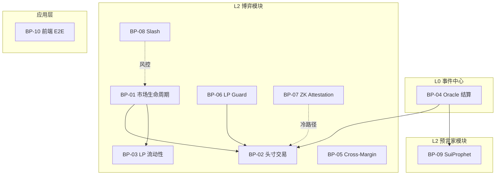
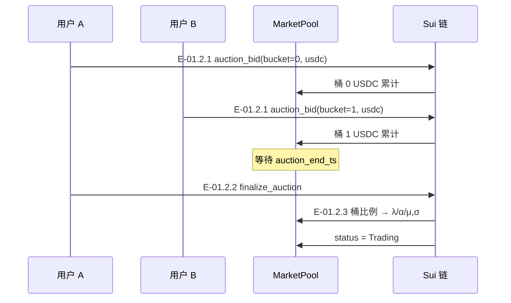
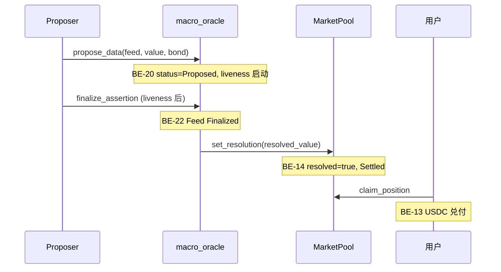
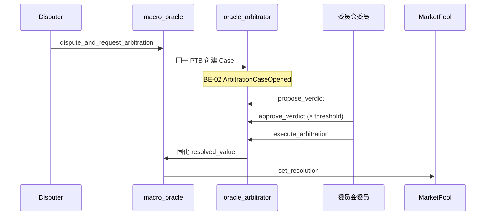
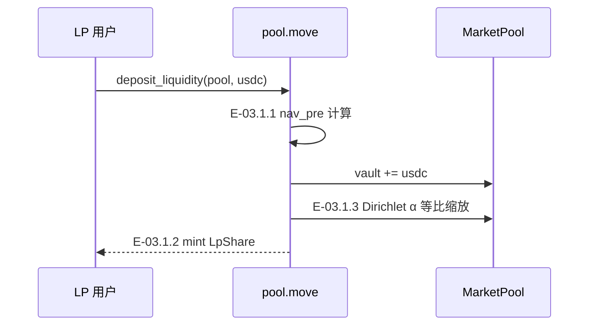
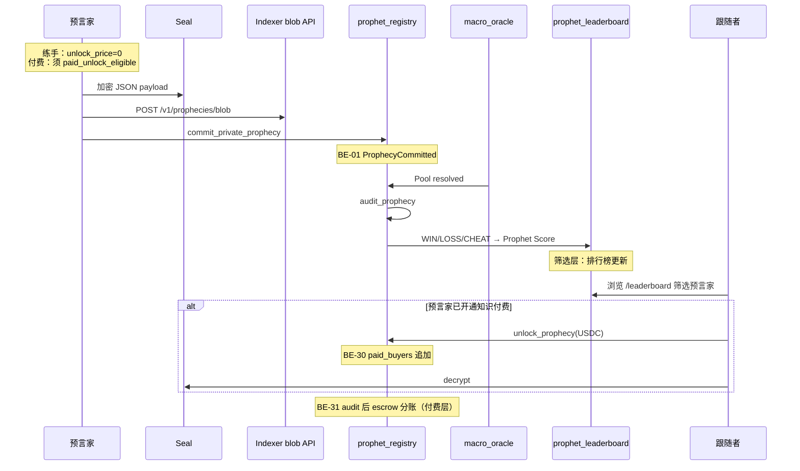
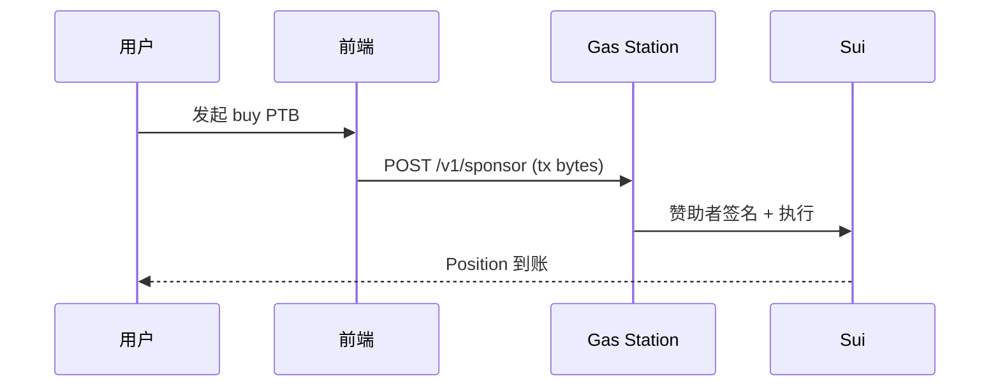

# X-Market Sui 业务规格文档

> **版本：** v1.1 · **日期：** 2026-06-11  
> **状态：** 草案  
> **关联：** [PRD.md](../PRD.md) · [test-cases.md](./test-cases.md) · [demo-walkthrough.md](./demo-walkthrough.md)

---

## 目录

1. [文档说明](#1-文档说明)
2. [系统概览](#2-系统概览)
3. [业务事件目录](#3-业务事件目录)
4. [业务流程](#4-业务流程)
5. [用例规格](#5-用例规格)
6. [交互规格](#6-交互规格)
7. [状态机总览](#7-状态机总览)
8. [附录：编号索引](#8-附录编号索引)

---

## 1. 文档说明

### 1.1 目的

本文从 **业务事件 → 业务流程 → 用例 → 交互（界面 / 事件 / 时序）** 四层整理 X-Market on Sui 产品体系的业务规格，供产品、研发、运维与审计对齐语义。测试用例与自动化映射见 [test-cases.md](./test-cases.md)。

### 1.2 编号规则

| 层级 | 前缀 | 示例 | 说明 |
| --- | --- | --- | --- |
| 业务事件 | `BE-xx` | BE-01 ProphecyCommitted | 链上 emit 或链下可观测事件 |
| 业务流程 | `BP-xx` | BP-01 市场生命周期 | 端到端业务链路 |
| 用例 | `UC-xx.y` | UC-01.2 Opening Auction | 角色目标与前置/后置 |
| 交互事件 | `E-xx.y.z` | E-01.2.3 finalize_auction | 单次可触发动作 |
| 交互界面 | `UI-xx` | UI-03 市场详情页 | 页面或组件 |

### 1.3 三层产品架构

```
┌─────────────────────────────────────────────────────────────┐
│  应用层：Web App · Flutter · Indexer API · Gas Station      │
├─────────────────────────────────────────────────────────────┤
│  L2 业务模块                                                 │
│  ┌─────────────────────┐    ┌─────────────────────────┐   │
│  │ X-Market 博弈模块    │    │ SuiProphet 预言家模块    │   │
│  │ MarketPool · Position│    │ ProphetStats · 排行榜     │   │
│  │                      │    │ PrivateProphecy · 知识付费│   │
│  └──────────┬──────────┘    └────────────┬────────────┘   │
│             └──────────────┬───────────────┘                 │
│                            ▼                               │
│              EventRoot（市场根 · Phase 4）                    │
├─────────────────────────────────────────────────────────────┤
│  L0 统一事件中心：macro_oracle · oracle_arbitrator          │
└─────────────────────────────────────────────────────────────┘
```

---

## 2. 系统概览

### 2.1 产品定位

**X-Market on Sui** 是 Sui 链上的预测市场产品体系：底层共享 **Macro Oracle（L0）** 作为唯一结算真相源，上层挂载 **博弈模块（X-Market）** 与 **预言家模块（SuiProphet）**，共用同一现实世界事件与 `lock_time`。

| 模块 | 核心问题 | 用户行为 |
| --- | --- | --- |
| **X-Market 博弈** | 如何用 USDC 承担赔付博弈 | 买入 Position、做 LP |
| **SuiProphet 预言家** | 谁值得跟随、谁预测可信 | 发布预测、积累战绩、被筛选；优秀者开通知识付费 |

### 2.2 SuiProphet 模块定位

**SuiProphet 是预言家模块，不是独立的「内容商城」。** 其核心职责是 **筛选预言家**——通过 Oracle 结算后的链上审计与 Prophet Score，把预测能力可验证、可排序、可发现；**知识付费**是筛选体系之上的 **特权能力**，仅战绩达标的优秀预言家可开通。

#### 2.2.1 与 X-Market 博弈模块的分工

| 维度 | X-Market 博弈 | SuiProphet 预言家 |
| --- | --- | --- |
| 核心价值 | 参数化 AMM 定价与赔付 | 预测声誉与预言家筛选 |
| 用户投入 | USDC 买入 Position | 发布预测、接受链上审计 |
| 结果载体 | Position + Vault 兑付 | ProphetStats + 排行榜 |
| 收入模式 | LP 滑点 + 协议费 | 优秀预言家解锁费（特权） |
| 共用依赖 | L0 Oracle `resolved_value` | 同一 Feed 触发 audit |

#### 2.2.2 筛选闭环（模块主线）

```
预言家 Commit 预测 → Oracle 结算 → audit_prophecy（WIN/LOSS/CHEAT）
    → 更新 ProphetStats / Prophet Score → 排行榜 / ROI 展示
    → 订阅者 / 跟单者筛选优秀预言家
```

- **战绩真相源：** 链上 `prophet_leaderboard::ProphetStats`，Indexer 仅缓存增强。
- **筛选指标：** 胜率、审计场次、连胜、Prophet Score（`score_bps`）。
- **发现入口：** `/leaderboard`（排行榜）、`/roi`（跟单 ROI）、市场页关联预言列表。

#### 2.2.3 知识付费（优秀预言家特权）

知识付费 **不是** 模块入口条件，而是 **筛选通过后的变现能力**：

| 阶段 | 条件 | 能力 |
| --- | --- | --- |
| **练手期** | 任意地址 | 可 Commit；`unlock_price = 0`（免费公开）；参与 audit 积累战绩 |
| **付费开通** | `paid_unlock_eligible` 链上 gate | 可设 `unlock_price > 0`；订阅者 USDC 解锁 Seal 加密分析 |

**付费开通门槛**（`prophet_leaderboard::paid_unlock_eligible`，`commit` 时 `unlock_price > 0` 强制校验）：

| 条件 | 阈值 | 说明 |
| --- | --- | --- |
| 无作弊记录 | `cheats = 0` | CHEAT 永久失去付费资格 |
| 最少审计场次 | `total_audited ≥ 3` | 样本量不足不可收费 |
| Prophet Score | `score_bps ≥ 4000` | 综合胜率 + 经验 + 收入，满分 10000 |

**付费流程（特权层）：** Commit（Seal+Indexer/IPFS）→ Unlock（USDC）→ Decrypt → Audit 后 escrow 分账。

> 详见 [PRD §11](../PRD.md#11-suiprophet-network知识付费模块) · [prophet-playbook.md](./prophet-playbook.md)

### 2.3 用户角色

| 角色 | 职责 | 典型链上入口 |
| --- | --- | --- |
| 协议运营 (Admin) | Oracle 基础设施、Slash、治理 | `create_oracle_config`、`slash_pool` |
| 市场创建者 | 建池 + 注册 Feed | `start_*_auction`、`create_*_pool_with_feed` |
| 交易者 (Buyer) | 买入头寸、claim | `buy_*`、`claim_position` |
| LP | 提供流动性 | `deposit_liquidity` / `withdraw_liquidity` |
| Proposer | 搬运官方数据上链 | `propose_data` |
| Disputer | 争议提议 | `dispute_and_request_arbitration` |
| 委员会委员 | 仲裁终裁 | `propose_verdict` → `execute_arbitration` |
| 预言家 (Prophet) | 发布预测、积累战绩；达标后开通知识付费 | `commit_private_prophecy` |
| 跟随者 / 订阅者 | 通过排行榜筛选预言家；可选付费解锁分析 | 浏览 `/leaderboard`；`unlock_prophecy` |
| Pool Authority | LP Guard 参数 | `set_lp_guard_params` |

### 2.4 核心实体

| 实体 | 类型 | 模块 | 说明 |
| --- | --- | --- | --- |
| MarketPool | Shared Object | `market_pool` | AMM 池：vault、μ/σ/λ/α、status |
| Position | Owned Object | `position` | 用户头寸：8 种合约类型 |
| LpShare | Owned Object | `lp_token` | LP 份额 |
| DataFeed | Shared Object | `macro_oracle` | Oracle 指标与结算值 |
| DataAssertion | Object | `macro_oracle` | 乐观提议与争议状态 |
| ArbitrationCase | Shared Object | `oracle_arbitrator` | 委员会仲裁案件 |
| **ProphetStats** | 链上战绩 | `prophet_leaderboard` | **筛选核心**：wins/losses/score_bps/付费资格 |
| PrivateProphecy | Shared Object | `prophet_registry` | 单次预测载体；含 blob、hash、unlock_price |
| ProphetRegistry | Shared Object | `prophet_registry` | 协议费、预言计数 |
| EventRoot | Shared Object | `event_root` | 市场根（Phase 4） |

---

## 3. 业务事件目录

业务事件分为 **链上显式事件**、**状态变迁事件（隐式）**、**链下服务事件** 与 **前端工作流事件** 四类。

### 3.1 链上显式事件（Move `event::emit`）

| ID | 事件结构 | 模块 | 触发时机 | 关键字段 | Indexer |
| --- | --- | --- | --- | --- | --- |
| BE-01 | `ProphecyCommitted` | `prophet_registry` | `commit_private_prophecy` | `prophecy_id`, `market_id`, `prophet`, `lock_time`, `unlock_price` | ✅ |
| BE-02 | `ArbitrationCaseOpened` | `oracle_arbitrator` | `dispute_and_request_arbitration` | `case_id`, `assertion_id`, `feed_id`, `pool_id`, proposer/disputer, `claimed_value` | ✅ |
| BE-03 | `UmaDvmArbitrationRequested` | `oracle_arbitrator` | UMA 适配器争议 | `data_identifier`, `claimed_value` 等 | ✅（relayer 消费） |

> 买入、LP、Oracle finalize 等 **无显式 Move Event**；Indexer 通过 RPC 轮询对象状态 + 上述事件流索引。

### 3.2 状态变迁事件（隐式 · 对象字段变更）

| ID | 事件语义 | 主体对象 | 触发入口 | 状态变更 |
| --- | --- | --- | --- | --- |
| BE-10 | 市场进入竞价 | MarketPool | `start_*_auction` | → `Auction` |
| BE-11 | 竞价定标 | MarketPool | `finalize_*_auction` | `Auction` → `Trading` |
| BE-12 | 头寸买入 | MarketPool + Position | `buy_*` | vault↑、参数更新、Position mint |
| BE-13 | 头寸兑付 | Position + MarketPool | `claim_position` | USDC 转出、`claimed=true` |
| BE-14 | 市场结算 | MarketPool | `set_resolution` / `report_resolution` | `resolved=true` → `Settled` |
| BE-15 | LP 申购 | MarketPool + LpShare | `deposit_liquidity` | vault↑、LpShare mint |
| BE-16 | LP 赎回 | MarketPool + LpShare | `withdraw_liquidity` | vault↓、LpShare burn |
| BE-20 | Oracle 提议 | DataAssertion | `propose_data` | → `ASSERTION_PROPOSED` |
| BE-21 | Oracle 争议 | DataAssertion + ArbitrationCase | `dispute_and_request_arbitration` | → `ASSERTION_DISPUTED` |
| BE-22 | Oracle 固化 | DataFeed | `finalize_assertion` / 仲裁回调 | → `FEED_FINALIZED` |
| BE-23 | Feed 作废 | DataFeed | `nullify_feed` | → `FEED_NULLIFIED` |
| BE-30 | 预言解锁 | PrivateProphecy | `unlock_prophecy` | `paid_buyers` 追加 |
| BE-31 | 预言审计 | PrivateProphecy + ProphetStats | `audit_prophecy` | → WIN/LOSS/CHEAT；**Prophet Score 刷新（筛选）** |
| BE-40 | 池暂停 | MarketPool | `slash_pool` | `paused=true` |
| BE-41 | 池恢复 | MarketPool | `unslash_resume_pool` | `paused=false` |
| BE-50 | LP Guard 调参 | MarketPool | `set_lp_guard_params` | 动态费率 / 虚拟 σ |

### 3.3 链下服务事件

| ID | 来源 | 语义 | 消费方 |
| --- | --- | --- | --- |
| BE-60 | LP Guard Keeper | 风险分评估 → `set_lp_guard_params` | 链上 MarketPool |
| BE-61 | Oracle Relayer | 到期自动 finalize / nullify | macro_oracle |
| BE-62 | Prophet Audit Keeper | Oracle 后自动 `audit_prophecy` | prophet_registry |
| BE-63 | UMA DVM Relayer | 消费 BE-03 → 链下投票 → 回调 | oracle_arbitrator |
| BE-64 | Brevis ZK Prover | 生成 proof → `submit_proof` | zk_coprocessor |
| BE-65 | Indexer Workers | 快照 / IV / GMV / ROI 聚合 | REST API |
| BE-66 | Gas Station | `POST /v1/sponsor` 赞助 Gas | 前端 PTB |
| BE-67 | Indexer Prophet blob | `POST /v1/prophecies/blob` 上传 blob | Prophet Commit |

### 3.4 前端工作流事件（抽象）

| 工作流 | 步骤 ID | 标签 | 库文件 |
| --- | --- | --- | --- |
| Oracle | `register_feed` | 注册 Feed | `app/src/lib/oracle.ts` |
| Oracle | `propose` | 1. 提议 | 同上 |
| Oracle | `liveness` | 2. 争议窗口 | 同上 |
| Oracle | `finalize_or_dispute` | 3. 结算 | 同上 |
| Oracle | `arbitration` | 3. 委员会终裁 | 同上 |
| Oracle | `settled` | 4. 领取 | 同上 |
| Prophet | `commit` | 1. 发布预测（练手/付费） | `app/src/lib/prophet.ts` |
| Prophet | `audit` | 2. Oracle 审计 → 战绩（筛选核心） | 同上 |
| Prophet | `unlock` | 3. 解锁（仅付费预言家） | 同上 |
| Prophet | `decrypt` | 4. Seal 解密 | 同上 |
| Prophet | `done` | 完成 | 同上 |

---

## 4. 业务流程

### 4.1 流程总览



| ID | 流程名称 | 简述 | 关键状态机 |
| --- | --- | --- | --- |
| BP-01 | 市场生命周期 | 创建池 → Opening Auction → Trading → Oracle 结算 → Settled | MarketPool |
| BP-02 | 头寸交易 | USDC → PDF 定价 → 参数更新 + Position 铸造 | MarketPool + Position |
| BP-03 | LP 流动性 | NAV 申购 → LpShare → 赎回 | MarketPool + LpShare |
| BP-04 | Oracle 结算 | 提议 → 争议窗口 → [仲裁] → Finalized → claim | DataFeed + Assertion |
| BP-05 | Cross-Margin | 同地址多 Position 统一 VaR | MarginAccount |
| BP-06 | LP Guard | Keeper 观测 → 动态费率/虚拟 σ | lp_guard 参数 |
| BP-07 | ZK Attestation | 冷路径证明见证（不阻塞 buy） | ZkVerification |
| BP-08 | Slash | 应急罚没 + timelock 恢复 | pool.paused |
| BP-09 | SuiProphet 预言家 | 预测 → Audit → 战绩/排行榜（筛选）；达标者知识付费 | ProphetStats + PrivateProphecy |
| BP-10 | 前端 E2E | 全页面与服务健康回归 | — |

---

### 4.2 BP-01 市场生命周期

**流程：** 创建池 → Opening Auction → Trading → Oracle 结算 → Settled

**状态机：** `Auction (0)` → `Trading (1)` → `Settled (2)`

**涉及实体：** MarketPool、DataFeed、EventRoot（Phase 4）

**关键链上入口：**

| 阶段 | 入口函数 | 模块 |
| --- | --- | --- |
| 初始化 Oracle | `create_oracle_config` | `macro_oracle` |
| 启动竞价 | `start_poisson_auction` / `start_dirichlet_auction` / `start_normal_auction` / `start_beta_auction` | `pool` |
| 建池即注册 Feed | `create_*_pool_with_feed` | `pool` |
| 竞价注资 | `auction_bid` | `pool` |
| 定标 | `finalize_*_auction` | `pool` |
| 结算绑定 | `set_resolution` / `report_resolution` | `settlement_oracle` / oracle 回调 |

---

### 4.3 BP-02 头寸交易（Parametric AMM）

**流程：** 用户 USDC → 链上 PDF 定价 → 参数更新 + Position 铸造

**Tier 1 热路径：** 单笔 PTB 内原子完成定价与状态变更。

**分布模板与入口：**

| 分布 | 场景 | 区间入口 | 数字入口 |
| --- | --- | --- | --- |
| Poisson | 足球进球 | `buy_poisson_interval` | `buy_poisson_digital` |
| Dirichlet | 胜平负 | `buy_dirichlet_outcome` | — |
| Normal | CPI / 宏观 | `buy_normal_interval` | `buy_normal_digital` |
| Beta | 得票率 | `buy_beta_interval` | — |

**Phase 3 结构化（Normal）：** `buy_normal_linear_call/put/straddle/variance_swap/structured_note/range_note/barrier_note`

**守卫：** 仅 `Trading` 状态；`risk` Max-Loss；`lp_guard` 有效费率与 resolution_window。

---

### 4.4 BP-03 LP 流动性（NAV）

**流程：** deposit（申购）→ 持有 LpShare → withdraw（赎回）

**NAV 公式：** `(vault − L_mtm) / lp_shares`

**Dirichlet 特殊行为：** 申购时 α 等比放大，概率形状不变。

---

### 4.5 BP-04 Oracle 结算（Macro Data Oracle）

**流程：** 事件发生 → 提议 → 争议窗口 → [仲裁] → Finalized → claim

**无争议路径：**

```
Proposer → propose_data(bond)
        → liveness 窗口
        → finalize_assertion
        → set_resolution(resolved_value)
用户     → claim_position
```

**争议路径：**

```
Disputer → dispute_and_request_arbitration (同一 PTB，emit BE-02)
委员     → propose_verdict → approve_verdict → execute_arbitration
        → Feed Finalized + resolved_value
```

**Testnet 快路径：** Admin `report_resolution`（生产禁用）。

---

### 4.6 BP-05 Cross-Margin 保证金

**流程：** 同地址多 Position → 统一 VaR 账本 → 限制新开仓

**链上模块：** `cross_margin` · 前端 `/margin` 展示组合 VaR。

---

### 4.7 BP-06 LP Guard 风控

**流程：** Keeper 观测池状态 → 评估风险分 → `set_lp_guard_params` → 动态费率 / 虚拟 σ

| 参数 | 效果 |
| --- | --- |
| `fee_multiplier_bps` | 有效费率抬高 |
| `sigma_virtual_tenths` | Normal 定价 σ 增大 |
| `deposit_cutoff_bps` | T2 禁申购 |
| `resolution_window_ts` | 到期前禁 buy |

**链下服务：** `services/lp-guard-keeper`

---

### 4.8 BP-07 ZK Attestation（冷路径）

**流程：** submit_proof → 委员会 attest → [challenge 3600s] → finalize

**原则：** **不阻塞** `buy_*` 热路径。

---

### 4.9 BP-08 Slash 罚没与恢复

**流程：**

```
Admin → slash_pool → paused + timelock(1800s)
     → [等待] → unslash_resume_pool
```

**多签路径：** `propose_slash_request` → `approve` (≥ threshold) → `execute`

**约束：** 单次 ≤30% vault；周期累计 ≤50%。

---

### 4.10 BP-09 SuiProphet 预言家（筛选 + 知识付费）

BP-09 分 **两层**：**筛选层（主线）** 与 **知识付费层（特权）**。

#### 4.10.1 筛选层（模块主线）

**流程：** Commit 预测 → Oracle 结算 → `audit_prophecy` → 更新 ProphetStats → 排行榜 / ROI

**Prophet Score 公式：**

$$\text{Prophet Score} = w_1 \cdot \text{Accuracy} + w_2 \cdot \log(N) + w_3 \cdot \text{Revenue}$$

权重（链上 bps）：`w1=6000` · `w2=2000` · `w3=2000`

| 审计结果 | 战绩影响 | 筛选语义 |
| --- | --- | --- |
| WIN | wins++、streak++、score 上升 | 预测与 Oracle 一致，声誉加分 |
| LOSS | losses++、streak 归零 | 预测错误，仍可继续练手 |
| CHEAT | cheats++、永久失付费资格 | 明文 hash 篡改，从筛选池剔除 |

**发现入口：** `/leaderboard` · `/roi` · Indexer `GET /v1/prophet/leaderboard`

#### 4.10.2 知识付费层（优秀预言家特权）

**前置：** `paid_unlock_eligible(stats) = true`（见 [§2.2.3](#223-知识付费优秀预言家特权)）

**流程：** Commit（Seal+Indexer/IPFS，`unlock_price > 0`）→ Unlock（USDC）→ Decrypt → Audit 后 escrow 分账

**Seal 访问 OR 策略：**

| 条件 | 说明 |
| --- | --- |
| A 付费 | sender ∈ `paid_buyers` |
| B 公开 | `now > lock_time` 或 `is_public`（audit 后） |

**练手 vs 付费：**

| 模式 | unlock_price | 谁可 Commit | 筛选作用 |
| --- | --- | --- | --- |
| 练手（免费） | `0` | 任意地址 | 积累 audit 样本，进入排行榜 |
| 知识付费 | `> 0` | 仅 `paid_unlock_eligible` | 变现能力；不影响筛选主线 |

---

### 4.11 BP-10 前端与服务 E2E

覆盖 Web 全路由、Gas Station 赞助、Indexer 只读 API、Keeper 健康检查。详见 [§6 交互规格](#6-交互规格) 与 [p0-drill-ef-checklist.md](./p0-drill-ef-checklist.md)。

---

## 5. 用例规格

用例按业务流程分组；交互事件编号 `E-xx.y.z` 与 [test-cases.md](./test-cases.md) 一致。

### 5.1 BP-01 市场生命周期

#### UC-01.1 创建带 Feed 的市场

| 属性 | 内容 |
| --- | --- |
| 角色 | 协议运营、市场创建者 |
| 目标 | 初始化 Oracle 并创建可结算的竞价池 |
| 前置 | 无 OracleConfig 或已存在 GlobalConfig |
| 后置 | MarketPool.status = Auction；Feed 可通过 `lookup_feed_by_market` 发现 |

| 交互事件 | 发起方 | 链上入口 | 后置条件 |
| --- | --- | --- | --- |
| E-01.1.1 创建 Oracle 配置 | 协议运营 | `macro_oracle::create_oracle_config` | OracleConfig + FeedRegistry |
| E-01.1.2 启动竞价池 | 市场创建者 | `start_*_auction` | status = Auction |
| E-01.1.3 建池即注册 Feed | 市场创建者 | `create_*_pool_with_feed` | Feed 绑定 market_id |

#### UC-01.2 Opening Auction 竞价与定标

| 属性 | 内容 |
| --- | --- |
| 角色 | 任意用户（竞价）、任意用户（定标） |
| 目标 | 通过桶比例确定初始 λ/α/μ,σ，进入 Trading |
| 前置 | MarketPool.status = Auction |
| 后置 | status = Trading；Vault 锁定；lp_shares seed |

| 交互事件 | 发起方 | 链上入口 | 约束 |
| --- | --- | --- | --- |
| E-01.2.1 竞价注资 | 任意用户 | `auction_bid` | 仅 Auction；USDC 入桶 |
| E-01.2.2 定标 | 任意用户 | `finalize_*_auction` | `now >= auction_end_ts` |
| E-01.2.3 状态切换 | 链上原子 | finalize 内部 | Auction → Trading |

#### UC-01.3 到期与结算状态

| 交互事件 | 发起方 | 链上入口 | 后置条件 |
| --- | --- | --- | --- |
| E-01.3.1 Oracle 固化 | Proposer / 委员会 | `finalize_assertion` / 仲裁 | DataFeed.resolved_value 可读 |
| E-01.3.2 池绑定结算 | Admin / 回调 | `set_resolution` | MarketPool.resolved = true |
| E-01.3.3 状态 Settled | 链上 | resolution 后 | 禁 `buy_*`；可 claim |

---

### 5.2 BP-02 头寸交易

#### UC-02.1 区间 / 数字期权（P0）

| 属性 | 内容 |
| --- | --- |
| 角色 | 交易者 |
| 目标 | 用 USDC 买入 Position，承担赔付博弈 |
| 前置 | Pool Trading；有足够 USDC；未超 Max-Loss |
| 后置 | Position owned object 至买家；池参数更新 |

| 交互事件 | 说明 |
| --- | --- |
| E-02.1.1 合并 USDC | 前端/PTB 合并多枚 Coin |
| E-02.1.2 Max-Loss 检查 | `risk.move` 最坏情景 ≤ Vault |
| E-02.1.3 参数更新 | μ/σ/λ/α 随成交量拨动 |
| E-02.1.4 铸造 Position | owned object 至买家地址 |

#### UC-02.2 线性期权与 Straddle（P1）

入口：`buy_normal_call` / `buy_normal_put` / `buy_normal_straddle`

#### UC-02.3 Phase 3 结构化票据（P1）

Variance Swap、Structured Note、Range Note、Barrier Note

#### UC-02.4 Position 转让（P2）

E-02.4.1：原生 `transfer` Position 至新地址，新 owner 可 claim

---

### 5.3 BP-03 LP 流动性

#### UC-03.1 NAV 申购

| 交互事件 | 链上入口 | 行为 |
| --- | --- | --- |
| E-03.1.1 计算 NAV | `nav::nav_pre` | (vault − L_mtm) / lp_shares |
| E-03.1.2 申购 | `deposit_liquidity` | mint_lp = amount / nav_pre |
| E-03.1.3 α 缩放 | Dirichlet 内部 | 等比放大 α |

#### UC-03.2 NAV 赎回

E-03.2.1：`withdraw_liquidity` → payout = burn × nav_pre

---

### 5.4 BP-04 Oracle 结算

#### UC-04.1 无争议路径

| 属性 | 内容 |
| --- | --- |
| 角色 | Proposer、用户 |
| 目标 | 固化官方数据并兑付头寸 |
| 前置 | DataFeed 已注册；bond 充足 |
| 后置 | Feed Finalized；Pool resolved；用户可 claim |

#### UC-04.2 争议与委员会仲裁

| 属性 | 内容 |
| --- | --- |
| 角色 | Disputer、委员会委员 |
| 目标 | 争议窗口内发起仲裁，委员会 2-of-N 终裁 |
| 前置 | Assertion Proposed；liveness 未结束 |
| 后置 | BE-02 发出；Case Executed；Feed Finalized |

#### UC-04.3 Testnet Admin 快路径

`settlement_oracle::report_resolution` — 仅联调用

---

### 5.5 BP-05 ~ BP-08 用例摘要

| 用例 | 角色 | 目标 |
| --- | --- | --- |
| UC-05.1 组合 VaR | 交易者 | 同地址多 Position 统一保证金视图 |
| UC-06.1 LP Guard 链上 | Pool Authority | 设动态费率 / 虚拟 σ / 禁买窗口 |
| UC-06.2 LP Guard Keeper | 链下 Keeper | 自动评估风险并上链调参 |
| UC-07.1 ZK 见证 | Verifier / Admin | 冷路径 proof 提交与 finalize |
| UC-08.1 Admin Slash | Admin | 应急罚没 + timelock 恢复 |
| UC-08.2 多签 Slash | Signers | 提案 → 审批 → 执行 |

---

### 5.6 BP-09 SuiProphet 预言家

#### UC-09.0 预言家筛选与发现（主线）

| 属性 | 内容 |
| --- | --- |
| 角色 | 跟随者 / 任意用户 |
| 目标 | 通过链上战绩发现、比较、筛选优秀预言家 |
| 前置 | 至少一名预言家已完成 audit |
| 后置 | 用户选定目标预言家；可选进入跟单或付费解锁 |

| 交互事件 | 说明 |
| --- | --- |
| E-09.0.1 浏览排行榜 | `/leaderboard` 读链上 ProphetStats |
| E-09.0.2 查看跟单 ROI | `/roi` 读 Indexer buyer-roi |
| E-09.0.3 对比 Score | 胜率、场次、streak、付费开通状态 |

#### UC-09.1 预言家发布预测（练手 / 付费）

| 属性 | 内容 |
| --- | --- |
| 角色 | 预言家 |
| 目标 | 对绑定市场提交 Seal 加密预测，进入 audit 筛选池 |
| 前置 | ProphetRegistry 已创建 |
| 后置 | BE-01 发出；PrivateProphecy 共享对象 |

| 模式 | 前置（额外） | unlock_price |
| --- | --- | --- |
| 练手 | 无 | `0`（任意地址） |
| 知识付费 | `paid_unlock_eligible` | `> 0`（链上 gate） |

#### UC-09.2 Oracle 审计与战绩更新（筛选核心）

| 属性 | 内容 |
| --- | --- |
| 角色 | Audit Keeper / 任意用户 |
| 目标 | Oracle 结算后比对 `plaintext_hash`，更新 ProphetStats 与排行榜 |
| 前置 | Pool resolved；预言 status = OPEN |
| 后置 | WIN / LOSS / CHEAT；Prophet Score 刷新；筛选池更新 |

> **Audit 是筛选闭环的关键节点**，知识付费分账依附于 audit 结果，但不改变筛选语义。

#### UC-09.3 知识付费解锁（特权层）

| 属性 | 内容 |
| --- | --- |
| 角色 | 跟随者 / 订阅者 |
| 目标 | 对 **已开通付费** 的预言家，USDC 解锁 Seal 加密分析 |
| 前置 | 预言 `unlock_price > 0`；钱包有足够 USDC |
| 后置 | `paid_buyers` 含买家；Seal decrypt 成功 |

#### UC-09.4 付费资格开通

| 属性 | 内容 |
| --- | --- |
| 角色 | 预言家 |
| 目标 | 战绩达标后，首次以 `unlock_price > 0` Commit，开通知识付费 |
| 前置 | `total_audited ≥ 3` · `score_bps ≥ 4000` · `cheats = 0` |
| 后置 | 前端 `/prophet` 展示「付费已开通」；后续 Commit 可收费 |

---

## 6. 交互规格

### 6.1 交互界面（UI）

#### 6.1.1 Web 路由与页面

| ID | 路由 | 文件 | 用途 | 关联 BP |
| --- | --- | --- | --- | --- |
| UI-01 | `/` | `app/src/app/page.tsx` | 首页、种子市场列表 | BP-01, BP-10 |
| UI-02 | `/markets/[id]` | `app/src/app/markets/[id]/page.tsx` | 单市场详情 | BP-01, BP-02, BP-06 |
| UI-03 | `/positions` | `app/src/app/positions/page.tsx` | 持仓列表 + claim | BP-02, BP-04 |
| UI-04 | `/lp` | `app/src/app/lp/page.tsx` | LP 申购/赎回 | BP-03 |
| UI-05 | `/margin` | `app/src/app/margin/page.tsx` | 保证金账户 | BP-05 |
| UI-06 | `/oracle` | `app/src/app/oracle/page.tsx` | Oracle 全流程 UI | BP-04 |
| UI-07 | `/prophet` | `app/src/app/prophet/page.tsx` | 预言家发布 / 解锁 / 付费门槛进度 | BP-09 |
| UI-08 | `/leaderboard` | `app/src/app/leaderboard/page.tsx` | **预言家筛选**：排行榜、Score、付费开通状态 | BP-09 |
| UI-09 | `/roi` | `app/src/app/roi/page.tsx` | 跟单 ROI（筛选辅助） | BP-09 |
| UI-10 | `/metrics` | `app/src/app/metrics/page.tsx` | Prophet GMV 指标 | BP-10 |
| UI-11 | `/blocked` | `app/src/app/blocked/page.tsx` | 地理封锁页 | 合规 |

**导航组件：** `app/src/components/SiteNav.tsx`

#### 6.1.2 核心组件

| ID | 组件 | 文件 | 用途 | 用户动作 |
| --- | --- | --- | --- | --- |
| UI-C01 | TradePanel | `TradePanel.tsx` | 买入 UI | 选合约类型、区间、USDC 金额 → 买入 |
| UI-C02 | AuctionPanel | `AuctionPanel.tsx` | Opening Auction | 选桶、注资 → 竞价 |
| UI-C03 | LpDepositPanel | `LpDepositPanel.tsx` | LP 存入 | 输入 USDC → 申购 |
| UI-C04 | IvPanel | `IvPanel.tsx` | 隐含波动率 | 只读（Indexer） |
| UI-C05 | PositionCard | `PositionCard.tsx` | 单头寸 + claim | 点击 claim |
| UI-C06 | ArbitrationCasesPanel | `ArbitrationCasesPanel.tsx` | 仲裁案件 | 委员投票 / 只读 |
| UI-C07 | MintUsdcButton | `MintUsdcButton.tsx` | 测试 USDC | Testnet 铸造 |
| UI-C08 | WalletButton | `WalletButton.tsx` | 钱包连接 | 连接 Sui 钱包 |

#### 6.1.3 Flutter 移动端

| Tab | 屏幕 | 文件 |
| --- | --- | --- |
| 市场 | Markets / Detail | `markets_screen.dart`, `market_detail_screen.dart` |
| 持仓 | Positions | `positions_screen.dart` |
| LP | LP | `lp_screen.dart` |
| 保证金 | Margin | `margin_screen.dart` |
| 钱包 | Wallet | `wallet_screen.dart` |

Shell：`mobile/x_market_flutter/lib/src/app/app_shell.dart`

---

### 6.2 交互事件映射（UI → 链上/服务）

| UI 动作 | 交互事件 | 链上/服务 | 库文件 |
| --- | --- | --- | --- |
| 连接钱包 | — | Sui Wallet | `WalletButton.tsx` |
| 铸造测试 USDC | — | Faucet / `usdc::mint_to_sender` | `app/src/lib/usdc.ts` |
| 市场页 · 买入 | E-02.1.x | `pool::buy_*` | `app/src/lib/trade.ts` |
| 市场页 · 竞价 | E-01.2.1 | `pool::auction_bid` | `app/src/lib/auction.ts` |
| 市场页 · 定标 | E-01.2.2 | `pool::finalize_*_auction` | `app/src/lib/auction.ts` |
| LP 页 · 申购 | E-03.1.2 | `pool::deposit_liquidity` | `app/src/lib/lp.ts` |
| LP 页 · 赎回 | E-03.2.1 | `pool::withdraw_liquidity` | `app/src/lib/lp.ts` |
| 持仓页 · claim | E-01.3.x | `settlement::claim_position` | `PositionCard.tsx` |
| 报价预览 | — | `GET /v1/quote` | `app/src/lib/pricing.ts` |
| Gas 赞助 | BE-66 | `POST /v1/sponsor` | `hooks/useSponsoredTransaction.ts` |
| Oracle · 提议 | E-04.x | `macro_oracle::propose_data` | `app/src/lib/oracle.ts` |
| Oracle · 争议 | E-04.x | `dispute_and_request_arbitration` | 同上 |
| Oracle · 终裁 | E-04.x | `execute_arbitration` | 同上 |
| Prophet · Commit | E-09.1.x | Seal + Indexer/IPFS + `commit_private_prophecy` | `prophet.ts`, `prophet-blob*.ts`, `seal-prophet.ts` |
| Prophet · Unlock | E-09.2.x | `unlock_prophecy` | `app/src/lib/prophet.ts` |
| Prophet · Audit | E-09.3.x | `audit_prophecy` | 同上 |
| 读取市场/Feed | — | Indexer `GET /v1/*` | `app/src/lib/indexer.ts` |
| 地理封锁 | — | middleware | `app/src/middleware.ts` |

---

### 6.3 时序图

#### 6.3.1 Opening Auction 定标（UC-01.2）



#### 6.3.2 头寸买入 — Poisson 区间（UC-02.1）

```mermaid
sequenceDiagram
    participant User as 交易者
    participant UI as TradePanel
    participant PE as Pricing Engine
    participant Chain as pool.move
    participant Pool as MarketPool

    User->>UI: 选区间 [L,U]、输入 USDC
    UI->>PE: GET /v1/quote（预览，非真相）
    PE-->>UI: 预估价格
    User->>UI: 确认买入
    UI->>Chain: buy_poisson_interval(pool, [L,U], usdc)
    Chain->>Chain: lp_guard effective_fee
    Chain->>Chain: Poisson PDF 积分定价
    Chain->>Chain: risk Max-Loss assert
    Chain->>Pool: vault += usdc; 更新 lambda
    Chain-->>User: mint Position
```

#### 6.3.3 Oracle 无争议结算（UC-04.1）



#### 6.3.4 Oracle 争议与仲裁（UC-04.2）



#### 6.3.5 LP NAV 申购（UC-03.1）



#### 6.3.6 SuiProphet 筛选 + 知识付费（UC-09.0 ~ UC-09.4）



#### 6.3.7 Gas 赞助买入（前端 E2E）



---

### 6.4 Indexer REST API（只读交互）

| 方法 | 路由 | 用途 | 消费 UI |
| --- | --- | --- | --- |
| GET | `/v1/markets` | 市场列表 | UI-01 |
| GET | `/v1/markets/:poolId` | 单市场 | UI-02 |
| GET | `/v1/feeds` | Oracle Feed | UI-06 |
| GET | `/v1/pools/:poolId/iv-history` | IV 历史 | UI-C04 |
| GET | `/v1/prophecies` | 预言列表 | UI-07 |
| GET | `/v1/prophet/leaderboard` | 排行榜 | UI-08 |
| GET | `/v1/buyer-roi` | 跟单 ROI | UI-09 |
| GET | `/v1/metrics/prophet-gmv` | GMV | UI-10 |
| GET | `/v1/arbitration/cases` | 仲裁案件 | UI-C06 |
| GET | `/v1/events` | 链上事件 | 运维 |

---

## 7. 状态机总览

### 7.1 MarketPool

```
Auction (0) ──finalize──▶ Trading (1) ──set_resolution──▶ Settled (2)
```

模块：`sources/market_status.move`

### 7.2 EventRoot（Phase 4）

```
Open (0) → Trading (1) → Locked (2) → Settled (3) / Nullified (4)
```

模块：`sources/event_root.move`

### 7.3 Oracle DataFeed

```
FEED_OPEN (0) → FEED_FINALIZED (1) / FEED_NULLIFIED (2)
```

72h 无提议可 `nullify_feed`。

### 7.4 Oracle Assertion

```
ASSERTION_PROPOSED (0) → ASSERTION_DISPUTED (1) → ASSERTION_FINALIZED (2) / ASSERTION_REJECTED (3)
```

### 7.5 ArbitrationCase

```
CASE_OPEN (0) → CASE_EXECUTED (1)
```

Verdict：`PROPOSER_WINS` / `DISPUTER_WINS` / `UNRESOLVED`

### 7.6 PrivateProphecy

```
OPEN (0) → AUDITED_WIN (1) / AUDITED_LOSS (2) / CHEAT (3)
```

### 7.7 ZkVerification（冷路径）

```
submit_proof → verify/attest → [challenge 3600s] → finalize_verification
```

### 7.8 Position 合约类型

| kind | 名称 | 说明 |
| --- | --- | --- |
| 0 | INTERVAL | 区间合约 |
| 1 | DIGITAL | 数字期权 |
| 2-5 | LINEAR_CALL/PUT/STRADDLE/VARIANCE_SWAP | 线性衍生品 |
| 6-8 | STRUCTURED/RANGE/BARRIER NOTE | 结构化票据 |

---

## 8. 附录：编号索引

### 8.1 业务流程 → 用例

| BP | 用例 |
| --- | --- |
| BP-01 | UC-01.1, UC-01.2, UC-01.3 |
| BP-02 | UC-02.1, UC-02.2, UC-02.3, UC-02.4 |
| BP-03 | UC-03.1, UC-03.2 |
| BP-04 | UC-04.1, UC-04.2, UC-04.3 |
| BP-05 | UC-05.1 |
| BP-06 | UC-06.1, UC-06.2 |
| BP-07 | UC-07.1, UC-07.2, UC-07.3 |
| BP-08 | UC-08.1, UC-08.2 |
| BP-09 | UC-09.0, UC-09.1, UC-09.2, UC-09.3, UC-09.4 |
| BP-10 | UC-10.1, UC-10.2 |

### 8.2 种子市场（Testnet）

| slug | 分布 | 场景 |
| --- | --- | --- |
| `poisson-goals` | Poisson | 足球总进球 |
| `dirichlet-wdl` | Dirichlet | 胜平负 |
| `normal-cpi` | Normal | CPI 宏观区间 |
| `beta-vote` | Beta | 得票率区间 |

定义：`app/src/lib/markets.ts` · 部署 ID：`deploy/testnet-v2.json`

### 8.3 关键源码索引

| 类别 | 路径 |
| --- | --- |
| Move 入口全集 | `sources/pool.move` |
| Oracle | `sources/macro_oracle.move`, `sources/oracle_arbitrator.move` |
| Prophet 筛选 | `sources/prophet_leaderboard.move` |
| Prophet 预测/付费 | `sources/prophet_registry.move` |
| 前端交易 | `app/src/lib/trade.ts`, `app/src/components/TradePanel.tsx` |
| Indexer API | `services/indexer/src/api/server.ts` |
| 事件索引 | `services/indexer/src/workers/events.ts` |

### 8.4 相关文档

| 文档 | 关系 |
| --- | --- |
| [test-cases.md](./test-cases.md) | 同编号体系的 **测试用例**（TC-xx.y.z） |
| [PRD.md](../PRD.md) | 产品需求与 Phase 规划 |
| [demo-walkthrough.md](./demo-walkthrough.md) | 路演演示路线 |
| [oracle-playbook.md](./oracle-playbook.md) | Oracle 运维 |
| [prophet-playbook.md](./prophet-playbook.md) | Prophet 运维 |
| [prophet-market-and-encryption-guide.md](./prophet-market-and-encryption-guide.md) | 创建市场 + 公开/加密预测操作指南 |

---

## 修订记录

| 日期 | 版本 | 说明 |
| --- | --- | --- |
| 2026-06-12 | v1.2 | 新增 [prophet-market-and-encryption-guide.md](./prophet-market-and-encryption-guide.md)：创建市场与加密预测操作指南 |
| 2026-06-11 | v1.1 | 重定位 SuiProphet：预言家筛选为主线，知识付费为优秀预言家特权 |
| 2026-06-11 | v1.0 | 初版：业务事件目录、10 大流程、用例、交互界面/事件/时序 |
