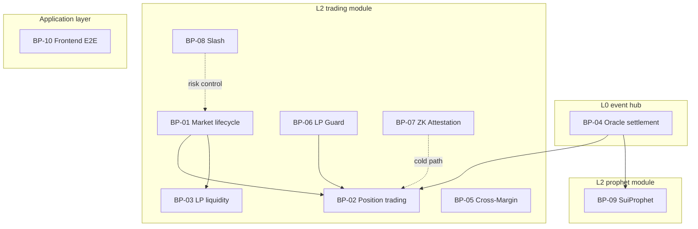
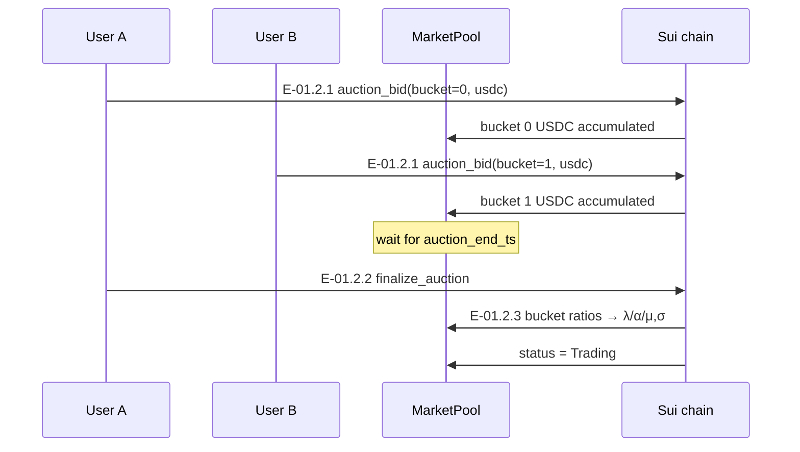
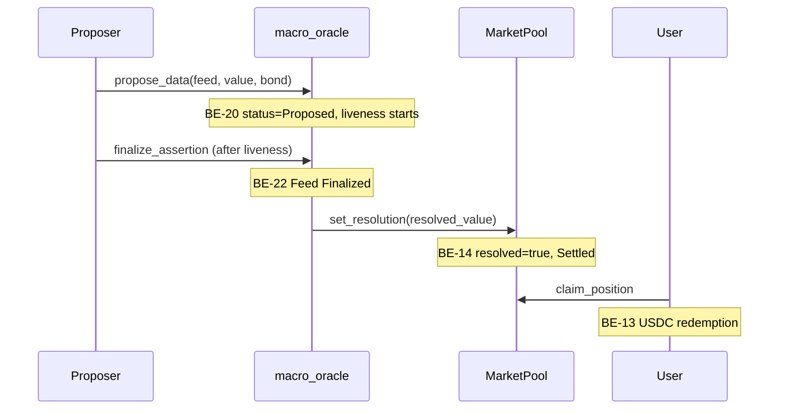
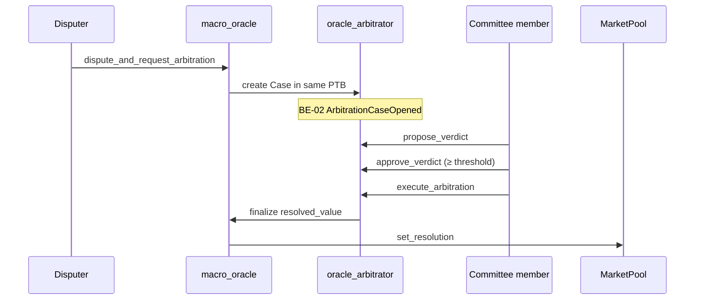
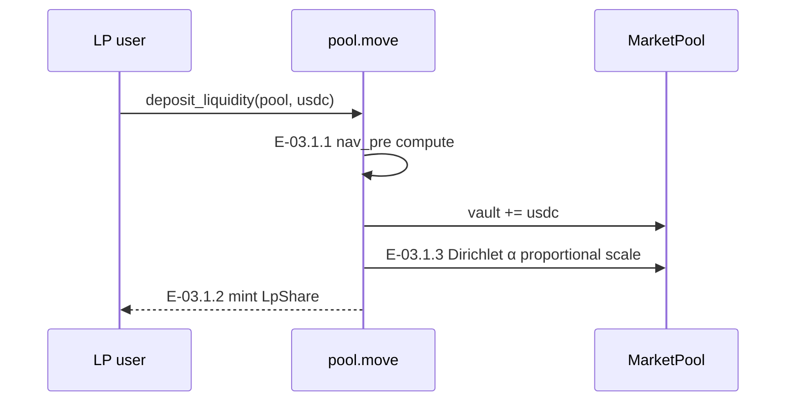
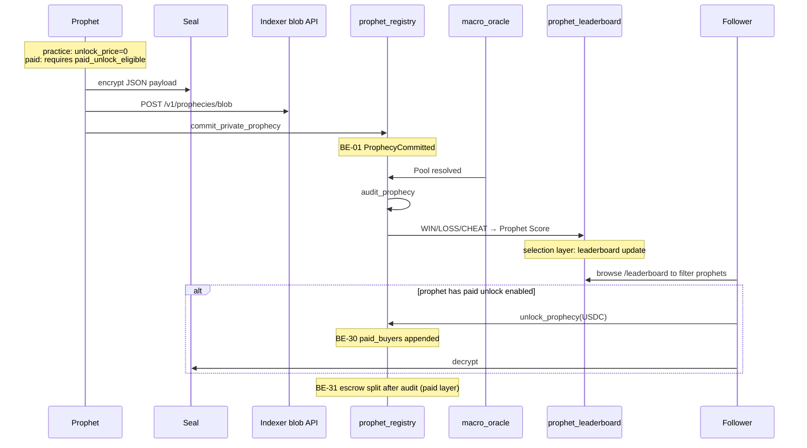
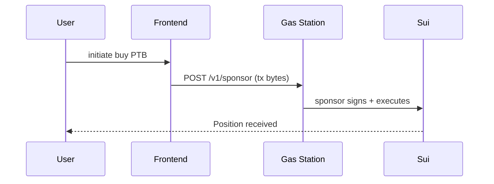

<!--
  Copyright (c) 2026 zouyc zouyccq@gmail.com.
  All rights reserved.

  Licensed under the Business Source License 1.1 (BSL 1.1).
  You may not use this file except in compliance with the License.

  Change Date: 2031-01-01
  On the Change Date, or the fourth anniversary of the first publicly available
  distribution of the code under the BSL, whichever comes first, the code
  automatically becomes available under the Apache License 2.0.
-->

**English** | [简体中文](./business-spec.zh.md)

# X-Market Sui Business Specification

> **Version:** v1.1 · **Date:** 2026-06-11  
> **Status:** Draft  
> **Related:** [PRD.md](../PRD.md) · [test-cases.md](./test-cases.md) · [demo-walkthrough.md](./demo-walkthrough.md)

---

## Table of Contents

1. [Document Overview](#1-document-overview)
2. [System Overview](#2-system-overview)
3. [Business Event Catalog](#3-business-event-catalog)
4. [Business Processes](#4-business-processes)
5. [Use Case Specifications](#5-use-case-specifications)
6. [Interaction Specifications](#6-interaction-specifications)
7. [State Machine Overview](#7-state-machine-overview)
8. [Appendix: ID Index](#8-appendix-id-index)

---

## 1. Document Overview

### 1.1 Purpose

This document organizes the business specification of the X-Market on Sui product system across four layers: **business events → business processes → use cases → interactions (UI / events / sequences)**, for alignment among product, engineering, operations, and audit. Test cases and automation mappings are in [test-cases.md](./test-cases.md).

### 1.2 ID Conventions

| Layer | Prefix | Example | Description |
| --- | --- | --- | --- |
| Business event | `BE-xx` | BE-01 ProphecyCommitted | On-chain emit or off-chain observable event |
| Business process | `BP-xx` | BP-01 Market lifecycle | End-to-end business flow |
| Use case | `UC-xx.y` | UC-01.2 Opening Auction | Role goals with pre/post conditions |
| Interaction event | `E-xx.y.z` | E-01.2.3 finalize_auction | Single triggerable action |
| Interaction UI | `UI-xx` | UI-03 Market detail page | Page or component |

### 1.3 Three-Layer Product Architecture

```
┌─────────────────────────────────────────────────────────────┐
│  Application layer: Web App · Flutter · Indexer API · Gas Station      │
├─────────────────────────────────────────────────────────────┤
│  L2 business modules                                                 │
│  ┌─────────────────────┐    ┌─────────────────────────┐   │
│  │ X-Market trading     │    │ SuiProphet prophet       │   │
│  │ MarketPool · Position│    │ ProphetStats · Leaderboard│   │
│  │                      │    │ PrivateProphecy · Paid unlock│   │
│  └──────────┬──────────┘    └────────────┬────────────┘   │
│             └──────────────┬───────────────┘                 │
│                            ▼                               │
│              EventRoot (market root · Phase 4)                    │
├─────────────────────────────────────────────────────────────┤
│  L0 unified event hub: macro_oracle · oracle_arbitrator          │
└─────────────────────────────────────────────────────────────┘
```

---

## 2. System Overview

### 2.1 Product Positioning

**X-Market on Sui** is a prediction market product system on Sui: the shared **Macro Oracle (L0)** is the single settlement source of truth; the **trading module (X-Market)** and **prophet module (SuiProphet)** share the same real-world events and `lock_time`.

| Module | Core question | User behavior |
| --- | --- | --- |
| **X-Market trading** | How to take payout risk with USDC | Buy Positions, provide LP |
| **SuiProphet prophet** | Who is worth following, who is credible | Publish prophecies, build track record, get ranked; top performers enable paid unlock |

### 2.2 SuiProphet Module Positioning

**SuiProphet is a prophet module, not a standalone “content marketplace.”** Its core job is **prophet selection**—after Oracle settlement, on-chain audit and Prophet Score make prediction ability verifiable, rankable, and discoverable; **paid knowledge unlock** is a **privileged capability** on top of the selection system, available only to prophets who meet performance thresholds.

#### 2.2.1 Division of Labor with X-Market Trading

| Dimension | X-Market trading | SuiProphet prophet |
| --- | --- | --- |
| Core value | Parametric AMM pricing and payout | Prediction reputation and prophet selection |
| User stake | USDC to buy Positions | Publish prophecies, accept on-chain audit |
| Outcome carrier | Position + Vault redemption | ProphetStats + leaderboard |
| Revenue model | LP slippage + protocol fee | Unlock fee for top prophets (privilege) |
| Shared dependency | L0 Oracle `resolved_value` | Same Feed triggers audit |

#### 2.2.2 Selection Loop (module main line)

```
Prophet commits prophecy → Oracle settlement → audit_prophecy (WIN/LOSS/CHEAT)
    → update ProphetStats / Prophet Score → leaderboard / ROI display
    → subscribers / copy traders filter top prophets
```

- **Track record source of truth:** on-chain `prophet_leaderboard::ProphetStats`; Indexer is cache/enrichment only.
- **Selection metrics:** win rate, audited count, streak, Prophet Score (`score_bps`).
- **Discovery entry points:** `/leaderboard`, `/roi` (copy ROI), prophet list on market pages.

#### 2.2.3 Paid Knowledge Unlock (top prophet privilege)

Paid unlock is **not** a module entry requirement; it is **monetization after passing selection**:

| Stage | Condition | Capability |
| --- | --- | --- |
| **Practice period** | Any address | Can Commit; `unlock_price = 0` (free public); participate in audit to build track record |
| **Paid enablement** | `paid_unlock_eligible` on-chain gate | Can set `unlock_price > 0`; subscribers unlock Seal-encrypted analysis with USDC |

**Paid enablement thresholds** (`prophet_leaderboard::paid_unlock_eligible`, enforced at `commit` when `unlock_price > 0`):

| Condition | Threshold | Description |
| --- | --- | --- |
| No cheat record | `cheats = 0` | CHEAT permanently revokes paid eligibility |
| Minimum audited count | `total_audited ≥ 3` | Insufficient sample size cannot charge |
| Prophet Score | `score_bps ≥ 4000` | Combined win rate + experience + revenue, max 10000 |

**Paid flow (privilege layer):** Commit (Seal+Indexer/IPFS) → Unlock (USDC) → Decrypt → escrow split after Audit.

> See [PRD §11](../PRD.md#11-suiprophet-network-knowledge-monetization-module) · [prophet-playbook.md](./prophet-playbook.md)

### 2.3 User Roles

| Role | Responsibility | Typical on-chain entry |
| --- | --- | --- |
| Protocol operator (Admin) | Oracle infrastructure, Slash, governance | `create_oracle_config`, `slash_pool` |
| Market creator | Create pool + register Feed | `start_*_auction`, `create_*_pool_with_feed` |
| Trader (Buyer) | Buy positions, claim | `buy_*`, `claim_position` |
| LP | Provide liquidity | `deposit_liquidity` / `withdraw_liquidity` |
| Proposer | Bring official data on-chain | `propose_data` |
| Disputer | Dispute a proposal | `dispute_and_request_arbitration` |
| Committee member | Final arbitration | `propose_verdict` → `execute_arbitration` |
| Prophet | Publish prophecies, build track record; enable paid unlock when eligible | `commit_private_prophecy` |
| Follower / subscriber | Filter prophets via leaderboard; optionally pay to unlock analysis | Browse `/leaderboard`; `unlock_prophecy` |
| Pool Authority | LP Guard parameters | `set_lp_guard_params` |

### 2.4 Core Entities

| Entity | Type | Module | Description |
| --- | --- | --- | --- |
| MarketPool | Shared Object | `market_pool` | AMM pool: vault, μ/σ/λ/α, status |
| Position | Owned Object | `position` | User position: 8 contract types |
| LpShare | Owned Object | `lp_token` | LP share |
| DataFeed | Shared Object | `macro_oracle` | Oracle metric and settlement value |
| DataAssertion | Object | `macro_oracle` | Optimistic proposal and dispute state |
| ArbitrationCase | Shared Object | `oracle_arbitrator` | Committee arbitration case |
| **ProphetStats** | On-chain track record | `prophet_leaderboard` | **Selection core**: wins/losses/score_bps/paid eligibility |
| PrivateProphecy | Shared Object | `prophet_registry` | Single prophecy carrier; blob, hash, unlock_price |
| ProphetRegistry | Shared Object | `prophet_registry` | Protocol fee, prophecy count |
| EventRoot | Shared Object | `event_root` | Market root (Phase 4) |

---

## 3. Business Event Catalog

Business events fall into four categories: **explicit on-chain events**, **implicit state-transition events**, **off-chain service events**, and **frontend workflow events**.

### 3.1 Explicit On-Chain Events (Move `event::emit`)

| ID | Event struct | Module | Trigger | Key fields | Indexer |
| --- | --- | --- | --- | --- | --- |
| BE-01 | `ProphecyCommitted` | `prophet_registry` | `commit_private_prophecy` | `prophecy_id`, `market_id`, `prophet`, `lock_time`, `unlock_price` | ✅ |
| BE-02 | `ArbitrationCaseOpened` | `oracle_arbitrator` | `dispute_and_request_arbitration` | `case_id`, `assertion_id`, `feed_id`, `pool_id`, proposer/disputer, `claimed_value` | ✅ |
| BE-03 | `UmaDvmArbitrationRequested` | `oracle_arbitrator` | UMA adapter dispute | `data_identifier`, `claimed_value`, etc. | ✅ (relayer consumes) |

> Buy, LP, Oracle finalize, etc. have **no explicit Move Event**; Indexer indexes via RPC object polling + the event streams above.

### 3.2 State-Transition Events (implicit · object field changes)

| ID | Event semantics | Subject object | Trigger entry | State change |
| --- | --- | --- | --- | --- |
| BE-10 | Market enters auction | MarketPool | `start_*_auction` | → `Auction` |
| BE-11 | Auction finalized | MarketPool | `finalize_*_auction` | `Auction` → `Trading` |
| BE-12 | Position bought | MarketPool + Position | `buy_*` | vault↑, params update, Position mint |
| BE-13 | Position redeemed | Position + MarketPool | `claim_position` | USDC out, `claimed=true` |
| BE-14 | Market settled | MarketPool | `set_resolution` / `report_resolution` | `resolved=true` → `Settled` |
| BE-15 | LP deposit | MarketPool + LpShare | `deposit_liquidity` | vault↑, LpShare mint |
| BE-16 | LP withdraw | MarketPool + LpShare | `withdraw_liquidity` | vault↓, LpShare burn |
| BE-20 | Oracle proposal | DataAssertion | `propose_data` | → `ASSERTION_PROPOSED` |
| BE-21 | Oracle dispute | DataAssertion + ArbitrationCase | `dispute_and_request_arbitration` | → `ASSERTION_DISPUTED` |
| BE-22 | Oracle finalized | DataFeed | `finalize_assertion` / arbitration callback | → `FEED_FINALIZED` |
| BE-23 | Feed nullified | DataFeed | `nullify_feed` | → `FEED_NULLIFIED` |
| BE-30 | Prophecy unlocked | PrivateProphecy | `unlock_prophecy` | `paid_buyers` appended |
| BE-31 | Prophecy audited | PrivateProphecy + ProphetStats | `audit_prophecy` | → WIN/LOSS/CHEAT; **Prophet Score refresh (selection)** |
| BE-40 | Pool paused | MarketPool | `slash_pool` | `paused=true` |
| BE-41 | Pool resumed | MarketPool | `unslash_resume_pool` | `paused=false` |
| BE-50 | LP Guard param update | MarketPool | `set_lp_guard_params` | dynamic fee / virtual σ |

### 3.3 Off-Chain Service Events

| ID | Source | Semantics | Consumer |
| --- | --- | --- | --- |
| BE-60 | LP Guard Keeper | Risk score → `set_lp_guard_params` | on-chain MarketPool |
| BE-61 | Oracle Relayer | Auto finalize / nullify at expiry | macro_oracle |
| BE-62 | Prophet Audit Keeper | Auto `audit_prophecy` after Oracle | prophet_registry |
| BE-63 | UMA DVM Relayer | Consume BE-03 → off-chain vote → callback | oracle_arbitrator |
| BE-64 | Brevis ZK Prover | Generate proof → `submit_proof` | zk_coprocessor |
| BE-65 | Indexer Workers | Snapshot / IV / GMV / ROI aggregation | REST API |
| BE-66 | Gas Station | `POST /v1/sponsor` gas sponsorship | frontend PTB |
| BE-67 | Indexer Prophet blob | `POST /v1/prophecies/blob` blob upload | Prophet Commit |

### 3.4 Frontend Workflow Events (abstract)

| Workflow | Step ID | Label | Library file |
| --- | --- | --- | --- |
| Oracle | `register_feed` | Register Feed | `app/src/lib/oracle.ts` |
| Oracle | `propose` | 1. Propose | same |
| Oracle | `liveness` | 2. Dispute window | same |
| Oracle | `finalize_or_dispute` | 3. Settle | same |
| Oracle | `arbitration` | 3. Committee final ruling | same |
| Oracle | `settled` | 4. Claim | same |
| Prophet | `commit` | 1. Publish prophecy (practice/paid) | `app/src/lib/prophet.ts` |
| Prophet | `audit` | 2. Oracle audit → track record (selection core) | same |
| Prophet | `unlock` | 3. Unlock (paid prophets only) | same |
| Prophet | `decrypt` | 4. Seal decrypt | same |
| Prophet | `done` | Done | same |

---

## 4. Business Processes

### 4.1 Process Overview



| ID | Process name | Summary | Key state machine |
| --- | --- | --- | --- |
| BP-01 | Market lifecycle | Create pool → Opening Auction → Trading → Oracle settlement → Settled | MarketPool |
| BP-02 | Position trading | USDC → PDF pricing → param update + Position mint | MarketPool + Position |
| BP-03 | LP liquidity | NAV deposit → LpShare → withdraw | MarketPool + LpShare |
| BP-04 | Oracle settlement | Propose → dispute window → [arbitration] → Finalized → claim | DataFeed + Assertion |
| BP-05 | Cross-Margin | Same-address multi-Position unified VaR | MarginAccount |
| BP-06 | LP Guard | Keeper observes → dynamic fee/virtual σ | lp_guard params |
| BP-07 | ZK Attestation | Cold-path proof attestation (does not block buy) | ZkVerification |
| BP-08 | Slash | Emergency slash + timelock resume | pool.paused |
| BP-09 | SuiProphet prophet | Prophecy → Audit → track record/leaderboard (selection); paid unlock for eligible | ProphetStats + PrivateProphecy |
| BP-10 | Frontend E2E | Full-page and service health regression | — |

---

### 4.2 BP-01 Market Lifecycle

**Flow:** Create pool → Opening Auction → Trading → Oracle settlement → Settled

**State machine:** `Auction (0)` → `Trading (1)` → `Settled (2)`

**Entities involved:** MarketPool, DataFeed, EventRoot (Phase 4)

**Key on-chain entries:**

| Phase | Entry function | Module |
| --- | --- | --- |
| Initialize Oracle | `create_oracle_config` | `macro_oracle` |
| Start auction | `start_poisson_auction` / `start_dirichlet_auction` / `start_normal_auction` / `start_beta_auction` | `pool` |
| Create pool with Feed | `create_*_pool_with_feed` | `pool` |
| Auction deposit | `auction_bid` | `pool` |
| Finalize | `finalize_*_auction` | `pool` |
| Settlement binding | `set_resolution` / `report_resolution` | `settlement_oracle` / oracle callback |

---

### 4.3 BP-02 Position Trading (Parametric AMM)

**Flow:** User USDC → on-chain PDF pricing → param update + Position mint

**Tier 1 hot path:** Single PTB atomically completes pricing and state change.

**Distribution templates and entries:**

| Distribution | Scenario | Interval entry | Digital entry |
| --- | --- | --- | --- |
| Poisson | Football goals | `buy_poisson_interval` | `buy_poisson_digital` |
| Dirichlet | Win/draw/loss | `buy_dirichlet_outcome` | — |
| Normal | CPI / macro | `buy_normal_interval` | `buy_normal_digital` |
| Beta | Vote share | `buy_beta_interval` | — |

**Phase 3 structured (Normal):** `buy_normal_linear_call/put/straddle/variance_swap/structured_note/range_note/barrier_note`

**Guards:** `Trading` status only; `risk` Max-Loss; `lp_guard` effective fee and resolution_window.

---

### 4.4 BP-03 LP Liquidity (NAV)

**Flow:** deposit → hold LpShare → withdraw

**NAV formula:** `(vault − L_mtm) / lp_shares`

**Dirichlet special behavior:** On deposit, α scales proportionally; probability shape unchanged.

---

### 4.5 BP-04 Oracle Settlement (Macro Data Oracle)

**Flow:** Event occurs → propose → dispute window → [arbitration] → Finalized → claim

**No-dispute path:**

```
Proposer → propose_data(bond)
        → liveness window
        → finalize_assertion
        → set_resolution(resolved_value)
User     → claim_position
```

**Dispute path:**

```
Disputer → dispute_and_request_arbitration (same PTB, emit BE-02)
Committee → propose_verdict → approve_verdict → execute_arbitration
        → Feed Finalized + resolved_value
```

**Testnet fast path:** Admin `report_resolution` (disabled in production).

---

### 4.6 BP-05 Cross-Margin

**Flow:** Same-address multi-Position → unified VaR ledger → limits new positions

**On-chain module:** `cross_margin` · frontend `/margin` shows portfolio VaR.

---

### 4.7 BP-06 LP Guard Risk Control

**Flow:** Keeper observes pool → assess risk score → `set_lp_guard_params` → dynamic fee / virtual σ

| Parameter | Effect |
| --- | --- |
| `fee_multiplier_bps` | Raises effective fee |
| `sigma_virtual_tenths` | Increases Normal pricing σ |
| `deposit_cutoff_bps` | T2 deposit ban |
| `resolution_window_ts` | Buy ban before expiry |

**Off-chain service:** `services/lp-guard-keeper`

---

### 4.8 BP-07 ZK Attestation (cold path)

**Flow:** submit_proof → committee attest → [challenge 3600s] → finalize

**Principle:** **Does not block** `buy_*` hot path.

---

### 4.9 BP-08 Slash and Recovery

**Flow:**

```
Admin → slash_pool → paused + timelock(1800s)
     → [wait] → unslash_resume_pool
```

**Multisig path:** `propose_slash_request` → `approve` (≥ threshold) → `execute`

**Constraints:** Single slash ≤30% vault; cumulative per period ≤50%.

---

### 4.10 BP-09 SuiProphet Prophet (selection + paid unlock)

BP-09 has **two layers**: **selection layer (main line)** and **paid unlock layer (privilege)**.

#### 4.10.1 Selection Layer (module main line)

**Flow:** Commit prophecy → Oracle settlement → `audit_prophecy` → update ProphetStats → leaderboard / ROI

**Prophet Score formula:**

$$\text{Prophet Score} = w_1 \cdot \text{Accuracy} + w_2 \cdot \log(N) + w_3 \cdot \text{Revenue}$$

Weights (on-chain bps): `w1=6000` · `w2=2000` · `w3=2000`

| Audit result | Track record impact | Selection semantics |
| --- | --- | --- |
| WIN | wins++, streak++, score up | Prediction matches Oracle, reputation boost |
| LOSS | losses++, streak reset | Wrong prediction, can continue practice |
| CHEAT | cheats++, permanent paid revocation | Plaintext hash tampered, removed from selection pool |

**Discovery entry points:** `/leaderboard` · `/roi` · Indexer `GET /v1/prophet/leaderboard`

#### 4.10.2 Paid Unlock Layer (top prophet privilege)

**Prerequisite:** `paid_unlock_eligible(stats) = true` (see [§2.2.3](#223-paid-knowledge-unlock-top-prophet-privilege))

**Flow:** Commit (Seal+Indexer/IPFS, `unlock_price > 0`) → Unlock (USDC) → Decrypt → escrow split after Audit

**Seal access OR policy:**

| Condition | Description |
| --- | --- |
| A paid | sender ∈ `paid_buyers` |
| B public | `now > lock_time` or `is_public` (after audit) |

**Practice vs paid:**

| Mode | unlock_price | Who can Commit | Selection role |
| --- | --- | --- | --- |
| Practice (free) | `0` | Any address | Build audit samples, enter leaderboard |
| Paid unlock | `> 0` | `paid_unlock_eligible` only | Monetization; does not change selection main line |

---

### 4.11 BP-10 Frontend and Service E2E

Covers Web full routes, Gas Station sponsorship, Indexer read-only API, Keeper health checks. See [§6 Interaction Specifications](#6-interaction-specifications) and [p0-drill-ef-checklist.md](./p0-drill-ef-checklist.md).

---

## 5. Use Case Specifications

Use cases grouped by business process; interaction event IDs `E-xx.y.z` align with [test-cases.md](./test-cases.md).

### 5.1 BP-01 Market Lifecycle

#### UC-01.1 Create Market with Feed

| Attribute | Content |
| --- | --- |
| Roles | Protocol operator, market creator |
| Goal | Initialize Oracle and create a settleable auction pool |
| Precondition | No OracleConfig or GlobalConfig exists |
| Postcondition | MarketPool.status = Auction; Feed discoverable via `lookup_feed_by_market` |

| Interaction event | Initiator | On-chain entry | Postcondition |
| --- | --- | --- | --- |
| E-01.1.1 Create Oracle config | Protocol operator | `macro_oracle::create_oracle_config` | OracleConfig + FeedRegistry |
| E-01.1.2 Start auction pool | Market creator | `start_*_auction` | status = Auction |
| E-01.1.3 Create pool with Feed | Market creator | `create_*_pool_with_feed` | Feed bound to market_id |

#### UC-01.2 Opening Auction Bidding and Finalization

| Attribute | Content |
| --- | --- |
| Roles | Any user (bid), any user (finalize) |
| Goal | Determine initial λ/α/μ,σ via bucket ratios, enter Trading |
| Precondition | MarketPool.status = Auction |
| Postcondition | status = Trading; Vault locked; lp_shares seeded |

| Interaction event | Initiator | On-chain entry | Constraint |
| --- | --- | --- | --- |
| E-01.2.1 Auction deposit | Any user | `auction_bid` | Auction only; USDC into buckets |
| E-01.2.2 Finalize | Any user | `finalize_*_auction` | `now >= auction_end_ts` |
| E-01.2.3 State transition | On-chain atomic | internal to finalize | Auction → Trading |

#### UC-01.3 Expiry and Settlement State

| Interaction event | Initiator | On-chain entry | Postcondition |
| --- | --- | --- | --- |
| E-01.3.1 Oracle finalize | Proposer / committee | `finalize_assertion` / arbitration | DataFeed.resolved_value readable |
| E-01.3.2 Pool bind settlement | Admin / callback | `set_resolution` | MarketPool.resolved = true |
| E-01.3.3 Settled state | On-chain | after resolution | `buy_*` disabled; claim enabled |

---

### 5.2 BP-02 Position Trading

#### UC-02.1 Interval / Digital Options (P0)

| Attribute | Content |
| --- | --- |
| Role | Trader |
| Goal | Buy Position with USDC, take payout risk |
| Precondition | Pool Trading; sufficient USDC; within Max-Loss |
| Postcondition | Position owned object to buyer; pool params updated |

| Interaction event | Description |
| --- | --- |
| E-02.1.1 Merge USDC | Frontend/PTB merges multiple Coins |
| E-02.1.2 Max-Loss check | `risk.move` worst case ≤ Vault |
| E-02.1.3 Param update | μ/σ/λ/α move with volume |
| E-02.1.4 Mint Position | owned object to buyer address |

#### UC-02.2 Linear Options and Straddle (P1)

Entries: `buy_normal_call` / `buy_normal_put` / `buy_normal_straddle`

#### UC-02.3 Phase 3 Structured Notes (P1)

Variance Swap, Structured Note, Range Note, Barrier Note

#### UC-02.4 Position Transfer (P2)

E-02.4.1: native `transfer` Position to new address; new owner can claim

---

### 5.3 BP-03 LP Liquidity

#### UC-03.1 NAV Deposit

| Interaction event | On-chain entry | Behavior |
| --- | --- | --- |
| E-03.1.1 Compute NAV | `nav::nav_pre` | (vault − L_mtm) / lp_shares |
| E-03.1.2 Deposit | `deposit_liquidity` | mint_lp = amount / nav_pre |
| E-03.1.3 α scaling | Dirichlet internal | proportional α scale |

#### UC-03.2 NAV Withdraw

E-03.2.1: `withdraw_liquidity` → payout = burn × nav_pre

---

### 5.4 BP-04 Oracle Settlement

#### UC-04.1 No-Dispute Path

| Attribute | Content |
| --- | --- |
| Roles | Proposer, user |
| Goal | Finalize official data and redeem positions |
| Precondition | DataFeed registered; sufficient bond |
| Postcondition | Feed Finalized; Pool resolved; user can claim |

#### UC-04.2 Dispute and Committee Arbitration

| Attribute | Content |
| --- | --- |
| Roles | Disputer, committee members |
| Goal | Initiate arbitration within dispute window; committee 2-of-N final ruling |
| Precondition | Assertion Proposed; liveness not ended |
| Postcondition | BE-02 emitted; Case Executed; Feed Finalized |

#### UC-04.3 Testnet Admin Fast Path

`settlement_oracle::report_resolution` — integration testing only

---

### 5.5 BP-05 ~ BP-08 Use Case Summary

| Use case | Role | Goal |
| --- | --- | --- |
| UC-05.1 Portfolio VaR | Trader | Unified margin view for same-address multi-Position |
| UC-06.1 LP Guard on-chain | Pool Authority | Set dynamic fee / virtual σ / buy ban window |
| UC-06.2 LP Guard Keeper | Off-chain Keeper | Auto assess risk and update params on-chain |
| UC-07.1 ZK attestation | Verifier / Admin | Cold-path proof submit and finalize |
| UC-08.1 Admin Slash | Admin | Emergency slash + timelock recovery |
| UC-08.2 Multisig Slash | Signers | Propose → approve → execute |

---

### 5.6 BP-09 SuiProphet Prophet

#### UC-09.0 Prophet Selection and Discovery (main line)

| Attribute | Content |
| --- | --- |
| Role | Follower / any user |
| Goal | Discover, compare, and filter top prophets via on-chain track record |
| Precondition | At least one prophet has completed audit |
| Postcondition | User selects target prophet; optionally copy trade or paid unlock |

| Interaction event | Description |
| --- | --- |
| E-09.0.1 Browse leaderboard | `/leaderboard` reads on-chain ProphetStats |
| E-09.0.2 View copy ROI | `/roi` reads Indexer buyer-roi |
| E-09.0.3 Compare Score | Win rate, count, streak, paid enablement status |

#### UC-09.1 Prophet Publishes Prophecy (practice / paid)

| Attribute | Content |
| --- | --- |
| Role | Prophet |
| Goal | Submit Seal-encrypted prophecy for bound market, enter audit selection pool |
| Precondition | ProphetRegistry created |
| Postcondition | BE-01 emitted; PrivateProphecy shared object |

| Mode | Precondition (extra) | unlock_price |
| --- | --- | --- |
| Practice | None | `0` (any address) |
| Paid unlock | `paid_unlock_eligible` | `> 0` (on-chain gate) |

#### UC-09.2 Oracle Audit and Track Record Update (selection core)

| Attribute | Content |
| --- | --- |
| Role | Audit Keeper / any user |
| Goal | After Oracle settlement, compare `plaintext_hash`, update ProphetStats and leaderboard |
| Precondition | Pool resolved; prophecy status = OPEN |
| Postcondition | WIN / LOSS / CHEAT; Prophet Score refresh; selection pool update |

> **Audit is the key node in the selection loop**; paid unlock escrow split depends on audit result but does not change selection semantics.

#### UC-09.3 Paid Unlock (privilege layer)

| Attribute | Content |
| --- | --- |
| Role | Follower / subscriber |
| Goal | For **paid-enabled** prophets, unlock Seal-encrypted analysis with USDC |
| Precondition | Prophecy `unlock_price > 0`; wallet has sufficient USDC |
| Postcondition | `paid_buyers` includes buyer; Seal decrypt succeeds |

#### UC-09.4 Paid Eligibility Enablement

| Attribute | Content |
| --- | --- |
| Role | Prophet |
| Goal | After meeting thresholds, first Commit with `unlock_price > 0` to enable paid unlock |
| Precondition | `total_audited ≥ 3` · `score_bps ≥ 4000` · `cheats = 0` |
| Postcondition | Frontend `/prophet` shows “Paid enabled”; subsequent Commits can charge |

---

## 6. Interaction Specifications

### 6.1 Interaction UI

#### 6.1.1 Web Routes and Pages

| ID | Route | File | Purpose | Related BP |
| --- | --- | --- | --- | --- |
| UI-01 | `/` | `app/src/app/page.tsx` | Home, seed market list | BP-01, BP-10 |
| UI-02 | `/markets/[id]` | `app/src/app/markets/[id]/page.tsx` | Single market detail | BP-01, BP-02, BP-06 |
| UI-03 | `/positions` | `app/src/app/positions/page.tsx` | Position list + claim | BP-02, BP-04 |
| UI-04 | `/lp` | `app/src/app/lp/page.tsx` | LP deposit/withdraw | BP-03 |
| UI-05 | `/margin` | `app/src/app/margin/page.tsx` | Margin account | BP-05 |
| UI-06 | `/oracle` | `app/src/app/oracle/page.tsx` | Oracle full-flow UI | BP-04 |
| UI-07 | `/prophet` | `app/src/app/prophet/page.tsx` | Prophet publish / unlock / paid threshold progress | BP-09 |
| UI-08 | `/leaderboard` | `app/src/app/leaderboard/page.tsx` | **Prophet selection**: leaderboard, Score, paid status | BP-09 |
| UI-09 | `/roi` | `app/src/app/roi/page.tsx` | Copy ROI (selection aid) | BP-09 |
| UI-10 | `/metrics` | `app/src/app/metrics/page.tsx` | Prophet GMV metrics | BP-10 |
| UI-11 | `/blocked` | `app/src/app/blocked/page.tsx` | Geo-block page | Compliance |

**Navigation component:** `app/src/components/SiteNav.tsx`

#### 6.1.2 Core Components

| ID | Component | File | Purpose | User action |
| --- | --- | --- | --- | --- |
| UI-C01 | TradePanel | `TradePanel.tsx` | Buy UI | Select contract type, interval, USDC amount → buy |
| UI-C02 | AuctionPanel | `AuctionPanel.tsx` | Opening Auction | Select bucket, deposit → bid |
| UI-C03 | LpDepositPanel | `LpDepositPanel.tsx` | LP deposit | Enter USDC → subscribe |
| UI-C04 | IvPanel | `IvPanel.tsx` | Implied volatility | Read-only (Indexer) |
| UI-C05 | PositionCard | `PositionCard.tsx` | Single position + claim | Click claim |
| UI-C06 | ArbitrationCasesPanel | `ArbitrationCasesPanel.tsx` | Arbitration cases | Committee vote / read-only |
| UI-C07 | MintUsdcButton | `MintUsdcButton.tsx` | Test USDC | Testnet mint |
| UI-C08 | WalletButton | `WalletButton.tsx` | Wallet connect | Connect Sui wallet |

#### 6.1.3 Flutter Mobile

| Tab | Screen | File |
| --- | --- | --- |
| Markets | Markets / Detail | `markets_screen.dart`, `market_detail_screen.dart` |
| Positions | Positions | `positions_screen.dart` |
| LP | LP | `lp_screen.dart` |
| Margin | Margin | `margin_screen.dart` |
| Wallet | Wallet | `wallet_screen.dart` |

Shell: `mobile/x_market_flutter/lib/src/app/app_shell.dart`

---

### 6.2 Interaction Event Mapping (UI → on-chain/service)

| UI action | Interaction event | On-chain/service | Library file |
| --- | --- | --- | --- |
| Connect wallet | — | Sui Wallet | `WalletButton.tsx` |
| Mint test USDC | — | Faucet / `usdc::mint_to_sender` | `app/src/lib/usdc.ts` |
| Market page · buy | E-02.1.x | `pool::buy_*` | `app/src/lib/trade.ts` |
| Market page · bid | E-01.2.1 | `pool::auction_bid` | `app/src/lib/auction.ts` |
| Market page · finalize | E-01.2.2 | `pool::finalize_*_auction` | `app/src/lib/auction.ts` |
| LP page · deposit | E-03.1.2 | `pool::deposit_liquidity` | `app/src/lib/lp.ts` |
| LP page · withdraw | E-03.2.1 | `pool::withdraw_liquidity` | `app/src/lib/lp.ts` |
| Positions page · claim | E-01.3.x | `settlement::claim_position` | `PositionCard.tsx` |
| Quote preview | — | `GET /v1/quote` | `app/src/lib/pricing.ts` |
| Gas sponsorship | BE-66 | `POST /v1/sponsor` | `hooks/useSponsoredTransaction.ts` |
| Oracle · propose | E-04.x | `macro_oracle::propose_data` | `app/src/lib/oracle.ts` |
| Oracle · dispute | E-04.x | `dispute_and_request_arbitration` | same |
| Oracle · final ruling | E-04.x | `execute_arbitration` | same |
| Prophet · Commit | E-09.1.x | Seal + Indexer/IPFS + `commit_private_prophecy` | `prophet.ts`, `prophet-blob*.ts`, `seal-prophet.ts` |
| Prophet · Unlock | E-09.2.x | `unlock_prophecy` | `app/src/lib/prophet.ts` |
| Prophet · Audit | E-09.3.x | `audit_prophecy` | same |
| Read market/Feed | — | Indexer `GET /v1/*` | `app/src/lib/indexer.ts` |
| Geo-block | — | middleware | `app/src/middleware.ts` |

---

### 6.3 Sequence Diagrams

#### 6.3.1 Opening Auction Finalization (UC-01.2)



#### 6.3.2 Position Buy — Poisson Interval (UC-02.1)

```mermaid
sequenceDiagram
    participant User as Trader
    participant UI as TradePanel
    participant PE as Pricing Engine
    participant Chain as pool.move
    participant Pool as MarketPool

    User->>UI: select interval [L,U], enter USDC
    UI->>PE: GET /v1/quote (preview, not source of truth)
    PE-->>UI: estimated price
    User->>UI: confirm buy
    UI->>Chain: buy_poisson_interval(pool, [L,U], usdc)
    Chain->>Chain: lp_guard effective_fee
    Chain->>Chain: Poisson PDF integral pricing
    Chain->>Chain: risk Max-Loss assert
    Chain->>Pool: vault += usdc; update lambda
    Chain-->>User: mint Position
```

#### 6.3.3 Oracle No-Dispute Settlement (UC-04.1)



#### 6.3.4 Oracle Dispute and Arbitration (UC-04.2)



#### 6.3.5 LP NAV Deposit (UC-03.1)



#### 6.3.6 SuiProphet Selection + Paid Unlock (UC-09.0 ~ UC-09.4)



#### 6.3.7 Gas-Sponsored Buy (frontend E2E)



---

### 6.4 Indexer REST API (read-only interaction)

| Method | Route | Purpose | Consuming UI |
| --- | --- | --- | --- |
| GET | `/v1/markets` | Market list | UI-01 |
| GET | `/v1/markets/:poolId` | Single market | UI-02 |
| GET | `/v1/feeds` | Oracle Feed | UI-06 |
| GET | `/v1/pools/:poolId/iv-history` | IV history | UI-C04 |
| GET | `/v1/prophecies` | Prophecy list | UI-07 |
| GET | `/v1/prophet/leaderboard` | Leaderboard | UI-08 |
| GET | `/v1/buyer-roi` | Copy ROI | UI-09 |
| GET | `/v1/metrics/prophet-gmv` | GMV | UI-10 |
| GET | `/v1/arbitration/cases` | Arbitration cases | UI-C06 |
| GET | `/v1/events` | On-chain events | Operations |

---

## 7. State Machine Overview

### 7.1 MarketPool

```
Auction (0) ──finalize──▶ Trading (1) ──set_resolution──▶ Settled (2)
```

Module: `sources/market_status.move`

### 7.2 EventRoot (Phase 4)

```
Open (0) → Trading (1) → Locked (2) → Settled (3) / Nullified (4)
```

Module: `sources/event_root.move`

### 7.3 Oracle DataFeed

```
FEED_OPEN (0) → FEED_FINALIZED (1) / FEED_NULLIFIED (2)
```

`nullify_feed` if no proposal within 72h.

### 7.4 Oracle Assertion

```
ASSERTION_PROPOSED (0) → ASSERTION_DISPUTED (1) → ASSERTION_FINALIZED (2) / ASSERTION_REJECTED (3)
```

### 7.5 ArbitrationCase

```
CASE_OPEN (0) → CASE_EXECUTED (1)
```

Verdict: `PROPOSER_WINS` / `DISPUTER_WINS` / `UNRESOLVED`

### 7.6 PrivateProphecy

```
OPEN (0) → AUDITED_WIN (1) / AUDITED_LOSS (2) / CHEAT (3)
```

### 7.7 ZkVerification (cold path)

```
submit_proof → verify/attest → [challenge 3600s] → finalize_verification
```

### 7.8 Position Contract Types

| kind | Name | Description |
| --- | --- | --- |
| 0 | INTERVAL | Interval contract |
| 1 | DIGITAL | Digital option |
| 2-5 | LINEAR_CALL/PUT/STRADDLE/VARIANCE_SWAP | Linear derivatives |
| 6-8 | STRUCTURED/RANGE/BARRIER NOTE | Structured notes |

---

## 8. Appendix: ID Index

### 8.1 Business Process → Use Cases

| BP | Use cases |
| --- | --- |
| BP-01 | UC-01.1, UC-01.2, UC-01.3 |
| BP-02 | UC-02.1, UC-02.2, UC-02.3, UC-02.4 |
| BP-03 | UC-03.1, UC-03.2 |
| BP-04 | UC-04.1, UC-04.2, UC-04.3 |
| BP-05 | UC-05.1 |
| BP-06 | UC-06.1, UC-06.2 |
| BP-07 | UC-07.1, UC-07.2, UC-07.3 |
| BP-08 | UC-08.1, UC-08.2 |
| BP-09 | UC-09.0, UC-09.1, UC-09.2, UC-09.3, UC-09.4 |
| BP-10 | UC-10.1, UC-10.2 |

### 8.2 Seed Markets (Testnet)

| slug | Distribution | Scenario |
| --- | --- | --- |
| `poisson-goals` | Poisson | Football total goals |
| `dirichlet-wdl` | Dirichlet | Win/draw/loss |
| `normal-cpi` | Normal | CPI macro interval |
| `beta-vote` | Beta | Vote share interval |

Definition: `app/src/lib/markets.ts` · Deploy IDs: `deploy/testnet-v2.json`

### 8.3 Key Source Index

| Category | Path |
| --- | --- |
| Move entry points | `sources/pool.move` |
| Oracle | `sources/macro_oracle.move`, `sources/oracle_arbitrator.move` |
| Prophet selection | `sources/prophet_leaderboard.move` |
| Prophet prophecy/paid | `sources/prophet_registry.move` |
| Frontend trading | `app/src/lib/trade.ts`, `app/src/components/TradePanel.tsx` |
| Indexer API | `services/indexer/src/api/server.ts` |
| Event indexing | `services/indexer/src/workers/events.ts` |

### 8.4 Related Documents

| Document | Relationship |
| --- | --- |
| [test-cases.md](./test-cases.md) | **Test cases** in same ID system (TC-xx.y.z) |
| [PRD.md](../PRD.md) | Product requirements and Phase planning |
| [demo-walkthrough.md](./demo-walkthrough.md) | Demo walkthrough route |
| [oracle-playbook.md](./oracle-playbook.md) | Oracle operations |
| [prophet-playbook.md](./prophet-playbook.md) | Prophet operations |
| [prophet-market-and-encryption-guide.md](./prophet-market-and-encryption-guide.md) | Create market + public/encrypted prophecy guide |

---

## Revision History

| Date | Version | Description |
| --- | --- | --- |
| 2026-06-12 | v1.2 | Added [prophet-market-and-encryption-guide.md](./prophet-market-and-encryption-guide.md): create market and encrypted prophecy guide |
| 2026-06-11 | v1.1 | Repositioned SuiProphet: prophet selection as main line, paid unlock as top prophet privilege |
| 2026-06-11 | v1.0 | Initial: business event catalog, 10 processes, use cases, interaction UI/events/sequences |
