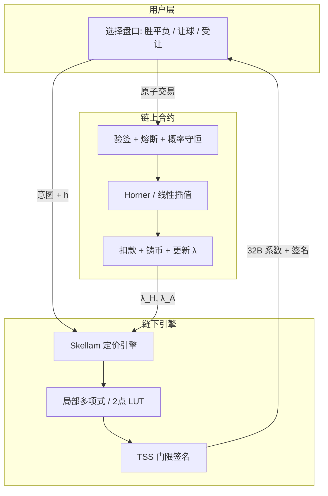

<!--
  Copyright (c) 2026 zouyc zouyccq@gmail.com.
  All rights reserved.

  Licensed under the Business Source License 1.1 (BSL 1.1).
  You may not use this file except in compliance with the License.

  Change Date: 2031-01-01
  On the Change Date, or the fourth anniversary of the first publicly available
  distribution of the code under the BSL, whichever comes first, the code
  automatically becomes available under the Apache License 2.0.
-->

**简体中文** | [English](./football-wdl-solution.md)

# 足球胜平负预测解决方案

> **版本：** v1.0 · **日期：** 2026-06-16  
> **状态：** 草案  
> **来源：** 基于 [Categorical_Distribution_QA.md](./Categorical_Distribution_QA.md) 整理  
> **关联：** [business-spec.zh.md](./business-spec.zh.md) · [qa.zh.md](./qa.zh.md) · [math-spec/SPEC.zh.md](../math-spec/SPEC.zh.md)

---

## 目录

1. [问题定义](#1-问题定义)
2. [核心架构：两层分布](#2-核心架构两层分布)
3. [统一数学模型](#3-统一数学模型)
4. [Skellam vs Dirichlet 选型](#4-skellam-vs-dirichlet-选型)
5. [推荐方案：链下 Skellam + 链上轻量结算](#5-推荐方案链下-skellam--链上轻量结算)
6. [安全架构](#6-安全架构)
7. [性能与成本](#7-性能与成本)
8. [端到端蓝图](#8-端到端蓝图)
9. [与当前 x-market-sui 的差异与演进](#9-与当前-x-market-sui-的差异与演进)
10. [落地决策清单](#10-落地决策清单)

---

## 1. 问题定义

足球「胜平负」及其衍生盘口「让胜平负」「受让胜平负」，在交易与结算层面均为**三档互斥分类结果**；在精算与动态变价层面，可由同一套**净胜球模型 + 让球平移**统一描述。

| 盘口 | 让球数 \(h\) | 虚拟净胜球 \(Z' = X - Y + h\) | 胜 | 平 | 负 |
| --- | --- | --- | --- | --- | --- |
| **胜平负** | \(h = 0\) | 原始净胜球 | \(Z > 0\) | \(Z = 0\) | \(Z < 0\) |
| **让胜平负**（主让 1 球） | \(h = -1\) | 边界左移 1 | \(X - Y > 1\) | \(X - Y = 1\) | \(X - Y < 1\) |
| **受让胜平负**（主受让 1 球） | \(h = +1\) | 边界右移 1 | \(X - Y > -1\) | \(X - Y = -1\) | \(X - Y < -1\) |

说明：

- \(X\)、\(Y\) 分别为主队、客队实际进球数。
- 上表以整数盘为例；半球盘在结算层需叠加走水/半赢半输规则，数学层仍为区间积分，边界定义在盘口配置中固化。
- **胜平负是让球盘口在 \(h = 0\) 时的特例**，不需要独立数学族。

---

## 2. 核心架构：两层分布

由表及里，采用「表层交易 + 底层驱动」双层设计：

```
┌─────────────────────────────────────────────────────────┐
│  表层：分类分布 Categorical（链上代币 / 结算）          │
│  P(Outcome = k) = p_k,  k ∈ {胜, 平, 负},  Σp_k = 1    │
├─────────────────────────────────────────────────────────┤
│  底层：Skellam(λ_H, λ_A)（定价引擎 / 参数联动）         │
│  X ~ Poisson(λ_H),  Y ~ Poisson(λ_A),  Z = X - Y       │
│  Z' = Z + h  →  在 PMF 轴上切三刀  →  表层三档概率      │
└─────────────────────────────────────────────────────────┘
```

| 层次 | 分布 | 职责 |
| --- | --- | --- |
| **表层** | 分类分布（单次多项 / Multinoulli） | 铸造三档互斥代币；赛后按标签 0/1 清算 |
| **底层** | Skellam（双泊松进球差） | 从 \(\lambda_H, \lambda_A\) 推导任意 \(h\) 下的 \(p_W, p_D, p_L\)；交易冲击统一参数 |

**结论：** 不是「Skellam 还是 Dirichlet 二选一」，而是 **Skellam 驱动定价与联动，Categorical 承载结算形态**。Dirichlet 是另一条独立路线（见 §4），适用于单盘口轻量 MVP。

---

## 3. 统一数学模型

### 3.1 底层状态

全场仅维护两个核心参数：

- \(\lambda_H\)：主队预期进球（进攻强度）
- \(\lambda_A\)：客队预期进球（进攻强度）

主队、客队进球分别服从独立泊松分布：

$$
X \sim \text{Poisson}(\lambda_H), \quad Y \sim \text{Poisson}(\lambda_A)
$$

净胜球 \(Z = X - Y\) 服从 **Skellam 分布**：

$$
Z \sim \text{Skellam}(\lambda_H, \lambda_A)
$$

引入让球数 \(h\) 后，虚拟净胜球：

$$
Z' = X - Y + h
$$

在 Skellam PMF 上对 \(Z'\) 切三刀，映射到表层分类概率：

$$
p_{\text{胜}} = P(Z' > 0), \quad p_{\text{平}} = P(Z' = 0), \quad p_{\text{负}} = P(Z' < 0)
$$

### 3.2 Skellam PMF（链下参考）

$$
P(Z = k) = e^{-(\lambda_H + \lambda_A)} \left( \frac{\lambda_H}{\lambda_A} \right)^{k/2} I_{|k|}(2\sqrt{\lambda_H \lambda_A})
$$

其中 \(I_{|k|}\) 为第一类修正贝塞尔函数。**该公式不在链上直接计算**（见 §5）。

### 3.3 统一定价接口

建议链上/链下共用同一抽象：

```text
get_quota(λ_H, λ_A, h) → (p_W, p_D, p_L)
```

| 调用 | 含义 |
| --- | --- |
| `get_quota(λ_H, λ_A, 0)` | 常规胜平负 |
| `get_quota(λ_H, λ_A, -1)` | 主让 1 球（让胜平负） |
| `get_quota(λ_H, λ_A, +1)` | 主受让 1 球（受让胜平负） |

**工程优势：** 一个资金池、两个状态变量，可联动常规盘与多档让球盘，避免流动性碎片化。

### 3.4 交易冲击与联动变价

用户购买任一盘口（如「让胜 \(h=-1\)」）时，买盘推动 \(\lambda_H\)（或 \(\lambda_A\)）变化；因全场共享同一 Skellam 曲面，**常规胜平负与其他让球盘赔率同步更新**，实现跨盘口流动性深度共享。

---

## 4. Skellam vs Dirichlet 选型

二者代表两种哲学：

- **Skellam**：自下而上（Bottom-Up）— 模拟进球，自然衍生所有盘口。
- **Dirichlet**：自上而下（Top-Down）— 不关心足球，只维护三档代币池资金配比 \(\alpha = (\alpha_W, \alpha_D, \alpha_L)\)。

### 4.1 对比矩阵

| 评估维度 | Skellam（底层联动） | Dirichlet（独立池） |
| --- | --- | --- |
| **业务契合度** | 完美。净胜球与让球平移为原生算子 | 差。每种盘口需独立 3 标签池 |
| **资金复用率（TVL 效率）** | 极高。\(\lambda\) 联动全场衍生盘口 | 极低。常规/让球/受让各自建池 |
| **链上计算复杂度** | 极高（贝塞尔 / 积分）；须链下 + 轻量链上 | 极低（\(p_i = \alpha_i / \sum \alpha\)） |
| **防跨盘套利** | 强。底层参数连续联动 | 弱。独立池易出合成套利空间 |
| **MVP 落地速度** | 慢。需报价服务与安全架构 | 快。当前链上已实现 |

### 4.2 Dirichlet 链上逻辑（现状参考）

初始 \(\alpha = (10, 10, 10)\)，买入「胜」后 \(\alpha_W\) 增加，概率自动收敛：

$$
p_W = \frac{\alpha_W}{\alpha_W + \alpha_D + \alpha_L}
$$

**痛点：** 无法在同一 \(\alpha\) 向量中表达「让 1 球胜平负」，必须另开 \(\alpha_{\text{handicap}}\) 池，资金与定价孤立。

### 4.3 工程结论

| 目标 | 更合适的选择 |
| --- | --- |
| 链上 MVP、单盘口、Gas 可控 | **Dirichlet**（当前 `dirichlet.move`） |
| 胜平负 + 让球 + 受让全场联动、专业体育盘 | **Skellam 底层 + Categorical 表层** |
| 生产级折中 | **链下 Skellam 映射，链上分段多项式 / 局部 LUT 结算**（§5） |

---

## 5. 推荐方案：链下 Skellam + 链上轻量结算

业界高级做法：**融合 Skellam 的资金效率与 Dirichlet 级链上算术开销**。

### 5.1 三层分工

| 环节 | 位置 | 内容 |
| --- | --- | --- |
| **状态存储** | 链上 | 持久化 \(\lambda_H, \lambda_A\)（及 Vault、Position）；不运行贝塞尔函数 |
| **报价与变价** | 链下 | Skellam 引擎计算 CDF、\(\Delta\lambda\)、各 \(h\) 三档概率 |
| **成交结算** | 链上 | Horner 多项式求值或 2 点线性插值；验签、熔断、滑点、扣款铸币 |

### 5.2 每次交易携带什么数据？

| 策略 | 数据尺寸 | 链上计算 | 成本 | 结论 |
| --- | --- | --- | --- | --- |
| 全量 LUT（256 点） | ~4 KB | 低 | 极高；Solana MTU 1232B 撞墙 | ❌ 不可行 |
| **局部 2 点 LUT** | ~32 B | 一阶插值 | 极低 | ✅ 推荐（线性拟合） |
| **分段多项式系数** | ~32 B（4×u64） | Horner 3 次 | 极低 | ✅ 推荐（高精度） |

### 5.3 Pull 模式（推荐）

系数 / LUT 作为**交易 calldata 或函数参数**传入，**不写入全局池定价状态**：

- 不同用户并发买入可并行执行，无写锁热点。
- 对比 Push 模式（每笔更新全局系数账户）可避免串行化灾难。

### 5.4 成交流程（用户自驱 Pull）

1. 用户在前端选择盘口（如让胜 \(h=-1\)）与金额。
2. 前端向报价服务请求该区间 **4 个多项式系数**（或 2 个 LUT 采样点）+ **门限签名**。
3. 用户打包：系数、签名、滑点上限、交易意图 → **一笔原子交易**上链。
4. 链上：验签 → 求价 → `require` 滑点 → 更新 \(\lambda\) → 扣款铸币。

链下 Skellam 全量计算约 **10–50 μs**；端到端报价通常数毫秒，用户无感。

---

## 6. 安全架构

**原则：永不信任链下裸数据；链上合约为无情法官。**

### 6.1 提交方角色（性能 / 成本权衡）

| 角色 | 说明 | 适用 |
| --- | --- | --- |
| **协议 Relayer Cluster** | 官方节点算价后提交 | 极速盘口、协议补贴 Gas |
| **用户自驱（Pull）** | 用户携带系数自签上链 | 类似 Pyth Pull；Gas 用户付 |
| **Keeper 网络** | Gelato / Chainlink Automation 等 | 事件触发批量更新 |

提交方选择影响性能与成本；**安全性由链上校验决定**，不依赖 Relayer 诚实。

### 6.2 三道防线

| 防线 | 机制 |
| --- | --- |
| **防伪造** | 系数须 M-of-N 门限签名（TSS / 多签）；链上白名单验公钥 |
| **防篡改（熔断）** | 连续提交 \(\lambda\) 变幅上限（如 ±20%）；\(p_W + p_D + p_L \in [0.999, 1.001]\)，否则 `revert` |
| **防延迟 / MEV** | 系数绑定 timestamp / block height；超 deadline（如 3s）作废；用户签名 `max_price` 滑点守卫 |

### 6.3 两阶段异步（高安全场景）

参考 Drift / GMX：

1. **阶段一：** 用户下单 → USDC 冻结，记录区块 \(B_1\)。
2. **阶段二：** Relayer 提交对应 \(B_1\) 的系数 + 签名。
3. **链上：** 验证签名与区块锚定 → Horner 求价 → 铸币 → 解冻。

Relayer 被劫持最多导致 **Liveness 风险**（拒服），难以通过健全性检查盗取 Vault。

---

## 7. 性能与成本

### 7.1 链下

- Skellam / 多项式系数生成：**10–50 μs** 级。
- 含网络：前端报价通常 **数毫秒**。

### 7.2 链上（以 32B 多项式为例）

- **Sui / Solana：** Compute Units 与 Gas 几乎无感。
- **以太坊 L2：** Calldata 成本极低（约 \< 0.0001 USD / 笔量级）。

### 7.3 架构要点

- 采用 **Pull + 局部系数**，避免 4KB 全量 LUT。
- 链下 **Localized Request**：只返回用户交易所涉区间的系数，非全场 Skellam 表。

---

## 8. 端到端蓝图



### 8.1 模块职责

| 模块 | 职责 |
| --- | --- |
| **Skellam Engine**（链下） | 维护 \(\lambda_H, \lambda_A\)；`get_quota(λ_H, λ_A, h)`；交易后算 \(\Delta\lambda\) |
| **Quote Service** | 按盘口 \(h\) 与用户区间生成局部系数；门限签名 |
| **On-chain Pool**（Move） | 存 \(\lambda\)、Vault、Position；轻量求价；`risk` Max-Loss |
| **Settlement / Oracle** | 赛后上报 \(X, Y\)；按 \(Z' = X - Y + h\) 兑付对应档位 |

### 8.2 结算

赛后 Oracle 提交实际比分 \((X, Y)\)：

1. 按盘口配置读取 \(h\)。
2. 计算 \(Z' = X - Y + h\)。
3. 映射到胜 / 平 / 负标签，对应 Position 兑付 1 USDC 或归零。

与 [business-spec.zh.md](./business-spec.zh.md) BP-04 Oracle 结算流程兼容；需为让球盘扩展 `resolved_value` 或比分字段解析规则。

---

## 9. 与当前 x-market-sui 的差异与演进

### 9.1 现状（MVP / Phase 1）

| 能力 | 实现 |
| --- | --- |
| 胜平负 | Dirichlet 池 · `buy_dirichlet_outcome` · `sources/math/dirichlet.move` |
| 足球进球 | 独立 Poisson 池 |
| 让球 / 受让 | **未实现** |
| 复合事件 | 独立池 + 独立假设：\(P(\text{胜} \land \text{大球}) \approx p_{\text{win}} \times P_{\text{tail}}\) |
| Skellam | 代码库中 **无** |

参见 [math-spec/SPEC.zh.md](../math-spec/SPEC.zh.md) §8 市场类型映射。

### 9.2 目标架构（本文档）

| 能力 | 实现 |
| --- | --- |
| 胜平负 / 让球 / 受让 | 统一 `get_quota(λ_H, λ_A, h)` |
| 链上状态 | \(\lambda_H, \lambda_A\) 双参数 |
| 链下 | Skellam 引擎 + Quote Service |
| 链上成交 | 32B 系数 + Horner / 插值 |

### 9.3 建议演进路径

| 阶段 | 内容 | 与现有代码关系 |
| --- | --- | --- |
| **Phase 1**（当前） | Dirichlet 胜平负 MVP | 保持 `dirichlet.move`、`pool.move` 不变 |
| **Phase 2** | 链下 Skellam 引擎 + Indexer 跨盘一致性监控、套利提示 | 新增 `services/skellam-engine`（建议）；不改链上热路径 |
| **Phase 3** | 链上 \(\lambda_H, \lambda_A\) 池 + Pull 系数成交；统一 \(h\) 参数化 | 新增 `sources/math/skellam.move`（LUT/插值）；扩展 `pool.move` |
| **Phase 4**（可选） | 两阶段异步清算；与 Cross-Margin 账本联动 | 扩展 `cross_margin`、Oracle 比分字段 |

Phase 1 → Phase 3 迁移时，可为存量 Dirichlet 池保留只读兼容，或 Admin 迁移脚本将 \(\alpha\) 近似反推为 \(\lambda\) 初值（链下工具，非精确逆问题）。

---

## 10. 落地决策清单

上线前需产品 / 架构共同确认：

| # | 决策项 | 选项 |
| --- | --- | --- |
| 1 | 链上纯度 | A. 纯 Dirichlet 闭环 B. Skellam 联动专业盘 |
| 2 | 提交方 | A. 用户 Pull 自付 Gas B. 协议 Relayer 批量补贴 |
| 3 | 安全等级 | A. 单阶段原子 + 滑点 B. 两阶段冻结清算 |
| 4 | 定价载荷 | A. 局部 2 点 LUT B. 4 系数多项式（均 ~32B） |
| 5 | 让球扩展 | A. 固定少数 \(h\)（-1, +1, …） B. 任意 \(h\) 参数化 |
| 6 | 与进球池关系 | A. 继续独立 Poisson + 独立假设 B. Skellam 统一进球与胜平负 |
| 7 | 半球 / 走水 | 结算规则表：整数盘走水、半球半赢半输的链上枚举 |

---

## 附录 A：术语对照

| 中文 | 英文 | 符号 |
| --- | --- | --- |
| 胜平负 | Win-Draw-Loss (1X2) | \(h = 0\) |
| 让胜平负 | Handicap WDL (giving) | \(h < 0\)（主让） |
| 受让胜平负 | Handicap WDL (receiving) | \(h > 0\)（主受让） |
| 分类分布 | Categorical / Multinoulli | \(p_k\) |
| 斯凯拉姆分布 | Skellam | \(Z = X - Y\) |

## 附录 B：相关文档

- [Categorical_Distribution_QA.md](./Categorical_Distribution_QA.md) — 原始 Q&A 与推导
- [qa.zh.md](./qa.zh.md) — Dirichlet 胜平负 AMM 详解
- [on-chain-distribution-math.zh.md](./on-chain-distribution-math.zh.md) — 链上四类分布实现
- [business-spec.zh.md](./business-spec.zh.md) — BP-02 头寸交易、BP-04 结算

---

## 一句话总结

足球胜平负（含让球、受让）的预测解决方案：**表层用分类分布承载三档结算；底层用 Skellam(\(\lambda_H, \lambda_A\)) 统一推导，让球 \(h\) 仅为平移算子；链上存 \(\lambda\)、不算贝塞尔，链下 Skellam 出 32 字节局部系数，链上 Horner/插值 + 门限签名 + 熔断 + 滑点成交。** 相对当前 Dirichlet MVP，换取全场流动性共享与跨盘一致性；演进上建议 Phase 2 链下引擎先行，Phase 3 再上链双参数池。
