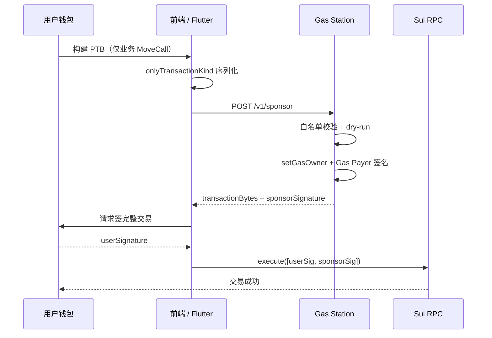

<!--
  Copyright (c) 2026 zouyc zouyccq@gmail.com.
  All rights reserved.

  Licensed under the Business Source License 1.1 (BSL 1.1).
  You may not use this file except in compliance with the License.

  Change Date: 2031-01-01
  On the Change Date, or the fourth anniversary of the first publicly available
  distribution of the code under the BSL, whichever comes first, the code
  automatically becomes available under the Apache License 2.0.
-->

# Gas Station 赞助服务实现说明

> PRD §11.3.6 · Phase 4  
> 相关文档：[services/gas-station/README.md](../services/gas-station/README.md) · [phase4-services.md](./phase4-services.md) · [services-testnet-runbook.md](./services-testnet-runbook.md)

Gas Station 是 **Sui 赞助交易（Sponsored Transactions）** 的链下实现：协议用服务端持有的 **Gas Payer 钱包** 代付 SUI Gas，用户钱包只签业务部分（USDC 转账、Prophet commit/unlock 等）。用户侧仅看到 USDC 变动，无需自己准备 SUI。

---

## 1. 整体架构

| 组件 | 位置 | 职责 |
| --- | --- | --- |
| Gas Payer 钱包 | 服务端密钥库 | 持有 SUI，作为 `gasOwner` 签署 gas 部分 |
| Sponsor API | `services/gas-station/` | 白名单校验 → 组装完整 PTB → dry-run → Gas Payer 签名 |
| Web App | `app/src/lib/gas-station.ts` + `useSponsoredTransaction` | 构建 PTB → 请求赞助 → 用户签 → 广播 |
| Flutter App | `gas_station_service.dart` + `AppController` | 同上，经 Phantom 双签后 RPC 执行 |

**无法用纯前端或纯链上合约替代**：Gas Payer 私钥必须留在服务端（PRD §11.3.6）。

---

## 2. 端到端流程

```
用户钱包构建 PTB（仅业务 MoveCall）
        ↓
onlyTransactionKind 序列化为 BCS bytes
        ↓
POST /v1/sponsor { transactionKindBcs, sender }
        ↓
服务端：白名单校验 → setGasOwner + setGasPayment → dry-run → Gas Payer 签名
        ↓
返回 { transactionBytes, sponsorSignature, gasOwner }
        ↓
用户钱包签完整交易 bytes（authority）
        ↓
executeTransactionBlock([userSignature, sponsorSignature])
        ↓
链上执行成功
```



核心机制是 Sui 的 **双签模型**：

- **`sender`** 签 authority（业务意图）
- **`gasOwner`** 签 gas 数据（谁付 Gas、用哪些 coin）

---

## 3. 服务端实现

代码目录：`services/gas-station/src/`

### 3.1 HTTP API

`server.ts` 暴露两个端点：

| 端点 | 方法 | 说明 |
| --- | --- | --- |
| `/v1/sponsor` | POST | 赞助主流程 |
| `/health` | GET | 检查 Gas Payer 配置与余额 |

附加能力：

- 按 `sender` 地址 **速率限制**（默认 30 次/分钟，环境变量 `SPONSOR_RATE_LIMIT_PER_MIN`）
- Gas 余额低于阈值时 **Webhook 告警**（`ALERT_WEBHOOK_URL`）
- CORS 支持（生产环境须显式配置 `CORS_ORIGIN`，禁止 `*`）

请求体示例：

```json
{
  "transactionKindBcs": "<base64>",
  "sender": "0x..."
}
```

响应体示例：

```json
{
  "transactionBytes": "<base64>",
  "sponsorSignature": "<base64>",
  "gasOwner": "0x..."
}
```

### 3.2 赞助核心逻辑（`sponsor.ts`）

步骤：

1. 从 `GAS_PAYER_PRIVATE_KEY` 加载 Ed25519 Gas Payer keypair
2. 用客户端传来的 **TransactionKind** 重建 PTB
3. 注入 `sender`、`gasOwner`、`gasPayment`（从 Gas Payer 账户选取 SUI coin）
4. **白名单校验**（见 §4）
5. **dry-run** 模拟执行，失败则拒绝
6. Gas Payer 对完整交易签名并返回

Gas coin 选取：从 Gas Payer 账户中筛选余额 ≥ 0.05 SUI 的 coin，取余额最大者作为主 gas coin。

关键代码路径：

```typescript
// services/gas-station/src/sponsor.ts
const tx = Transaction.fromKind(kindBytes);
tx.setSender(req.sender);
tx.setGasOwner(gasOwner);
tx.setGasPayment(await pickGasCoins(client, gasOwner));

const built = await tx.build({ client });
// validateTransactionData(...) → dryRun → gasPayer.signTransaction(built)
```

### 3.3 健康检查（`health.ts`）

`GET /health` 返回：

| 字段 | 说明 |
| --- | --- |
| `ok` | 配置与余额是否正常 |
| `gasOwner` | Gas Payer 地址 |
| `gasBalanceMist` | 当前 SUI 余额 |
| `gasBalanceLow` | 是否低于 `GAS_MIN_BALANCE_MIST`（默认 0.5 SUI） |
| `errors` | 错误列表 |

余额不足或密钥缺失时 `ok: false`，HTTP 503。

### 3.4 配置（`config.ts`）

| 环境变量 | 说明 |
| --- | --- |
| `GAS_PAYER_PRIVATE_KEY` | Gas Payer 私钥（生产必填） |
| `PACKAGE_ID` | 白名单包 ID（生产必填） |
| `GAS_STATION_PRODUCTION` | `true` 时强制密钥 + 非 `*` CORS |
| `SUI_RPC_URL` / `SUI_NETWORK` | RPC 与网络 |
| `PORT` | 默认 8787 |
| `GAS_MIN_BALANCE_MIST` | 余额告警阈值，默认 500000000（0.5 SUI） |
| `SPONSOR_RATE_LIMIT_PER_MIN` | 每 sender 每分钟上限，默认 30 |
| `ALERT_WEBHOOK_URL` | 低余额 Webhook |
| `CORS_ORIGIN` | 允许的前端 Origin |

---

## 4. 白名单安全（`whitelist.ts`）

只允许 **纯 MoveCall** 命令；非 MoveCall 一律拒绝。若配置了 `PACKAGE_ID`，MoveCall 的 package 必须匹配。

### 4.1 MVP 白名单

| 模块 | 函数 | 额外限制 |
| --- | --- | --- |
| `prophet_registry` | `commit_private_prophecy` | 仅 `unlock_price = 0`（第 6 个 pure u64 参数） |
| `prophet_registry` | `unlock_prophecy` | — |
| `prophet_registry` | `audit_prophecy` | — |
| `pool` | `buy_poisson_interval` | 市场买入（可选赞助） |
| `pool` | `buy_dirichlet_outcome` | 同上 |
| `pool` | `buy_normal_digital` | 同上 |
| `pool` | `buy_normal_interval` | 同上 |

`commit_private_prophecy` 的 `unlock_price = 0` 限制与链上 **付费开通门槛**（PRD §11.3.7）配合：新预言家须先发布免费预测积累战绩，Gas Station 也只赞助免费 commit，避免滥用。

### 4.2 校验失败示例

- `empty transaction`
- `only MoveCall commands are allowed`
- `package mismatch: 0x...`
- `move call not whitelisted: module::function`
- `unlock_price N not allowed for sponsored commit`
- `dry-run: <链上错误>`

---

## 5. 客户端集成

### 5.1 Web（Next.js）

**配置：** `app/.env.local`

```env
NEXT_PUBLIC_GAS_STATION_URL=http://localhost:8787
```

**库：** `app/src/lib/gas-station.ts`

- `buildTransactionKind(tx, client, sender)` — `onlyTransactionKind: true` 构建 BCS
- `requestSponsor(kindBytes, sender)` — 调用 `POST /v1/sponsor`

**Hook：** `app/src/hooks/useSponsoredTransaction.ts`

流程：

1. 构建 TransactionKind bytes
2. 请求 Gas Station 赞助
3. 用户钱包签完整 `transactionBytes`
4. 合并 `[userSignature, sponsorSignature]`（若 sender ≠ gasOwner）
5. `executeTransactionBlock` 广播

**使用场景：** `app/src/app/prophet/page.tsx` — 发布预测、解锁等。配置了 Gas Station URL 时优先走赞助；失败或未配置时回退到用户自付 Gas（`signAndExecute`）。

### 5.2 Flutter（Phantom 钱包）

**配置：** `SuiConfig.gasStationUrl`（见 `mobile/x_market_flutter/lib/src/sui_config.dart`）

**服务：** `GasStationService`

- `checkHealth()` — `GET /health`
- `requestSponsor(transactionKindBase64, sender)` — `POST /v1/sponsor`

**编排：** `AppController.submitChainTx`

1. 构建 `PendingBuyTransaction`（含 `transactionKindBase64`）
2. 若 Gas Station 可用且健康，调用 `requestSponsor`
3. `withSponsor()` 替换为完整 bytes + 赞助签名
4. 切换 Phantom 为 **仅签名** 模式（`PhantomSubmitMode.signOnly`）

**双签广播：** `phantom_wallet_controller.dart` 在回调中合并签名：

```dart
final signatures = <String>[userSignature];
if (sponsor != null && gasOwner != sender) {
  signatures.add(sponsor);
}
await _tx.executeWithSignatures(txBytesBase64: pending, signatures: signatures);
```

赞助失败时 **降级为自付 Gas**，不阻塞交易。

### 5.3 E2E 脚本

`app/scripts/e2e-commit.ts` 与 `services/gas-station/scripts/test-sponsor.mjs` 可用于本地验证赞助流程。

---

## 6. 部署与运维

### 6.1 本地启动

```bash
cd services/gas-station
npm install
export GAS_PAYER_PRIVATE_KEY=suiprivkey1...
export PACKAGE_ID=<NEXT_PUBLIC_PACKAGE_ID>
export SUI_RPC_URL=https://fullnode.testnet.sui.io
npm run dev
```

或使用仓库脚本：

```powershell
.\scripts\bootstrap-services-env.ps1
.\scripts\start-services-testnet.ps1
.\scripts\verify-services-health.ps1
```

### 6.2 Docker

`docker-compose.services.yml` 中 `gas-station` 服务：

- 端口：**8787**
- 环境文件：`services/gas-station/.env.local`
- 健康检查：`GET /health`
- `chain-monitor` 依赖其 `service_healthy`

### 6.3 资金与监控

- `scripts/check-gas-balances.ps1` — 检查 Gas Payer 余额
- `scripts/fund-gas-payer-testnet.ps1` — Testnet 充值
- 服务端定时轮询余额，低于阈值写日志并可选 Webhook

---

## 7. 设计要点总结

| 要点 | 说明 |
| --- | --- |
| 链下 Gas Payer + 链上双签 | 符合 Sui 原生赞助交易模型，用户无需持有 SUI |
| 白名单 + dry-run | 签名前严格限制可赞助的 MoveCall，防止私钥被滥用 |
| 免费 commit 优先赞助 | 仅 `unlock_price = 0` 的 `commit_private_prophecy` 可赞助 commit |
| 付费 unlock 仍可赞助 | `unlock_prophecy` 在白名单内；付费开通门槛由链上 `paid_unlock_eligible` 强制 |
| 优雅降级 | Web/Flutter 在 Gas Station 未配置或不可用时，走常规自付 Gas 路径 |

---

## 8. 相关代码索引

| 路径 | 说明 |
| --- | --- |
| `services/gas-station/src/server.ts` | HTTP 入口 |
| `services/gas-station/src/sponsor.ts` | 赞助逻辑 |
| `services/gas-station/src/whitelist.ts` | PTB 白名单校验 |
| `services/gas-station/src/health.ts` | 健康检查 |
| `services/gas-station/src/config.ts` | 环境变量加载 |
| `app/src/lib/gas-station.ts` | Web 客户端 API |
| `app/src/hooks/useSponsoredTransaction.ts` | Web React Hook |
| `mobile/x_market_flutter/lib/src/services/gas_station_service.dart` | Flutter 客户端 |
| `mobile/x_market_flutter/lib/src/app/app_controller.dart` | Flutter 赞助编排 |
| `mobile/x_market_flutter/lib/src/wallet/phantom_wallet_controller.dart` | Phantom 双签执行 |
