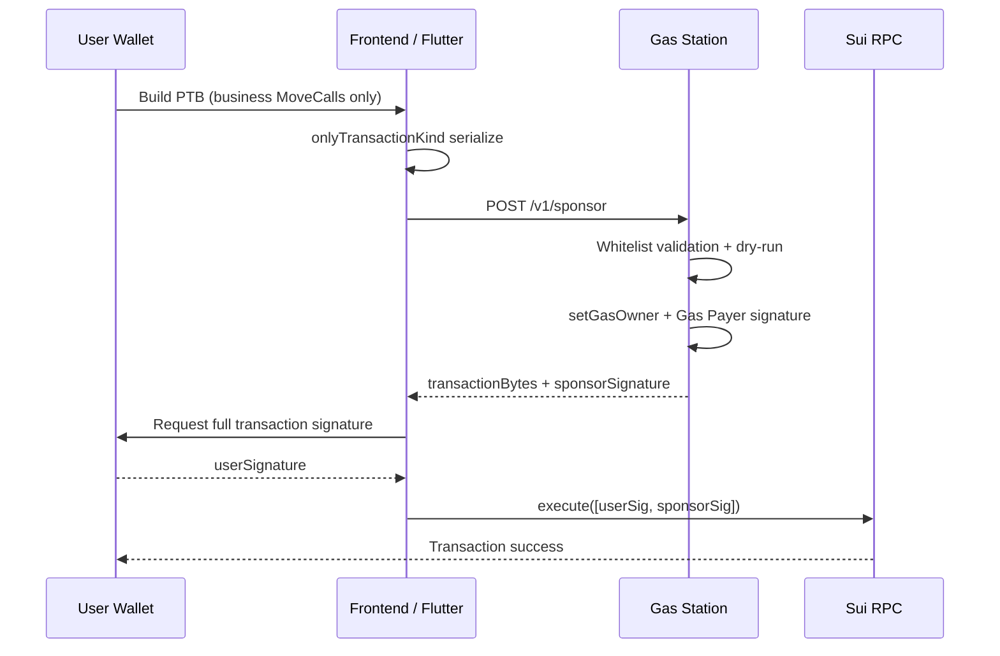

<!--
  Copyright (c) 2026 zouyc zouyccq@gmail.com.
  All rights reserved.

  Licensed under the Business Source License 1.1 (BSL 1.1).
  You may not use this file except in compliance with the License.

  Change Date: 2031-01-01
  On the Change Date, or the fourth anniversary of the first publicly available
  distribution of the code under the BSL, whichever comes first, the code
  automatically becomes available under the Apache License 2.0.
-->

**English** | [简体中文](./gas-station-implementation.zh.md)

# Gas Station Sponsorship Service Implementation

> PRD §11.3.6 · Phase 4  
> Related: [services/gas-station/README.md](../services/gas-station/README.md) · [phase4-services.md](./phase4-services.md) · [services-testnet-runbook.md](./services-testnet-runbook.md)

Gas Station is the off-chain implementation of **Sui Sponsored Transactions**: the protocol uses a server-held **Gas Payer wallet** to pay SUI Gas on behalf of users; the user wallet only signs the business portion (USDC transfers, Prophet commit/unlock, etc.). Users only see USDC changes and do not need to hold SUI.

---

## 1. Overall Architecture

| Component | Location | Responsibility |
| --- | --- | --- |
| Gas Payer wallet | Server key store | Holds SUI, signs gas portion as `gasOwner` |
| Sponsor API | `services/gas-station/` | Whitelist validation → assemble full PTB → dry-run → Gas Payer signature |
| Web App | `app/src/lib/gas-station.ts` + `useSponsoredTransaction` | Build PTB → request sponsorship → user signs → broadcast |
| Flutter App | `gas_station_service.dart` + `AppController` | Same flow, dual-sign via Phantom then RPC execute |

**Cannot be replaced by pure frontend or pure on-chain contract**: Gas Payer private key must remain on the server (PRD §11.3.6).

---

## 2. End-to-end Flow

```
User wallet builds PTB (business MoveCalls only)
        ↓
onlyTransactionKind serialized to BCS bytes
        ↓
POST /v1/sponsor { transactionKindBcs, sender }
        ↓
Server: whitelist validation → setGasOwner + setGasPayment → dry-run → Gas Payer signature
        ↓
Returns { transactionBytes, sponsorSignature, gasOwner }
        ↓
User wallet signs full transaction bytes (authority)
        ↓
executeTransactionBlock([userSignature, sponsorSignature])
        ↓
On-chain execution succeeds
```



Core mechanism is Sui's **dual-signature model**:

- **`sender`** signs authority (business intent)
- **`gasOwner`** signs gas data (who pays Gas, which coins)

---

## 3. Server Implementation

Code directory: `services/gas-station/src/`

### 3.1 HTTP API

`server.ts` exposes two endpoints:

| Endpoint | Method | Description |
| --- | --- | --- |
| `/v1/sponsor` | POST | Main sponsorship flow |
| `/health` | GET | Check Gas Payer config and balance |

Additional capabilities:

- **Rate limiting** per `sender` address (default 30/min, env `SPONSOR_RATE_LIMIT_PER_MIN`)
- **Webhook alerts** when Gas balance below threshold (`ALERT_WEBHOOK_URL`)
- CORS support (production must set explicit `CORS_ORIGIN`, no `*`)

Request body example:

```json
{
  "transactionKindBcs": "<base64>",
  "sender": "0x..."
}
```

Response body example:

```json
{
  "transactionBytes": "<base64>",
  "sponsorSignature": "<base64>",
  "gasOwner": "0x..."
}
```

### 3.2 Sponsorship Core Logic (`sponsor.ts`)

Steps:

1. Load Ed25519 Gas Payer keypair from `GAS_PAYER_PRIVATE_KEY`
2. Rebuild PTB from client **TransactionKind**
3. Inject `sender`, `gasOwner`, `gasPayment` (select SUI coin from Gas Payer account)
4. **Whitelist validation** (see §4)
5. **dry-run** simulation; reject on failure
6. Gas Payer signs full transaction and returns

Gas coin selection: filter coins ≥ 0.05 SUI from Gas Payer account, use largest balance as primary gas coin.

Key code path:

```typescript
// services/gas-station/src/sponsor.ts
const tx = Transaction.fromKind(kindBytes);
tx.setSender(req.sender);
tx.setGasOwner(gasOwner);
tx.setGasPayment(await pickGasCoins(client, gasOwner));

const built = await tx.build({ client });
// validateTransactionData(...) → dryRun → gasPayer.signTransaction(built)
```

### 3.3 Health Check (`health.ts`)

`GET /health` returns:

| Field | Description |
| --- | --- |
| `ok` | Config and balance healthy |
| `gasOwner` | Gas Payer address |
| `gasBalanceMist` | Current SUI balance |
| `gasBalanceLow` | Below `GAS_MIN_BALANCE_MIST` (default 0.5 SUI) |
| `errors` | Error list |

Returns `ok: false`, HTTP 503 when balance insufficient or key missing.

### 3.4 Configuration (`config.ts`)

| Env Variable | Description |
| --- | --- |
| `GAS_PAYER_PRIVATE_KEY` | Gas Payer private key (required in production) |
| `PACKAGE_ID` | Whitelist package ID (required in production) |
| `GAS_STATION_PRODUCTION` | `true` enforces key + non-`*` CORS |
| `SUI_RPC_URL` / `SUI_NETWORK` | RPC and network |
| `PORT` | Default 8787 |
| `GAS_MIN_BALANCE_MIST` | Low-balance alert threshold, default 500000000 (0.5 SUI) |
| `SPONSOR_RATE_LIMIT_PER_MIN` | Per-sender per-minute limit, default 30 |
| `ALERT_WEBHOOK_URL` | Low-balance webhook |
| `CORS_ORIGIN` | Allowed frontend Origin |

---

## 4. Whitelist Security (`whitelist.ts`)

Only **pure MoveCall** commands allowed; non-MoveCall rejected. If `PACKAGE_ID` is set, MoveCall package must match.

### 4.1 MVP Whitelist

| Module | Function | Extra Constraint |
| --- | --- | --- |
| `prophet_registry` | `commit_private_prophecy` | Only `unlock_price = 0` (6th pure u64 arg) |
| `prophet_registry` | `unlock_prophecy` | — |
| `prophet_registry` | `audit_prophecy` | — |
| `pool` | `buy_poisson_interval` | Market buy (optional sponsorship) |
| `pool` | `buy_dirichlet_outcome` | Same |
| `pool` | `buy_normal_digital` | Same |
| `pool` | `buy_normal_interval` | Same |

`commit_private_prophecy` `unlock_price = 0` restriction pairs with on-chain **paid unlock eligibility** (PRD §11.3.7): new prophets must publish free predictions to build stats; Gas Station only sponsors free commits to prevent abuse.

### 4.2 Validation Failure Examples

- `empty transaction`
- `only MoveCall commands are allowed`
- `package mismatch: 0x...`
- `move call not whitelisted: module::function`
- `unlock_price N not allowed for sponsored commit`
- `dry-run: <on-chain error>`

---

## 5. Client Integration

### 5.1 Web (Next.js)

**Config:** `app/.env.local`

```env
NEXT_PUBLIC_GAS_STATION_URL=http://localhost:8787
```

**Library:** `app/src/lib/gas-station.ts`

- `buildTransactionKind(tx, client, sender)` — build BCS with `onlyTransactionKind: true`
- `requestSponsor(kindBytes, sender)` — call `POST /v1/sponsor`

**Hook:** `app/src/hooks/useSponsoredTransaction.ts`

Flow:

1. Build TransactionKind bytes
2. Request Gas Station sponsorship
3. User wallet signs full `transactionBytes`
4. Merge `[userSignature, sponsorSignature]` (if sender ≠ gasOwner)
5. `executeTransactionBlock` broadcast

**Usage:** `app/src/app/prophet/page.tsx` — publish prediction, unlock, etc. Uses sponsorship when Gas Station URL configured; falls back to self-paid Gas (`signAndExecute`) on failure or when not configured.

### 5.2 Flutter (Phantom Wallet)

**Config:** `SuiConfig.gasStationUrl` (see `mobile/x_market_flutter/lib/src/sui_config.dart`)

**Service:** `GasStationService`

- `checkHealth()` — `GET /health`
- `requestSponsor(transactionKindBase64, sender)` — `POST /v1/sponsor`

**Orchestration:** `AppController.submitChainTx`

1. Build `PendingBuyTransaction` (includes `transactionKindBase64`)
2. If Gas Station available and healthy, call `requestSponsor`
3. `withSponsor()` replaces with full bytes + sponsor signature
4. Switch Phantom to **sign-only** mode (`PhantomSubmitMode.signOnly`)

**Dual-sign broadcast:** `phantom_wallet_controller.dart` merges signatures in callback:

```dart
final signatures = <String>[userSignature];
if (sponsor != null && gasOwner != sender) {
  signatures.add(sponsor);
}
await _tx.executeWithSignatures(txBytesBase64: pending, signatures: signatures);
```

Falls back to **self-paid Gas** on sponsorship failure without blocking the transaction.

### 5.3 E2E Scripts

`app/scripts/e2e-commit.ts` and `services/gas-station/scripts/test-sponsor.mjs` can verify sponsorship locally.

---

## 6. Deployment & Operations

### 6.1 Local Startup

```bash
cd services/gas-station
npm install
export GAS_PAYER_PRIVATE_KEY=suiprivkey1...
export PACKAGE_ID=<NEXT_PUBLIC_PACKAGE_ID>
export SUI_RPC_URL=https://fullnode.testnet.sui.io
npm run dev
```

Or use repo scripts:

```powershell
.\scripts\bootstrap-services-env.ps1
.\scripts\start-services-testnet.ps1
.\scripts\verify-services-health.ps1
```

### 6.2 Docker

`docker-compose.services.yml` `gas-station` service:

- Port: **8787**
- Env file: `services/gas-station/.env.local`
- Health check: `GET /health`
- `chain-monitor` depends on `service_healthy`

### 6.3 Funding & Monitoring

- `scripts/check-gas-balances.ps1` — check Gas Payer balance
- `scripts/fund-gas-payer-testnet.ps1` — Testnet refill
- Server polls balance periodically; logs and optional webhook below threshold

---

## 7. Design Summary

| Point | Description |
| --- | --- |
| Off-chain Gas Payer + on-chain dual-sign | Native Sui sponsored transaction model; users need not hold SUI |
| Whitelist + dry-run | Strict MoveCall limits before signing to prevent key abuse |
| Free commit sponsorship priority | Only `unlock_price = 0` `commit_private_prophecy` eligible for commit sponsorship |
| Paid unlock still sponsored | `unlock_prophecy` whitelisted; paid unlock gate enforced on-chain via `paid_unlock_eligible` |
| Graceful degradation | Web/Flutter use self-paid Gas when Gas Station unavailable or not configured |

---

## 8. Code Index

| Path | Description |
| --- | --- |
| `services/gas-station/src/server.ts` | HTTP entry |
| `services/gas-station/src/sponsor.ts` | Sponsorship logic |
| `services/gas-station/src/whitelist.ts` | PTB whitelist validation |
| `services/gas-station/src/health.ts` | Health check |
| `services/gas-station/src/config.ts` | Env loading |
| `app/src/lib/gas-station.ts` | Web client API |
| `app/src/hooks/useSponsoredTransaction.ts` | Web React Hook |
| `mobile/x_market_flutter/lib/src/services/gas_station_service.dart` | Flutter client |
| `mobile/x_market_flutter/lib/src/app/app_controller.dart` | Flutter sponsorship orchestration |
| `mobile/x_market_flutter/lib/src/wallet/phantom_wallet_controller.dart` | Phantom dual-sign execute |
