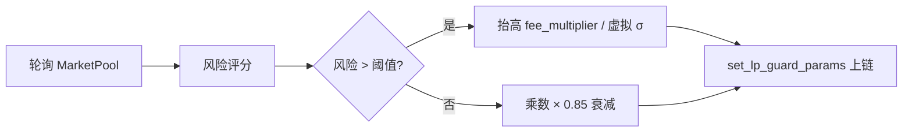

<!--
  Copyright (c) 2026 zouyc zouyccq@gmail.com.
  All rights reserved.

  Licensed under the Business Source License 1.1 (BSL 1.1).
  You may not use this file except in compliance with the License.

  Change Date: 2031-01-01
  On the Change Date, or the fourth anniversary of the first publicly available
  distribution of the code under the BSL, whichever comes first, the code
  automatically becomes available under the Apache License 2.0.
-->

**简体中文** | [English](./iv-lp-guard-and-vol-crush-explained.md)

# IV / LP Guard 与 Vol Crush — 详细说明

> **版本：** v1.0 · **日期：** 2026-06-20  
> **类型：** 本地归档（对话整理）  
> **范围：** IV / LP Guard 面板、链上防守机制、LP Guard Keeper 风控、Vol Crush 数学含义  
> **关联：** [phase2-playbook.zh.md](./phase2-playbook.zh.md) · [trading-fee-bps-explained.zh.md](./trading-fee-bps-explained.zh.md) · [mainnet-governance-params.zh.md](./mainnet-governance-params.zh.md) · [qa.zh.md](./qa.zh.md) · [glossary.zh.md](./glossary.zh.md)

---

## 摘要

在 X-Market Sui 中，前端市场页 `/markets/[id]` 的 **IV / LP Guard 面板**把两件事组合展示：

- **IV（隐含波动率）**：链下 Indexer 对池子「不确定性」的观测与可视化
- **LP Guard**：链上 Phase 2 的 LP 防守机制，保护做市商免受逆向选择与末期套利

二者相关但不相同：IV 偏**观测**，LP Guard 偏**执行**。**Vol Crush** 则是 Indexer 用时间衰减模型刻画「临近到期不确定性塌缩」的指标，公式为 `vol_crush_bps = IV × √τ × 100`，仅用于展示，不直接改链上定价。

---

## 第一部分：IV / LP Guard 详细解释

### 1. 为什么需要 LP Guard？

参数化 AMM 里，LP 承担的是「承保人」角色：赚滑点和手续费，但可能被知情交易者定向收割。

| 风险 | 表现 |
| --- | --- |
| 单边砸盘 | μ/λ/α 在短时间内被连续同向推高/压低 |
| 逆向选择 | 内幕消息者赶在结果公布前大额建仓 |
| 末期套利 | 结果几乎确定后仍有人买入，或 LP 在 T2 阶段「白嫖」进场 |
| 信息差夹子 | 现实世界结果已出，链上仍可交易的几百毫秒窗口 |

项目用三套链上机制应对（见 [qa.zh.md](./qa.zh.md) §四）：

1. **动态费率** — 风险升高时抬高交易成本
2. **虚拟流动性** — 人为加宽分布，增大滑点
3. **时间窗口锁** — 末期禁买、禁申购

---

### 2. LP Guard 的五项链上参数

`MarketPool` 上由 `pool::set_lp_guard_params` 设置（仅 **Pool Authority** 可调用）：

| 参数 | 链上字段 | 作用 |
| --- | --- | --- |
| 动态费率乘数 | `fee_multiplier_bps` | 在基础费率上叠加加成 |
| 虚拟波动率 | `sigma_virtual_tenths` | Normal 池定价时 σ 额外 +N/10 |
| 虚拟浓度 | `concentration_virtual` | Dirichlet 池每个 α 均 +N，概率向均值回归 |
| T2 禁申购 | `deposit_cutoff_bps` | 生命周期末段禁止 `deposit_liquidity` |
| 结算时间锁 | `resolution_window_ts` | 到期前 N 秒内禁止一切 `buy_*` |

#### 2.1 动态费率

链上实现（`sources/lp_guard.move`）：

```
有效费率 = fee_bps × (10_000 + fee_multiplier_bps) / 10_000
```

每笔 `buy_*` 都会：

1. 算有效费率 `fee_eff`
2. 从用户支付中扣费，净额进入定价逻辑，手续费留在 Vault 归 LP

**示例：** 基础 200 bps + 乘数 30000（+300%）→ 有效 800 bps（8%，主网上限）。

#### 2.2 虚拟流动性

**Normal 池**：定价用 `σ_eff = σ + σ_virtual`。σ 越大，同样 stake 对 μ 的冲击越小 → 滑点更大，套利成本更高。

**Dirichlet 池**：用 `dirichlet_prob_with_virtual` 给每个 outcome 的 α 加虚拟浓度，使概率更均匀：

```
P_i = (α_i + v) / (Σα + n·v)
```

#### 2.3 时间窗口

**结算时间锁**（禁买）：若 `maturity_ts - now_ts ≤ resolution_window_ts`，所有 `buy_*` revert。

**T2 禁申购**（禁 LP 进场）：在生命周期最后 `deposit_cutoff_bps / 100%` 时段内，拒绝 `deposit_liquidity`，防止末期「秃鹫 LP」白嫖。

---

### 3. LP Guard Keeper：自动风控

链上只存参数；**自动检测风险并调参**由链下服务 `services/lp-guard-keeper/` 完成（默认 30s 轮询，健康检查端口 8788）。



#### 3.1 风险评分模型

Keeper 维护最近 N 个快照（默认 10 个），计算三项信号：

| 信号 | 权重 | 含义 |
| --- | --- | --- |
| 参数漂移 | 40% | 窗口内 μ/λ/α 变化幅度 |
| 单边偏度 | 35% | 连续同向更新，或 Dirichlet 最大 α 占比偏离均匀 |
| 成交量冲击 | 25% | `collateral_usdc` 增量相对 EMA |

综合风险分：

```
riskScore = drift×0.4 + skew×0.35 + volume×0.25    （∈ [0, 1]）
```

#### 3.2 目标参数映射

- `riskScore > 0.05`：线性抬高有效费率，最高 800 bps；同步抬高 `sigma_virtual` / `concentration_virtual`
- `riskScore ≤ 0.05`：费率乘数每 tick × **0.85** 平滑衰减
- 只有变化超过阈值（费率乘数 ≥ 200 bps 等）才真正发链上交易，避免频繁更新

Keeper 密钥必须等于池子的 `authority`，否则无法调用 `set_lp_guard_params`。

---

### 4. IV（隐含波动率）是什么？

IV 不是链上合约字段，而是 **Indexer 链下计算** 的观测指标，写入 `iv_history` 表，供前端 `IvPanel` 展示。

计算逻辑（`services/indexer/src/chain/parse.ts`）：

| 指标 | 含义 |
| --- | --- |
| `iv_tenths` | 隐含波动率代理（Normal 用 σ_eff；Poisson 用 max(4λ, σ_eff)；Dirichlet 下限 30） |
| `tau_bps` | 剩余生命周期比例 τ = (T−t)/(T−T₀)，10000 = 100% |
| `vol_crush_bps` | Vol Crush 代理：IV × √τ × 100 |
| `sigma_eff_tenths` | 基础 σ + 虚拟 σ（LP Guard 效果直接体现在这里） |

**与交易行为的关系：**

- 买 Straddle（跨式）等波动率产品 → 链上直接推高 σ
- 临近到期且无新信息 → Vol Crush，σ 应加速收敛
- LP Guard 抬高 `sigma_virtual` → `sigma_eff` 上升 → IV 面板同步反映

IV 面板**不控制**定价，只做监控；真正影响定价的是链上 `sigma_tenths` + `sigma_virtual_tenths`。

---

### 5. 前端 IV / LP Guard 面板

`app/src/components/IvPanel.tsx` 展示：

**链上实时（RPC 读池）：**

- 基础 σ / 虚拟 σ / 有效 σ
- 基础费率 / 费率乘数 / 有效费率

**Indexer 历史（若启用）：**

- Vol Crush 柱状图（最近 48 个采样点）
- 最新 IV、τ、vol_crush_bps

---

### 6. 完整交易路径中的 LP Guard

每笔 `buy_*` 的调用链大致为：

```
assert_buy_window_open()          ← 结算时间锁
  → effective_fee_bps()           ← 动态费率
  → net_stake_after_fee()         ← 扣费
  → 定价（σ + σ_virtual 或 dirichlet_prob_with_virtual）
  → risk::assert_max_loss_bounded ← Max-Loss 检查
  → 更新池参数 + 铸 Position
```

`deposit_liquidity` 额外经过 `assert_deposit_window_open()`（T2 禁申购）。

---

### 7. 治理参数速查

| 参数 | 主网基线 |
| --- | --- |
| 有效费率上限 | 800 bps (8%) |
| 费率乘数上限 | 30000 (+300%) |
| 虚拟 σ 上限 | 20 tenths (2.0) |
| 虚拟浓度上限 | 50 |
| Keeper 轮询 | 30s |
| 衰减系数 | 0.85 |
| 更新阈值 | 200 bps |

详见 [mainnet-governance-params.zh.md](./mainnet-governance-params.zh.md)、[trading-fee-bps-explained.zh.md](./trading-fee-bps-explained.zh.md)。

---

### 8. IV / LP Guard 一句话总结

**IV / LP Guard** = **观测不确定性（IV + Vol Crush）** + **执行 LP 防守（动态费率、虚拟流动性、时间锁）**。

- IV 告诉你池子「有多慌」、时间衰减是否在发生
- LP Guard 在风险升高时自动「抬价、加滑点、锁窗口」，把逆向选择成本转回给 LP

手动调参可用 `scripts/set-lp-guard.ps1`；生产环境由 LP Guard Keeper 自动运行（`LP_GUARD_DRY_RUN=false` 后才会真正上链）。

---

## 第二部分：Vol Crush 的数学含义

### 1. 直觉：「到期前不确定性塌缩」

预测市场有**硬性到期日** \(T\)（`maturity_ts`）。在 \(t < T\) 时，结果仍不确定，分布有宽度（Normal 的 \(\sigma\)、Poisson 的 \(\lambda\) 等）；到 \(T\) 结算后，结果变成**单点**，宽度应归零。

**Vol Crush（波动率碾压 / 方差塌缩）** 描述的就是这个过程：随着剩余时间 \(\tau \to 0\)，若**没有重大新信息**涌入，市场隐含的不确定性应快速收敛。

传统期权里，财报/大选前 IV 很高，事件落地后 IV「被碾平」——预测市场里，机制类似，但驱动因素是**时间终点**而非单一事件公告。

---

### 2. 项目里的符号定义

Indexer 在 `computeIvMetrics` 中计算（链下观测，**不直接改链上定价**）：

| 符号 | 含义 |
| --- | --- |
| \(T_0\) | 池创建时刻 `created_ts` |
| \(T\) | 到期时刻 `maturity_ts` |
| \(t\) | 当前时刻 `nowSec` |
| \(\tau\) | 归一化剩余生命周期：\(\displaystyle\tau = \frac{T - t}{T - T_0} \in [0, 1]\) |
| IV | 隐含波动率代理 `iv_tenths` |
| vol_crush_bps | Vol Crush 指标 |

---

### 3. 核心公式

\[
\boxed{\text{vol\_crush\_bps} = \text{IV} \times \sqrt{\tau} \times 100}
\]

等价地，把「时间调整后仍有效的波动宽度」写成：

\[
\sigma_{\text{crush}} \;\propto\; \text{IV} \times \sqrt{\tau}
\]

#### 3.1 为什么用 \(\sqrt{\tau}\)？

来自随机过程的标准结论：若信息以近似恒定速率到达（类似布朗运动的扩散），**剩余时间 \(\tau\) 内可积累的方差**与 \(\tau\) 成正比：

\[
\mathrm{Var}_{\text{remaining}} \;\propto\; \sigma^2 \cdot \tau
\]

因此**剩余标准差**（分布还能「跑多远」）：

\[
\sigma_{\text{remaining}} \;\propto\; \sigma \cdot \sqrt{\tau}
\]

含义：

- \(\tau = 1\)（刚开盘）：\(\sqrt{\tau}=1\)，Vol Crush 取全量 IV
- \(\tau = 0.25\)（还剩 1/4 生命周期）：宽度缩为原来的 \(\sqrt{0.25}=50\%\)
- \(\tau \to 0\)（临近到期）：\(\sqrt{\tau}\to 0\)，Vol Crush **收敛到 0**

\(\sqrt{\tau}\) 是金融里「恒定年化波动率 + 剩余期限」的常见近似，介于线性衰减 \(\sigma \cdot \tau\) 与方差衰减 \(\sigma \cdot \tau^2\) 之间。

#### 3.2 数值例子

设 Normal 池 \(\sigma_{\text{eff}} = 50\) tenths（即 5.0），无虚拟 σ：

| 剩余生命周期 \(\tau\) | \(\sqrt{\tau}\) | vol_crush_bps |
| --- | --- | --- |
| 100% | 1.00 | 5000 |
| 50% | 0.71 | 3536 |
| 25% | 0.50 | 2500 |
| 10% | 0.32 | 1581 |
| 1% | 0.10 | 500 |
| 0% | 0 | 0 |

前端 IvPanel 柱状图高度正比于 `vol_crush_bps`；柱高随到期临近而下降，即「Crush 曲线」。

---

### 4. IV（`iv_tenths`）怎么来？

Vol Crush 的「振幅」由 IV 决定，不同池型代理不同：

\[
\text{IV} = \begin{cases}
\sigma_{\text{eff}} = \sigma + \sigma_{\text{virtual}} & \text{Normal} \\
\max(4\lambda,\; \sigma_{\text{eff}}) & \text{Poisson} \\
\max(30,\; \sigma_{\text{eff}}) & \text{Dirichlet}
\end{cases}
\]

- **Normal**：IV 就是有效标准差（含 LP Guard 虚拟 σ）
- **Poisson**：用 \(\lambda\) 刻画计数不确定性（\(\lambda\) 越大，分布越散）
- **Dirichlet**：设下限 30 tenths，避免多结果池 IV 过小

IV 反映**当前链上状态**；\(\sqrt{\tau}\) 反映**时间还剩多少**；两者相乘得到「到期视角下还剩多少不确定性」。

---

### 5. 与链上 \(\sigma\) 的关系（重要区分）

| | 链上 `sigma_tenths` | Indexer `vol_crush_bps` |
| --- | --- | --- |
| 是否参与定价 | ✅ 每笔 `buy_*` 直接用 | ❌ 仅展示 |
| 是否随时间自动衰减 | ❌ 只有交易/LP Guard 才改 | ✅ 每采样点按 \(\sqrt{\tau}\) 重算 |
| 用途 | AMM 积分、滑点、变价 | IvPanel 曲线、风控观测 |

因此：

- **理论上的 Vol Crush**：\(\sigma(t)\) 应随 \(\tau \downarrow\) 而塌缩
- **当前实现**：链上 \(\sigma\) **不会**自动乘 \(\sqrt{\tau}\)；Indexer 用公式**模拟**「若 IV 不变，时间衰减后还剩多少不确定性」

若临近到期 \(\sigma\) 仍很高（大量 Straddle 买入、单边砸盘），IV 大 → Vol Crush 仍高，说明**时间衰减被交易抬 σ 抵消**——这正是面板要暴露的信号。

---

### 6. 在 PDF 定价里的几何含义（Normal 池）

Normal 池区间概率：

\[
P(a \le X \le b) = \Phi\!\left(\frac{b-\mu}{\sigma}\right) - \Phi\!\left(\frac{a-\mu}{\sigma}\right)
\]

固定 \([a,b]\)，\(\sigma \downarrow\) 时：

- 概率质量向 \(\mu\) 集中
- 同样 stake 对 \(\mu\) 的冲击更大（曲线更陡）
- 买跨式（Straddle）会**主动推高** \(\sigma\)，对抗 Vol Crush

Vol Crush 刻画的是**自然收敛方向**；交易行为决定 \(\sigma\) 是否真的塌下去。

---

### 7. 与经典期权 Vol Crush 的对照

| | 期权市场 | X-Market 预测市场 |
| --- | --- | --- |
| 触发 | 事件落地（财报、FDA） | 到期日 \(T\) 逼近 |
| IV 行为 | 事件后 IV 断崖下跌 | \(\tau \to 0\) 时 \(\sqrt{\tau}\) 驱动指标归零 |
| 本项目实现 | — | Indexer 观测曲线；链上 σ 由交易决定 |

---

### 8. Vol Crush 一句话总结

**Vol Crush = 在恒定 IV 假设下，用 \(\sigma \cdot \sqrt{\tau}\) 刻画「离到期越近，分布还能再扩散多少」；`vol_crush_bps` 是其离散化指标，\(\tau \to 0\) 时必趋于 0。**

它是 Indexer 的**时间衰减观测**，不是链上自动执行的定价规则。若要链上也强制 time-decay 定价，需要在 `buy_*` 里把 \(\sigma_{\text{eff}}\) 乘上 \(\sqrt{\tau}\)——当前代码尚未这样做。

---

## 源码索引

| 模块 / 服务 | 路径 | 职责 |
| --- | --- | --- |
| LP Guard 链上逻辑 | `sources/lp_guard.move` | 有效费率、虚拟浓度、时间窗口 |
| 池子入口 | `sources/pool.move` | `buy_*` 扣费 + `set_lp_guard_params` |
| LP Guard Keeper | `services/lp-guard-keeper/` | 链下风险评分 → 自动调参 |
| IV / Vol Crush 计算 | `services/indexer/src/chain/parse.ts` | `computeIvMetrics` |
| IV 历史写入 | `services/indexer/src/workers/snapshots.ts` | `iv_history` 表 |
| 前端面板 | `app/src/components/IvPanel.tsx` | IV / LP Guard 展示 |
| 手动配置脚本 | `scripts/set-lp-guard.ps1` | Authority 手动设参 |

---

## 变更记录

| 日期 | 版本 | 说明 |
| --- | --- | --- |
| 2026-06-20 | v1.0 | 初版：对话整理归档，IV / LP Guard 与 Vol Crush 数学含义 |
