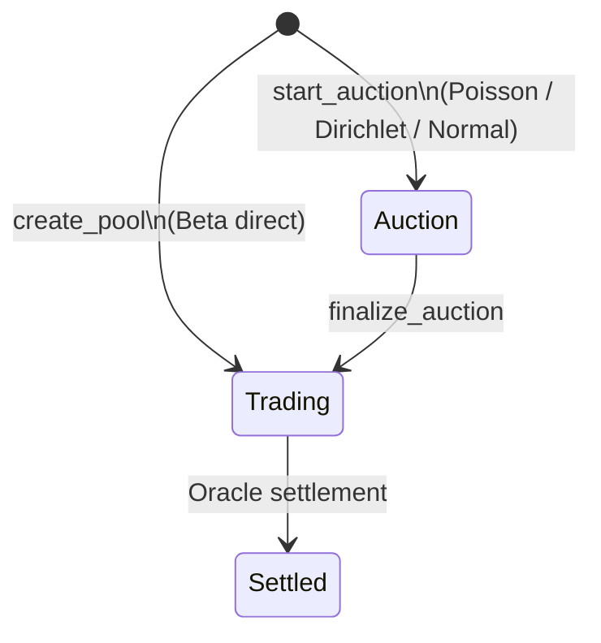

# Market Page UI Visibility by Lifecycle

**English** | [简体中文](./market-page-ui-by-lifecycle.zh.md)

> Rules for showing or hiding panels on the market detail page `/markets/[id]` based on Pool state.  
> On-chain state machine: PRD §2.7, `sources/market_status.move`; current frontend: `app/src/components/MarketDetailView.tsx`.

---

## Background

After a market is created, the typical flow is:

1. **Opening Auction**
2. **Finalize** (`finalize_auction`)
3. Enter **Trading** — LP deposits and user trades become available
4. Oracle settlement → **Settled**

Today `MarketDetailView` renders all panels unconditionally (Trade / LP / Auction / IV / Comment) without reading on-chain `pool.status`. Every action entry appears at once, so users can click the wrong panel and hit on-chain errors such as `not_trading` or `not_auction`.

---

## On-Chain State Machine

| `status` | Constant | Meaning |
| --- | --- | --- |
| `0` | `STATUS_AUCTION` | Opening auction phase |
| `1` | `STATUS_TRADING` | Trading (buy + LP allowed) |
| `2` | `STATUS_SETTLED` | Settled |

Sources: `sources/market_status.move`, `app/src/lib/position-display.ts` (`STATUS_AUCTION = 0`, etc.).

### Entry-Point Constraints (`sources/pool.move`)

| Operation | Allowed state |
| --- | --- |
| `auction_bid` / `finalize_auction` | **Auction** only |
| `buy_*` (all contract types) | **Trading** only |
| `deposit_liquidity` | **Trading** only |

PRD §2.7: `buy_poisson_interval` and similar calls require **Trading** state.

### Special Case: Beta Markets

- Beta has no Opening Auction; pools start in **Trading** (`market_pool::new_beta_trading`).
- The market page **must not show** `AuctionPanel`.

---

## Page Header (Always Visible)

Regardless of Pool state, always show:

- Cover (`MarketCover`)
- Market kind badge, tags, title, description
- Pool ID (when configured)
- **Status badge**: In auction / Trading / Settled (copy keys: `positions.poolStatus.*`)

---

## Panel Visibility Matrix

### 1. Auction (Opening phase, `status = 0`)

| Panel | Show | Notes |
| --- | --- | --- |
| **AuctionPanel** | ✅ | Only active actions: pick bucket, `auction_bid`; after `auction_end_ts`, `finalize_auction` |
| **TradePanel** | ❌ | On-chain abort: `not_trading` |
| **LpDepositPanel** | ❌ | On-chain abort: `not_trading`; auction vault funds become initial LP 1:1 at finalize |
| **IvPanel** | ⚠️ Optional | Prior / σ not fixed yet; metrics often zero — hide or read-only “available after finalize” |
| **CommentPanel** | ✅ | Social discussion; independent of trading state |

### 2. Trading (after finalize → before maturity, `status = 1` and not `resolved`)

| Panel | Show | Notes |
| --- | --- | --- |
| **AuctionPanel** | ❌ | Already finalized; further calls abort with `not_auction` |
| **TradePanel** | ✅ | Primary path: `buy_*` |
| **LpDepositPanel** | ✅ | `deposit_liquidity` (mint LP at NAV) |
| **IvPanel** | ✅ | σ, fees, Vol Crush meaningful during Trading |
| **CommentPanel** | ✅ | Always available |

### 3. Settled (`status = 2` or `resolved = true`)

| Panel | Show | Notes |
| --- | --- | --- |
| **AuctionPanel** | ❌ | Finished |
| **TradePanel** | ❌ | No new buys |
| **LpDepositPanel** | ❌ | No new deposits |
| **IvPanel** | ⚠️ Read-only | Final parameters OK; editable Pool ID input not required |
| **CommentPanel** | ✅ | Discussion still allowed |
| **Extra CTA** | — | Direct users to `/positions` to claim payouts |

### 4. Pool ID Not Configured

| Content | Show |
| --- | --- |
| Market metadata (cover, title, etc.) | ✅ |
| Hint: “Create or bind a Pool first” | ✅ |
| All on-chain action panels | ❌ Hide or disable globally |

---

## State Flow



---

## Gap vs Current Implementation

| Issue | Location / note |
| --- | --- |
| No state awareness | `MarketDetailView` does not read on-chain `pool.status` |
| Scattered Pool IDs | Each panel owns its own `poolId`; `IvPanel` already `getObject`s but does not lift `status` |
| Beta not filtered | `AuctionPanel` still shown for Beta; no on-chain entry |
| Demo legacy | `phase1.5-playbook` documents “three panels at once” for manual Pool ID entry — not the product end state |

Relevant code:

```tsx
// app/src/components/MarketDetailView.tsx (current: render all)
<div className="market-panels">
  <TradePanel market={displayMarket} />
  <LpDepositPanel market={displayMarket} />
  <AuctionPanel market={displayMarket} />
  <IvPanel market={displayMarket} />
  <CommentPanel market={displayMarket} />
</div>
```

---

## Suggested Frontend Implementation

In `MarketDetailView`:

1. Call `getObject` with `defaultPoolId(market)` (see `IvPanel`).
2. Parse `status`, `resolved`, `auction_end_ts`.
3. Conditionally render panels; show status badge in the header.

Pseudocode:

```tsx
const showAuction = poolStatus === 0 && market.kind !== "beta";
const showTrade = poolStatus === 1 && !resolved;
const showLp = poolStatus === 1 && !resolved;
const showIv = poolStatus === 1 || poolStatus === 2;
// CommentPanel: always show
```

i18n keys already exist: `positions.poolStatus.auction` / `trading` / `settled` (`app/src/i18n/messages/en.ts`).

---

## Related Docs

| Doc | Content |
| --- | --- |
| [PRD.md](../PRD.md) · [PRD.zh.md](../PRD.zh.md) §2.7 | Opening Auction and state machine |
| [phase1.5-playbook.md](./phase1.5-playbook.md) · [phase1.5-playbook.zh.md](./phase1.5-playbook.zh.md) §6 | Auction → Trading → LP walkthrough |
| [demo-walkthrough.md](./demo-walkthrough.md) · [demo-walkthrough.zh.md](./demo-walkthrough.zh.md) §5.1 | Demo flow with AuctionPanel |
| [qa.md](./qa.md) · [qa.zh.md](./qa.zh.md) | Opening Auction product logic and LP economics |
| [market-page-ui-by-lifecycle.zh.md](./market-page-ui-by-lifecycle.zh.md) | Simplified Chinese version |

---

## One-Line Summary

**Show only the auction panel during Opening; after finalize show trade + LP + IV; after settlement keep comments and route claims to `/positions`; skip auction for Beta.** Today’s “show everything” is a demo shortcut — gate panels by on-chain `pool.status`.
