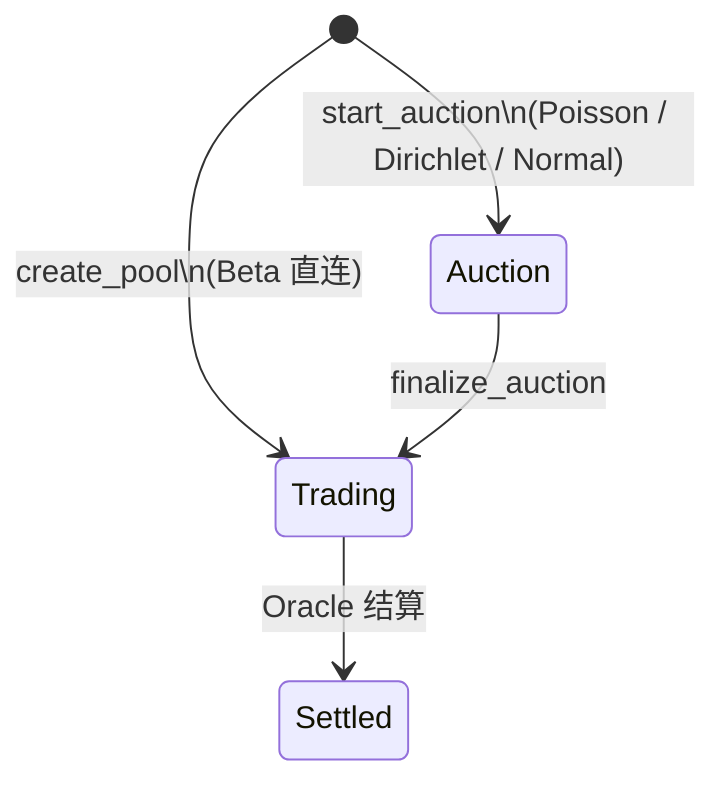

# 市场页 UI 显隐规则（按生命周期）

**简体中文** | [English](./market-page-ui-by-lifecycle.md)

> 说明市场详情页 `/markets/[id]` 在不同 Pool 状态下，各面板应显示或隐藏的规则。
> 链上状态机见 PRD §2.7、`sources/market_status.move`；当前前端实现见 `app/src/components/MarketDetailView.tsx`。

---

## 背景

创建市场后，一般流程为：

1. **Opening 竞价**（Auction）
2. **定标**（`finalize_auction`）
3. 进入 **Trading**，方可 LP 注入或用户交易
4. Oracle 结算后进入 **Settled**

当前 `MarketDetailView` 无条件渲染全部面板（Trade / LP / Auction / IV / Comment），未读取链上 `pool.status`，导致各阶段操作入口同时出现，用户易误点并收到链上错误（如 `not_trading`、`not_auction`）。

---

## 链上状态机

| `status` | 常量 | 含义 |
| --- | --- | --- |
| `0` | `STATUS_AUCTION` | Opening 竞价期 |
| `1` | `STATUS_TRADING` | 交易中（可买、可 LP） |
| `2` | `STATUS_SETTLED` | 已结算 |

来源：`sources/market_status.move`、`app/src/lib/position-display.ts`（`STATUS_AUCTION = 0` 等）。

### 链上入口约束（`sources/pool.move`）

| 操作 | 允许状态 |
| --- | --- |
| `auction_bid` / `finalize_auction` | 仅 **Auction** |
| `buy_*`（各类合约） | 仅 **Trading** |
| `deposit_liquidity` | 仅 **Trading** |

PRD §2.7：`buy_poisson_interval` 等仅 `Trading` 状态可调用。

### 特殊：Beta 市场

- Beta 无 Opening Auction，创建后直接进入 **Trading**（`market_pool::new_beta_trading`）。
- 市场页**不应显示** `AuctionPanel`。

---

## 页面顶部（始终显示）

无论 Pool 处于何状态，以下信息应始终可见：

- 封面（`MarketCover`）
- 市场类型 badge、标签、标题、描述
- Pool ID（若已配置）
- **当前状态徽章**：竞价中 / 交易中 / 已结算（文案见 `positions.poolStatus.*`）

---

## 各面板显隐矩阵

### 1. Auction（Opening 竞价期，`status = 0`）

| 面板 | 显示 | 说明 |
| --- | --- | --- |
| **AuctionPanel** | ✅ | 唯一可用操作：选桶、`auction_bid`；到 `auction_end_ts` 后 `finalize_auction` |
| **TradePanel** | ❌ | 链上会 `not_trading` |
| **LpDepositPanel** | ❌ | 链上会 `not_trading`；竞价资金在 finalize 时按 1:1 记为初始 LP |
| **IvPanel** | ⚠️ 可选 | Prior / σ 尚未定标，指标多为 0；可隐藏或只读提示「定标后可见」 |
| **CommentPanel** | ✅ | 社交讨论，与交易状态无关 |

### 2. Trading（定标后 → 到期前，`status = 1` 且未 `resolved`）

| 面板 | 显示 | 说明 |
| --- | --- | --- |
| **AuctionPanel** | ❌ | 已 finalize；再操作会 `not_auction` |
| **TradePanel** | ✅ | 主路径：`buy_*` |
| **LpDepositPanel** | ✅ | `deposit_liquidity`（按 NAV 铸 LP） |
| **IvPanel** | ✅ | σ、费率、Vol Crush 在 Trading 阶段有意义 |
| **CommentPanel** | ✅ | 始终可用 |

### 3. Settled（已结算，`status = 2` 或 `resolved = true`）

| 面板 | 显示 | 说明 |
| --- | --- | --- |
| **AuctionPanel** | ❌ | 已结束 |
| **TradePanel** | ❌ | 不可再买 |
| **LpDepositPanel** | ❌ | 不可再注入 |
| **IvPanel** | ⚠️ 只读 | 可展示最终参数；不必保留可编辑 Pool ID 输入 |
| **CommentPanel** | ✅ | 仍可讨论结果 |
| **额外引导** | — | 引导用户前往 `/positions` 领取赔付（claim） |

### 4. 尚未配置 Pool ID

| 内容 | 显示 |
| --- | --- |
| 市场元信息（封面、标题等） | ✅ |
| 提示「请先创建 / 绑定 Pool」 | ✅ |
| 所有链上操作面板 | ❌ 隐藏或全局禁用 |

---

## 状态流转



---

## 与当前实现的差距

| 问题 | 位置 / 说明 |
| --- | --- |
| 无状态感知 | `MarketDetailView` 不读取链上 `pool.status` |
| Pool ID 分散 | 各 Panel 各自维护 `poolId`；`IvPanel` 已 `getObject` 但未向上传递 `status` |
| Beta 未过滤 | `AuctionPanel` 对 Beta 仍显示，链上无对应入口 |
| Demo 遗留 | `phase1.5-playbook` 描述「三个面板同时存在」便于演示手填 Pool ID，非产品终态 |

相关代码：

```tsx
// app/src/components/MarketDetailView.tsx（当前：全部渲染）
<div className="market-panels">
  <TradePanel market={displayMarket} />
  <LpDepositPanel market={displayMarket} />
  <AuctionPanel market={displayMarket} />
  <IvPanel market={displayMarket} />
  <CommentPanel market={displayMarket} />
</div>
```

---

## 建议实现（前端）

在 `MarketDetailView` 中：

1. 用 `defaultPoolId(market)` 调用 `getObject`（可参考 `IvPanel`）。
2. 解析 `status`、`resolved`、`auction_end_ts`。
3. 按状态条件渲染面板；顶部展示状态徽章。

伪代码：

```tsx
const showAuction = poolStatus === 0 && market.kind !== "beta";
const showTrade = poolStatus === 1 && !resolved;
const showLp = poolStatus === 1 && !resolved;
const showIv = poolStatus === 1 || poolStatus === 2;
// CommentPanel: 始终 show
```

i18n 已有状态文案：`positions.poolStatus.auction` / `trading` / `settled`（`app/src/i18n/messages/zh.ts`）。

---

## 相关文档

| 文档 | 内容 |
| --- | --- |
| [PRD.zh.md](../PRD.zh.md) · [PRD.md](../PRD.md) §2.7 | Opening Auction 与状态机 |
| [phase1.5-playbook.zh.md](./phase1.5-playbook.zh.md) · [phase1.5-playbook.md](./phase1.5-playbook.md) §6 | Auction → Trading → LP 实操 |
| [demo-walkthrough.zh.md](./demo-walkthrough.zh.md) · [demo-walkthrough.md](./demo-walkthrough.md) §5.1 | 演示动线中的 AuctionPanel |
| [qa.zh.md](./qa.zh.md) · [qa.md](./qa.md) | Opening Auction 产品逻辑与 LP 经济学 |
| [market-page-ui-by-lifecycle.md](./market-page-ui-by-lifecycle.md) | 英文版 |

---

## 一句话总结

**Opening 阶段只露竞价面板；finalize 后露交易 + LP + IV；结算后只留评论并引导去持仓页 claim；Beta 跳过竞价。** 当前「全都显示」是 demo 简化，应按链上 `pool.status` 做显隐。
