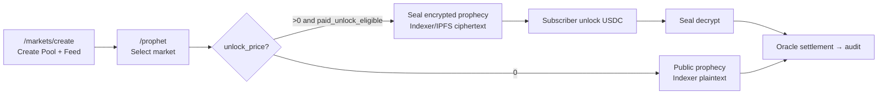

<!--
  Copyright (c) 2026 zouyc zouyccq@gmail.com.
  All rights reserved.

  Licensed under the Business Source License 1.1 (BSL 1.1).
  You may not use this file except in compliance with the License.

  Change Date: 2031-01-01
  On the Change Date, or the fourth anniversary of the first publicly available
  distribution of the code under the BSL, whichever comes first, the code
  automatically becomes available under the Apache License 2.0.
-->

**English** | [简体中文](./prophet-market-and-encryption-guide.zh.md)

# SuiProphet: Market Creation and Encrypted Prophecy Guide

> **Applies to:** Testnet / local development · **Related:** [prophet-playbook.md](./prophet-playbook.md) · [oracle-playbook.md](./oracle-playbook.md) · [business-spec.md](./business-spec.md) §4.10  
> **Updated:** 2026-06-12 (v4 package: public prophecies `unlock_price=0`, paid prophecies Seal encrypted)

---

## 1. Concept Clarification

There is **no separate "encrypted market" type** in this product.

| Layer | Encrypted? | Description |
| --- | --- | --- |
| **Market (MarketPool)** | No | Standard AMM + Oracle Feed, public on-chain |
| **Prophecy (PrivateProphecy)** | Optional | Analysis content may be **Seal encrypted** (paid) or **Indexer plaintext** (public practice) |

**"Encryption" refers to SuiProphet private paid prophecies:** prophets encrypt analysis JSON via Seal, store in Indexer/IPFS; subscribers decrypt after USDC unlock; on-chain only locks `plaintext_hash` and `predicted_value`.

Full path is two steps: **create market first → publish encrypted prophecy on that market**.

---

## 2. Step 1: Create Market

Any new market supports subsequent Prophet prophecies (shares same Pool `maturity_ts` and Oracle settlement).

### 2.1 Frontend (Recommended)

1. Connect Testnet wallet
2. Open **`/markets/create`**
3. Fill form:

| Field | Description |
| --- | --- |
| Title / description / slug | Display and URL (`/markets/{slug}`) |
| Distribution type | Poisson / Dirichlet / Normal / Beta |
| Maturity time | Form input in **selected timezone**; on-chain stores **UTC Unix seconds**; default timezone is browser system timezone |
| Trading fee rate | 0–500 bps |
| Feed ID | Oracle metric ID; default may match slug |
| Ancillary text | Ancillary text; default uses description |
| Topic tags | Optional; Indexer discovery and filtering |
| Cover | Optional; uploaded via Indexer; storage via `INDEXER_COVER_STORAGE` chooses **local** or **ipfs** (Pin) |

4. Click **"Create Market"**

Single on-chain transaction calls `create_*_pool_with_feed`, creating **MarketPool** and registering **DataFeed** simultaneously.

After success, redirects to market detail page; if Indexer is running, metadata syncs to `GET /v1/markets`.

### 2.2 Prerequisites

`app/.env.local` requires at minimum:

```env
NEXT_PUBLIC_PACKAGE_ID=0x...
NEXT_PUBLIC_ORACLE_CONFIG_ID=0x...
NEXT_PUBLIC_SUI_NETWORK=testnet
```

Current Testnet v4 deployment IDs see [deploy/testnet-v2.json](../deploy/testnet-v2.json).

### 2.3 On-chain Entry (Script / CLI)

Core calls equivalent to frontend:

```bash
# Example: Poisson + Feed (requires ORACLE_CONFIG_ID, FeedRegistry ID)
sui client call --package $PKG --module pool --function create_poisson_pool_with_feed \
  --args $ORACLE_CONFIG $FEED_REGISTRY 25 $MATURITY_TS 30 \
  "vector<u8>:MY_FEED_ID" "vector<u8>:规则说明" \
  --gas-budget 150000000
```

Batch seed markets: `scripts/deploy-oracle-prophet-testnet.ps1`; single pool: `scripts/seed-testnet.ps1`.

---

## 3. Step 2: Publish Encrypted Prophecy (Private Paid)

What is encrypted is **prophet analysis content**, not the market itself.

### 3.1 Entry

Open **`/prophet`** → select target market in **Prophet market selector** (self-created or seed pool; must be **unsettled** and **before maturity**).

### 3.2 Two Prophecy Modes

| Mode | `unlock_price` | Storage | Readable when |
| --- | --- | --- | --- |
| **Public practice** | `0` | Indexer **plaintext** JSON (`idx:` / `ipfs:`) | Immediately after Commit (`is_public=true`) |
| **Encrypted paid** | `> 0` | **Seal encrypted** → Indexer/IPFS ciphertext | After paid unlock / after `lock_time` / after audit public |

### 3.3 Prerequisites for Encrypted Paid

On-chain `prophet_leaderboard::paid_unlock_eligible`, enforced at Commit when `unlock_price > 0`:

| Condition | Threshold |
| --- | --- |
| No cheats | `cheats = 0` |
| Minimum audited count | `total_audited ≥ 3` |
| Prophet Score | `score_bps ≥ 4000` (40/100) |

If not eligible, only **`unlock_price = 0`** public practice prophecies; build track record on `/leaderboard` before enabling paid.

### 3.4 Submit Encrypted Prophecy (UI)

1. Fill **predicted value** (matches Pool distribution type: slot / bucket / tenths)
2. Fill **exclusive analysis** text
3. **Unlock price > 0** (e.g. `1` USDC)
4. Click **"Seal encrypt → Indexer → Commit private prophecy"**

Backend flow:

```
canonical JSON
  → SealClient.encrypt(seal_id)
  → POST Indexer /v1/prophecies/blob (local or IPFS pin)
  → commit_private_prophecy(registry, pool, blob_id, seal_id, plaintext_hash, …)
```

On-chain locks: `predicted_value`, `plaintext_hash` (blake2b256), `lock_time = pool.maturity_ts`.

### 3.5 Submit Public Practice Prophecy (UI)

Same as above, but **unlock price = `0`** → Indexer uploads **plaintext**; on-chain `is_public=true`, empty `seal_id`, no Seal decrypt needed.

### 3.6 Subscriber Reading Encrypted Prophecy

1. `/prophet` select prophecy → **Unlock** (`unlock_prophecy`, pay USDC)
2. **Seal decrypt** (SessionKey + `seal_approve_prophecy` on-chain gate)
3. After Oracle settlement **audit** → track record update, escrow split, `is_public=true`

Seal OR policy (`seal_access_allowed`):

| Condition | Description |
| --- | --- |
| A Paid | `sender ∈ paid_buyers` |
| B Public | `is_public` or `now > lock_time` |

See [prophet-playbook.md](./prophet-playbook.md).

---

## 4. End-to-End Flow



---

## 5. Environment Checklist

| Variable / service | Purpose |
| --- | --- |
| `NEXT_PUBLIC_PACKAGE_ID` | Create pool, Commit, Unlock, Audit |
| `NEXT_PUBLIC_ORACLE_CONFIG_ID` | Create pool with Feed |
| `NEXT_PUBLIC_PROPHET_REGISTRY_ID` | Submit / unlock / audit prophecy |
| `NEXT_PUBLIC_INDEXER_URL` | **Required** (Prophet blob upload/read, market list, leaderboard) |
| `NEXT_PUBLIC_IPFS_GATEWAY_URL` | Resolve `ipfs:` blob when `INDEXER_PROPHET_STORAGE=ipfs` |
| `NEXT_PUBLIC_SEAL_THRESHOLD` | Seal threshold (Testnet default 1) |
| `NEXT_PUBLIC_GAS_STATION_URL` | Optional; practice Commit may use gas sponsorship |
| Indexer + Postgres | Prophet blob, market metadata, `/leaderboard` |
| `INDEXER_PROPHET_STORAGE` | Indexer side: `local` (disk) or `ipfs` (Pin) |
| `NEXT_PUBLIC_IPFS_GATEWAY_URL` | Resolve `ipfs:` blob when `INDEXER_PROPHET_STORAGE=ipfs` |

Local Postgres (no Docker): `.\scripts\bootstrap-local-postgres.ps1` → `.\scripts\start-indexer.ps1`.

---

## 6. Common Misconceptions

1. **"Encrypted market" ≠ new market type**  
   Any Pool with Feed, unsettled, can host Prophet; encryption happens at prophecy layer.

2. **Market cover and Prophet blob both go through Indexer**  
   Cover: `POST /v1/markets/cover` (`INDEXER_COVER_STORAGE=local|ipfs`).  
   Prophet: `POST /v1/prophecies/blob` (`INDEXER_PROPHET_STORAGE=local|ipfs`); on-chain `blob_id` is `idx:…` or `ipfs:…`.

3. **EventRoot**  
   Seed markets wrapped via `wrap-event-roots-testnet.ps1`; self-created markets can Commit directly with `poolId`. EventRoot is architectural unification, **not** prerequisite for encrypted prophecy.

4. **After republishing package**  
   Must update `NEXT_PUBLIC_PACKAGE_ID`; old Seal ciphertext cannot be decrypted by new package `seal_approve`; re-Commit with new package.

---

## 7. Quick Reference

| Goal | Steps |
| --- | --- |
| Create market | `/markets/create` → fill form → create |
| Public practice prophecy | `/prophet` → select market → unlock price `0` → Commit |
| Encrypted paid prophecy | Meet threshold first (≥3 audits, Score≥40) → `/prophet` → unlock price `>0` → Seal Commit |
| View prophet rankings | `/leaderboard` |
| Oracle settlement | `/oracle` → propose → finalize → trigger audit |

---

## 8. Related Code and Modules

| Capability | Path |
| --- | --- |
| Create market UI | `app/src/app/markets/create/page.tsx` |
| Create pool PTB | `app/src/lib/create-market.ts` |
| Prophet UI | `app/src/app/prophet/page.tsx` |
| Seal / Indexer blob | `app/src/lib/seal-prophet.ts`, `app/src/lib/prophet-blob.ts`, `app/src/lib/prophet-blob-upload.ts` |
| Prophecy workflow | `app/src/lib/prophet.ts` |
| Market eligibility | `app/src/lib/prophet-market-eligibility.ts` |
| On-chain Commit / Audit | `sources/prophet_registry.move` |
| Paid unlock threshold | `sources/prophet_leaderboard.move` |
