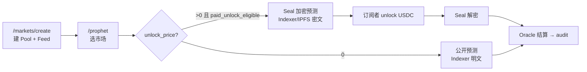

<!--
  Copyright (c) 2026 zouyc zouyccq@gmail.com.
  All rights reserved.

  Licensed under the Business Source License 1.1 (BSL 1.1).
  You may not use this file except in compliance with the License.

  Change Date: 2031-01-01
  On the Change Date, or the fourth anniversary of the first publicly available
  distribution of the code under the BSL, whichever comes first, the code
  automatically becomes available under the Apache License 2.0.
-->

**简体中文** | [English](./prophet-market-and-encryption-guide.md)

# SuiProphet：创建市场与加密预测操作指南

> **适用：** Testnet / 本地开发 · **关联：** [prophet-playbook.zh.md](./prophet-playbook.zh.md) · [oracle-playbook.zh.md](./oracle-playbook.zh.md) · [business-spec.zh.md](./business-spec.zh.md) §4.10  
> **更新：** 2026-06-12（v4 包：公开预测 `unlock_price=0`、付费预测 Seal 加密）

---

## 1. 概念澄清

本产品中**不存在单独的「加密市场」类型**。

| 层级 | 是否加密 | 说明 |
| --- | --- | --- |
| **市场（MarketPool）** | 否 | 标准 AMM + Oracle Feed，链上公开 |
| **预言（PrivateProphecy）** | 可选 | 分析内容可 **Seal 加密**（付费）或 **Indexer 明文**（公开练手） |

**「加密」指的是 SuiProphet 的私密付费预测**：预言家把分析 JSON 经 Seal 加密后存 Indexer/IPFS，订阅者 USDC 解锁后才能解密；链上只锁定 `plaintext_hash` 与 `predicted_value`。

完整路径分两步：**先建市场 → 再在该市场上发加密预测**。

---

## 2. 第一步：创建市场

任意新建市场都支持后续挂载 Prophet 预测（共用同一 Pool 的 `maturity_ts` 与 Oracle 结算）。

### 2.1 前端（推荐）

1. 连接 Testnet 钱包
2. 打开 **`/markets/create`**
3. 填写表单：

| 字段 | 说明 |
| --- | --- |
| 标题 / 描述 / slug | 展示与 URL（`/markets/{slug}`） |
| 分布类型 | Poisson / Dirichlet / Normal / Beta |
| 到期时间 | 表单按**所选时区**输入；链上存 **UTC Unix 秒**；默认时区为浏览器系统时区 |
| 交易费率 | 0–500 bps |
| Feed 标识 | Oracle 指标 ID，默认可与 slug 相同 |
| 辅助说明 | Ancillary 文本，默认用描述 |
| 主题标签 | 可选，Indexer 发现与筛选 |
| 封面 | 可选，经 Indexer 上传；存储由 `INDEXER_COVER_STORAGE` 选择 **local** 或 **ipfs**（Pin） |

4. 点击 **「创建市场」**

链上一笔交易调用 `create_*_pool_with_feed`，同时创建 **MarketPool** 并注册 **DataFeed**。

成功后跳转市场详情页；若 Indexer 在跑，元数据会同步到 `GET /v1/markets`。

### 2.2 前置环境

`app/.env.local` 至少需：

```env
NEXT_PUBLIC_PACKAGE_ID=0x...
NEXT_PUBLIC_ORACLE_CONFIG_ID=0x...
NEXT_PUBLIC_SUI_NETWORK=testnet
```

当前 Testnet v4 部署 ID 见 [deploy/testnet-v2.json](../deploy/testnet-v2.json)。

### 2.3 链上入口（脚本 / CLI）

与前端等价的核心调用：

```bash
# 示例：Poisson + Feed（需 ORACLE_CONFIG_ID、FeedRegistry ID）
sui client call --package $PKG --module pool --function create_poisson_pool_with_feed \
  --args $ORACLE_CONFIG $FEED_REGISTRY 25 $MATURITY_TS 30 \
  "vector<u8>:MY_FEED_ID" "vector<u8>:规则说明" \
  --gas-budget 150000000
```

批量种子市场见 `scripts/deploy-oracle-prophet-testnet.ps1`；单池见 `scripts/seed-testnet.ps1`。

---

## 3. 第二步：发布加密预测（私密付费）

加密的是**预言家分析内容**，不是市场本身。

### 3.1 入口

打开 **`/prophet`** → 在 **Prophet 市场选择器** 中选择目标市场（自建池或种子池均可，须 **未结算** 且 **未过 maturity**）。

### 3.2 两种预测模式

| 模式 | `unlock_price` | 存储 | 可读时机 |
| --- | --- | --- | --- |
| **公开练手** | `0` | Indexer **明文** JSON（`idx:` / `ipfs:`） | Commit 后立即可读（`is_public=true`） |
| **加密付费** | `> 0` | **Seal 加密** → Indexer/IPFS 密文 | 付费解锁 / `lock_time` 后 / audit 后公开 |

### 3.3 加密付费的前置门槛

链上 `prophet_leaderboard::paid_unlock_eligible`，Commit 时 `unlock_price > 0` 强制校验：

| 条件 | 阈值 |
| --- | --- |
| 无作弊 | `cheats = 0` |
| 最少审计场次 | `total_audited ≥ 3` |
| Prophet Score | `score_bps ≥ 4000`（40/100） |

未达标只能发 **`unlock_price = 0`** 公开练手预测，在 `/leaderboard` 积累战绩后再开通付费。

### 3.4 提交加密预测（UI）

1. 填写 **预测值**（与 Pool 分布类型一致：slot / bucket / tenths）
2. 填写 **独家分析** 文本
3. **解锁价 > 0**（如 `1` USDC）
4. 点击 **「Seal 加密 → Indexer → Commit 私密预测」**

后台流程：

```
canonical JSON
  → SealClient.encrypt(seal_id)
  → POST Indexer /v1/prophecies/blob（local 或 IPFS pin）
  → commit_private_prophecy(registry, pool, blob_id, seal_id, plaintext_hash, …)
```

链上锁定：`predicted_value`、`plaintext_hash`（blake2b256）、`lock_time = pool.maturity_ts`。

### 3.5 提交公开练手预测（UI）

同上，但 **解锁价填 `0`** → Indexer 上传**明文**，链上 `is_public=true`、空 `seal_id`，无需 Seal 解密。

### 3.6 订阅者阅读加密预测

1. `/prophet` 选择预测 → **解锁**（`unlock_prophecy`，付 USDC）
2. **Seal 解密**（SessionKey + `seal_approve_prophecy` 链上 gate）
3. Oracle 结算后 **audit** → 战绩更新、escrow 分账、`is_public=true`

Seal OR 策略（`seal_access_allowed`）：

| 条件 | 说明 |
| --- | --- |
| A 付费 | `sender ∈ paid_buyers` |
| B 公开 | `is_public` 或 `now > lock_time` |

详见 [prophet-playbook.zh.md](./prophet-playbook.zh.md)。

---

## 4. 端到端流程



---

## 5. 环境检查清单

| 变量 / 服务 | 用途 |
| --- | --- |
| `NEXT_PUBLIC_PACKAGE_ID` | 建池、Commit、Unlock、Audit |
| `NEXT_PUBLIC_ORACLE_CONFIG_ID` | 建池带 Feed |
| `NEXT_PUBLIC_PROPHET_REGISTRY_ID` | 提交 / 解锁 / 审计预测 |
| `NEXT_PUBLIC_INDEXER_URL` | **必需**（Prophet blob 上传/读取、市场列表、排行榜） |
| `NEXT_PUBLIC_IPFS_GATEWAY_URL` | `INDEXER_PROPHET_STORAGE=ipfs` 时解析 `ipfs:` blob |
| `NEXT_PUBLIC_SEAL_THRESHOLD` | Seal 门限（Testnet 默认 1） |
| `NEXT_PUBLIC_GAS_STATION_URL` | 可选；练手 Commit 可 Gas 代付 |
| Indexer + Postgres | Prophet blob、市场元数据、`/leaderboard` |
| `INDEXER_PROPHET_STORAGE` | Indexer 侧：`local`（磁盘）或 `ipfs`（Pin） |
| `NEXT_PUBLIC_IPFS_GATEWAY_URL` | `INDEXER_PROPHET_STORAGE=ipfs` 时解析 `ipfs:` blob |

本地 Postgres（不用 Docker）：`.\scripts\bootstrap-local-postgres.ps1` → `.\scripts\start-indexer.ps1`。

---

## 6. 常见误解

1. **「加密市场」≠ 新建一种市场类型**  
   任何带 Feed、未结算的 Pool 均可挂 Prophet；加密发生在预测层。

2. **市场封面与 Prophet blob 均走 Indexer**  
   封面：`POST /v1/markets/cover`（`INDEXER_COVER_STORAGE=local|ipfs`）。  
   Prophet：`POST /v1/prophecies/blob`（`INDEXER_PROPHET_STORAGE=local|ipfs`），链上 `blob_id` 为 `idx:…` 或 `ipfs:…`。

3. **EventRoot**  
   种子市场已通过 `wrap-event-roots-testnet.ps1` 包装 EventRoot；自建市场可直接用 `poolId` Commit，EventRoot 为架构统一项，**非**加密预测前置条件。

4. **重新 publish 包后**  
   须更新 `NEXT_PUBLIC_PACKAGE_ID`；旧 Seal 密文无法被新包 `seal_approve` 解密，需用新包重新 Commit。

---

## 7. 最短路径速查

| 目标 | 步骤 |
| --- | --- |
| 新建市场 | `/markets/create` → 填表 → 创建 |
| 公开练手预测 | `/prophet` → 选市场 → 解锁价 `0` → Commit |
| 加密付费预测 | 先达标（≥3 场 audit、Score≥40）→ `/prophet` → 解锁价 `>0` → Seal Commit |
| 查看预言家排名 | `/leaderboard` |
| Oracle 结算 | `/oracle` → propose → finalize → 触发 audit |

---

## 8. 相关代码与模块

| 能力 | 路径 |
| --- | --- |
| 创建市场 UI | `app/src/app/markets/create/page.tsx` |
| 建池 PTB | `app/src/lib/create-market.ts` |
| Prophet UI | `app/src/app/prophet/page.tsx` |
| Seal / Indexer blob | `app/src/lib/seal-prophet.ts`, `app/src/lib/prophet-blob.ts`, `app/src/lib/prophet-blob-upload.ts` |
| 预言工作流 | `app/src/lib/prophet.ts` |
| 市场可选性 | `app/src/lib/prophet-market-eligibility.ts` |
| 链上 Commit / Audit | `sources/prophet_registry.move` |
| 付费门槛 | `sources/prophet_leaderboard.move` |
