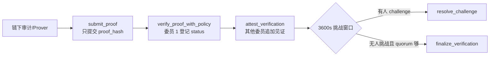
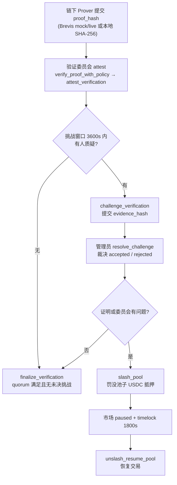

<!--
  Copyright (c) 2026 zouyc zouyccq@gmail.com.
  All rights reserved.

  Licensed under the Business Source License 1.1 (BSL 1.1).
  You may not use this file except in compliance with the License.

  Change Date: 2031-01-01
  On the Change Date, or the fourth anniversary of the first publicly available
  distribution of the code under the BSL, whichever comes first, the code
  automatically becomes available under the Apache License 2.0.
-->

# Slash 与 Attestation 概念说明

> **版本：** v1.2 · **日期：** 2026-06-08  
> **状态：** 概念文档（与链上实现一致）  
> **关联：** [tier2-decision.md](./tier2-decision.md) · [phase3-playbook.md](./phase3-playbook.md) · [mainnet-governance-params.md](./mainnet-governance-params.md)

---

## 摘要

**Slash** 与 **Attestation** 均非外部项目或第三方服务，而是 X-Market Sui 协议内的链上机制，共同支撑 Tier 2 / ZK 监督线的**乐观执行 + 事后追责**信任模型。

| 概念 | 链上模块 | 作用 |
| --- | --- | --- |
| **Attestation** | `zk_coprocessor` | 登记 `proof_hash`，由验证委员会见证接受/拒绝；**不**在链上验算 Groth16/Plonk |
| **Slash** | `slash` | 争议或风控触发时，从池子抵押中罚没 USDC、暂停市场，并设恢复 timelock |

二者与 Macro Oracle 的「提议 → 争议期 → 委员会终裁」属于同类模型；区别是 Attestation 面向 ZK/审计监督线，Slash 提供经济约束。

---

## 1. Attestation（见证 / 认证）

### 1.1 定义

**Attestation** 是一种信任模型：**指定方在链上声明「某条监督结论成立」并记录**，链上**不执行** ZK 证明的数学验算。

| 方式 | 链上做什么 | 信任来源 |
| --- | --- | --- |
| **真 ZK** | 验证证明的数学正确性 | 密码学 |
| **Attestation** | 登记 `proof_hash` + 委员会投票「接受 / 拒绝」 | 验证委员会 + 挑战期 + Slash |

当前 Sui Move **无** Groth16/Plonk 原生预编译，因此 `zk_coprocessor` 明确为 **Attestation 过渡层**，不能等同于链上真 ZK 验算。

### 1.2 链上实现

**模块：** `sources/zk_coprocessor.move`

**核心对象：**

| 对象 | 类型 | 说明 |
| --- | --- | --- |
| `ZkProofTicket` | owned | 用户/ Keeper 提交的证明哈希票据 |
| `ZkVerifierPolicy` | shared | 验证委员会地址列表 + 阈值 |
| `ZkVerification` | shared | 已登记见证记录（含挑战状态） |

**典型流程（链上入口序）：**



> 挑战路径：`challenge_verification` 提交 `evidence_hash` 后，由 Admin 调用 `resolve_challenge` 裁决；裁决为 rejected 且治理认定委员会有责时，可另行触发 `slash_pool`（见 §1.4）。

**链上登记字段（非完整证明验算）：**

- `proof_hash` — 证明或审计结果哈希（32–128 字节）
- `public_inputs_hash` — 公开输入哈希
- `proof_scheme_code` — `1=Groth16, 2=Plonk, 3=STARK`（**仅作标签**）
- `status_code` — `1=accepted, 2=rejected, 3=challenged`
- `approvals` — 委员会阈值见证列表

验证委员会成员做的是：**在链上对哈希对应的结论签字认可**；Move 内无椭圆曲线配对或约束系统验算。

### 1.3 与 Brevis「真 ZK」的关系

**链下服务：** `services/brevis-zk-prover/`

Brevis 可在链下生成真实 ZK 证明（`ZK_PROVER_MODE=live`），但 Sui 上仍无原生验算器，因此：

```
Brevis / 本地审计输出
  → 映射为 proof_hash + public_inputs_hash
  → 走同一套 Attestation 登记（submit_proof → verify_proof_with_policy）
```

即：**链下可以是真 ZK，链上仍是「哈希 + 委员会见证」**。

### 1.4 与 ZK / 验证委员会 / Slash 的关系

监督线由三类角色协作：**链下 ZK Prover** 产出哈希、**验证委员会**（`ZkVerifierPolicy`）链上见证、**Slash** 在争议成立后提供经济追责。

| 角色 | 模块 / 服务 | 职责 |
| --- | --- | --- |
| **ZK Prover** | `brevis-zk-prover`（mock / live） | 链下审计池状态，输出 `proof_hash` / `public_inputs_hash` |
| **验证委员会** | `ZkVerifierPolicy` + `attest_verification` | 对登记结论阈值见证（accepted / rejected） |
| **挑战者** | 任意地址 | 挑战窗口内 `challenge_verification` |
| **Admin / 治理** | `resolve_challenge` · `slash_pool` · `unslash_resume_pool` | 裁决争议、罚没抵押、timelock 后恢复市场 |

端到端流程：



要点：

- **ZK** 只在链下提供可验证性（live 模式）；链上登记仍走 Attestation，不验算证明数学。
- **验证委员会** 决定监督结论是否被链上「认可」；信任来自 quorum，而非单点 Admin。
- **Slash** 不自动触发，需 Admin 或多签治理在争议/风控成立后调用；与 ZK 监督线是**事后约束**，不是证明验算的一部分。

### 1.5 性能与路径定位

| 路径 | 延迟 | 是否阻塞 `buy_*` 热路径 |
| --- | --- | --- |
| Tier 1 链上定点数 | 毫秒级 | ✅ 热路径 |
| Attestation（hash + quorum） | 毫秒～秒 | ❌ 冷路径（异步监督） |
| 真 ZK 链上验算 | 秒～分钟（且 Move 无预编译） | ❌ 不可放热路径 |

**产品决议（[tier2-decision.md](./tier2-decision.md)）：** 主路径不依赖 Attestation/ZK；`zk_coprocessor` 为可选监督层，Tier 2 联合 PDF 尚未接入 `buy_*`。

### 1.6 治理参数

见 [mainnet-governance-params.md](./mainnet-governance-params.md) §3：

| 参数 | 链上常量 |
| --- | --- |
| Challenge 窗口 | `3600 s` |
| Finalize | 窗口结束后，需 quorum 满足且无未决挑战；由协议运营 on-call 触发 `finalize_verification` |

---

## 2. Slash（罚没 / 削减抵押）

### 2.1 定义

**Slashing** 在区块链语境中指：当参与者行为不当或争议成立时，**从抵押资金中扣减罚金**，作为经济约束。

在 X-Market Sui 中，**Slash 不是以太坊 PoS 那种自动共识 slash**，而是 **Phase 3 市场池风控与治理机制**：从 `MarketPool.vault` 扣 USDC、暂停交易、设恢复 timelock。

### 2.2 链上实现

**模块：** `sources/slash.move`

**核心对象：**

| 对象 | 类型 | 说明 |
| --- | --- | --- |
| `SlashRecord` | shared | 罚没记录（金额、原因码、执行人等） |
| `SlashGovernance` | shared | 多签治理（signers + threshold） |
| `SlashRequest` | shared | 多签罚没提案 |

**单签应急路径：**

```powershell
# Admin 直接罚没（应急）
slash_pool(config, cap, pool, amount_usdc, reason_code, recipient, clock)
```

**行为：**

- 从 `MarketPool.vault` 扣减 `amount_usdc`，转入 `recipient`
- 市场 `paused = true`
- 设置治理恢复 timelock（**1800 s**）
- 生成 `SlashRecord`

**多签路径（推荐）：**

```
init_slash_governance(signers, threshold)
  → propose_slash_request
  → approve_slash_request（达 threshold）
  → execute_slash_request
```

**恢复：**

```powershell
# timelock 到期后 Admin 恢复
unslash_resume_pool(config, cap, pool, clock)
```

恢复后 `paused = false`，并重置本轮 slash 状态。

### 2.3 限额与治理参数

见 [mainnet-governance-params.md](./mainnet-governance-params.md) §2：

| 参数 | 链上常量 |
| --- | --- |
| Timelock | `1800 s` |
| 单次扣减上限 | 抵押的 **30%**（3000 bps） |
| 周期累计上限 | 抵押的 **50%**（5000 bps） |
| 提案 TTL | `86400 s` |

`reason_code` 为链下治理映射用的不透明数字；`recipient` 为罚没资金接收地址。

### 2.4 与以太坊 / Cosmos Slash 对比

| | 以太坊 PoS Slash | X-Market `slash_pool` |
| --- | --- | --- |
| 罚没对象 | 验证者质押 | 市场池 USDC 抵押 |
| 触发方 | 协议自动（如双签） | Admin 或多签治理 |
| 直接效果 | 削减质押 | 扣 Vault + **暂停市场** |
| 目的 | 保障共识安全 | 风控 + 争议后经济追责 |

---

## 3. Attestation 与 Slash 如何配合

Attestation 解决**性能**：登记哈希 + 委员会投票，不阻塞交易热路径。

其弱点是委员会可能串通或误判。补救靠三层机制：

1. **挑战窗口** — `challenge_verification`（3600s 内可提交 `evidence_hash`）
2. **管理员裁决** — `resolve_challenge`（将 challenged 裁决为 accepted/rejected）
3. **Slash** — 争议成立或风控需要时，`slash_pool` 罚没池子抵押并暂停市场

```
                    ┌─────────────────────────────────────┐
                    │  Tier 1：buy_* 热路径（链上算价）    │
                    └─────────────────────────────────────┘
                                      │
                    ┌─────────────────▼───────────────────┐
                    │  冷路径：Attestation 监督线          │
                    │  submit_proof → 委员会 attest        │
                    └─────────────────┬───────────────────┘
                                      │
              ┌───────────────────────┼───────────────────────┐
              ▼                       ▼                       ▼
        挑战窗口内质疑          quorum + finalize          发现问题
    challenge_verification    finalize_verification      slash_pool
              │                       │                       │
              └──────── resolve_challenge ──────────────────────┘
                                      │
                              unslash_resume_pool（timelock 后）
```

**[tier2-decision.md](./tier2-decision.md) §5 原意：**

> 信任依赖验证委员会 + slash（与 Macro Oracle 同类模型）

即：监督线**不是**密码学在热路径当场拦截，而是「多人见证 + 事后可挑战 + 经济罚没」。

---

## 4. 与 Macro Oracle 的类比

| 环节 | Macro Oracle | ZK Attestation 监督线 |
| --- | --- | --- |
| 提交 | `propose` 数据 | `submit_proof` 哈希 |
| 确认 | 委员会 / 争议期 / `finalize` | 委员会 `attest` + `finalize_verification` |
| 质疑 | `dispute` | `challenge_verification` |
| 追责 | 仲裁 / 质押博弈 | `slash_pool` + 市场暂停 |

二者共享**乐观执行 + 事后可争议 + 经济约束**范式；Attestation 面向链下审计/ZK 监督，Slash 是协议级罚没工具。

---

## 5. 操作与验证

### 5.1 ZK Attestation（Testnet）

详见 [phase3-playbook.md](./phase3-playbook.md) §4：

```powershell
.\scripts\init-zk-verifier-policy.ps1 -PackageId 0x... -VerifierAddress 0x...
.\scripts\bootstrap-services-env.ps1
cd services/brevis-zk-prover && npm install && npm start
# GET http://localhost:8794/health
```

### 5.2 Slash 演练

详见 [phase3-playbook.md](./phase3-playbook.md) §5、[mainnet-drill-2026-06-06.md](./mainnet-drill-2026-06-06.md) 演练 B/C：

- 演练 B：`slash_pool` → 等待 timelock → `unslash_resume_pool`
- 演练 C：`init_slash_governance` → `propose` → `execute_slash_request`

---

## 6. 修订记录

| 日期 | 版本 | 说明 |
| --- | --- | --- |
| 2026-06-08 | v1.0 | 初版：Slash 与 Attestation 概念、链上实现、协作关系 |
| 2026-06-08 | v1.1 | 补充 §1.4 ZK / 验证委员会 / Slash 关系流程图 |
| 2026-06-08 | v1.2 | §1.2 补充 Attestation 链上入口序 LR 流程图 |
