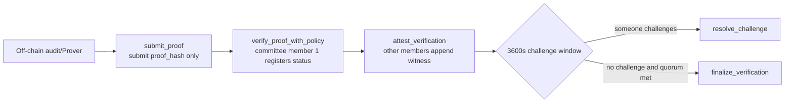
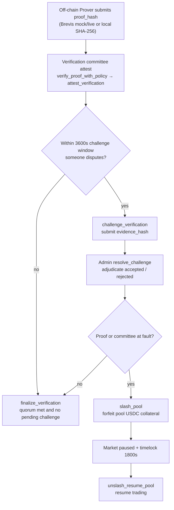

<!--
  Copyright (c) 2026 zouyc zouyccq@gmail.com.
  All rights reserved.

  Licensed under the Business Source License 1.1 (BSL 1.1).
  You may not use this file except in compliance with the License.

  Change Date: 2031-01-01
  On the Change Date, or the fourth anniversary of the first publicly available
  distribution of the code under the BSL, whichever comes first, the code
  automatically becomes available under the Apache License 2.0.
-->

**English** | [简体中文](./slash-and-attestation.zh.md)

# Slash and Attestation Concepts

> **Version:** v1.2 · **Date:** 2026-06-08  
> **Status:** Concept document (aligned with on-chain implementation)  
> **Related:** [tier2-decision.md](./tier2-decision.md) · [phase3-playbook.md](./phase3-playbook.md) · [mainnet-governance-params.md](./mainnet-governance-params.md)

---

## Summary

**Slash** and **Attestation** are not external projects or third-party services; they are on-chain mechanisms within the X-Market Sui protocol, together supporting the **optimistic execution + post-hoc accountability** trust model for the Tier 2 / ZK supervision line.

| Concept | On-chain module | Role |
| --- | --- | --- |
| **Attestation** | `zk_coprocessor` | Register `proof_hash`; verification committee witnesses accept/reject; **does not** verify Groth16/Plonk on-chain |
| **Slash** | `slash` | On dispute or risk control, forfeit USDC from pool collateral, pause market, set recovery timelock |

Both follow the same model as Macro Oracle's "propose → dispute period → committee final arbitration"; Attestation targets ZK/audit supervision, Slash provides economic constraints.

---

## 1. Attestation (Witness / Certification)

### 1.1 Definition

**Attestation** is a trust model: **designated parties declare on-chain that a supervision conclusion holds and record it**; the chain **does not execute** mathematical verification of ZK proofs.

| Approach | What on-chain does | Trust source |
| --- | --- | --- |
| **True ZK** | Verify mathematical correctness of proof | Cryptography |
| **Attestation** | Register `proof_hash` + committee votes "accept / reject" | Verification committee + challenge period + Slash |

Current Sui Move has **no** Groth16/Plonk native precompile; therefore `zk_coprocessor` is explicitly an **Attestation transition layer**, not equivalent to on-chain true ZK verification.

### 1.2 On-chain Implementation

**Module:** `sources/zk_coprocessor.move`

**Core objects:**

| Object | Type | Description |
| --- | --- | --- |
| `ZkProofTicket` | owned | Proof hash ticket submitted by user / Keeper |
| `ZkVerifierPolicy` | shared | Verification committee address list + threshold |
| `ZkVerification` | shared | Registered witness record (includes challenge state) |

**Typical flow (on-chain entry sequence):**



> Challenge path: after `challenge_verification` submits `evidence_hash`, Admin calls `resolve_challenge` to adjudicate; if ruling is rejected and governance finds committee at fault, `slash_pool` may be triggered separately (see §1.4).

**On-chain registered fields (not full proof verification):**

- `proof_hash` — hash of proof or audit result (32–128 bytes)
- `public_inputs_hash` — public inputs hash
- `proof_scheme_code` — `1=Groth16, 2=Plonk, 3=STARK` (**label only**)
- `status_code` — `1=accepted, 2=rejected, 3=challenged`
- `approvals` — committee threshold witness list

Verification committee members: **sign off on-chain on the conclusion corresponding to the hash**; Move has no elliptic curve pairing or constraint system verification.

### 1.3 Relationship to Brevis "True ZK"

**Off-chain service:** `services/brevis-zk-prover/`

Brevis can generate real ZK proofs off-chain (`ZK_PROVER_MODE=live`), but Sui still has no native verifier, therefore:

```
Brevis / local audit output
  → mapped to proof_hash + public_inputs_hash
  → same Attestation registration (submit_proof → verify_proof_with_policy)
```

I.e.: **off-chain can be true ZK; on-chain remains "hash + committee witness"**.

### 1.4 Relationship to ZK / Verification Committee / Slash

The supervision line coordinates three roles: **off-chain ZK Prover** produces hash, **verification committee** (`ZkVerifierPolicy`) witnesses on-chain, **Slash** provides economic accountability when disputes are upheld.

| Role | Module / service | Responsibility |
| --- | --- | --- |
| **ZK Prover** | `brevis-zk-prover` (mock / live) | Off-chain audit pool state, output `proof_hash` / `public_inputs_hash` |
| **Verification committee** | `ZkVerifierPolicy` + `attest_verification` | Threshold witness on registered conclusion (accepted / rejected) |
| **Challenger** | Any address | `challenge_verification` within challenge window |
| **Admin / governance** | `resolve_challenge` · `slash_pool` · `unslash_resume_pool` | Adjudicate disputes, forfeit collateral, resume market after timelock |

End-to-end flow:



Key points:

- **ZK** provides verifiability off-chain only (live mode); on-chain registration still uses Attestation, no proof math verification.
- **Verification committee** decides whether supervision conclusion is "recognized" on-chain; trust from quorum, not single Admin.
- **Slash** does not auto-trigger; Admin or multisig governance must call after dispute/risk control upheld; **post-hoc constraint** on ZK supervision line, not part of proof verification.

### 1.5 Performance and Path Positioning

| Path | Latency | Blocks `buy_*` hot path |
| --- | --- | --- |
| Tier 1 on-chain fixed-point | Milliseconds | ✅ Hot path |
| Attestation (hash + quorum) | Milliseconds–seconds | ❌ Cold path (async supervision) |
| True ZK on-chain verify | Seconds–minutes (Move has no precompile) | ❌ Cannot place on hot path |

**Product decision ([tier2-decision.md](./tier2-decision.md)):** Main path does not depend on Attestation/ZK; `zk_coprocessor` is optional supervision layer; Tier 2 joint PDF not wired into `buy_*`.

### 1.6 Governance Parameters

See [mainnet-governance-params.md](./mainnet-governance-params.md) §3:

| Parameter | On-chain constant |
| --- | --- |
| Challenge window | `3600 s` |
| Finalize | After window ends, quorum met and no pending challenge; protocol ops on-call triggers `finalize_verification` |

---

## 2. Slash (Forfeiture / Collateral Reduction)

### 2.1 Definition

**Slashing** in blockchain context: when participants misbehave or disputes are upheld, **deduct penalty from collateral** as economic constraint.

In X-Market Sui, **Slash is not automatic consensus slash like Ethereum PoS**; it is a **Phase 3 market pool risk control and governance mechanism**: deduct USDC from `MarketPool.vault`, pause trading, set recovery timelock.

### 2.2 On-chain Implementation

**Module:** `sources/slash.move`

**Core objects:**

| Object | Type | Description |
| --- | --- | --- |
| `SlashRecord` | shared | Forfeiture record (amount, reason code, executor, etc.) |
| `SlashGovernance` | shared | Multisig governance (signers + threshold) |
| `SlashRequest` | shared | Multisig forfeiture proposal |

**Single-signer emergency path:**

```powershell
# Admin direct forfeiture (emergency)
slash_pool(config, cap, pool, amount_usdc, reason_code, recipient, clock)
```

**Behavior:**

- Deduct `amount_usdc` from `MarketPool.vault`, transfer to `recipient`
- Market `paused = true`
- Set governance recovery timelock (**1800 s**)
- Emit `SlashRecord`

**Multisig path (recommended):**

```
init_slash_governance(signers, threshold)
  → propose_slash_request
  → approve_slash_request (reach threshold)
  → execute_slash_request
```

**Recovery:**

```powershell
# After timelock expires, Admin resumes
unslash_resume_pool(config, cap, pool, clock)
```

After recovery `paused = false`, and current slash round state reset.

### 2.3 Limits and Governance Parameters

See [mainnet-governance-params.md](./mainnet-governance-params.md) §2:

| Parameter | On-chain constant |
| --- | --- |
| Timelock | `1800 s` |
| Single deduction cap | **30%** of collateral (3000 bps) |
| Period cumulative cap | **50%** of collateral (5000 bps) |
| Proposal TTL | `86400 s` |

`reason_code` is opaque number for off-chain governance mapping; `recipient` is forfeiture fund recipient address.

### 2.4 Comparison with Ethereum / Cosmos Slash

| | Ethereum PoS Slash | X-Market `slash_pool` |
| --- | --- | --- |
| Forfeiture target | Validator stake | Market pool USDC collateral |
| Trigger | Protocol automatic (e.g. double-sign) | Admin or multisig governance |
| Direct effect | Reduce stake | Deduct Vault + **pause market** |
| Purpose | Consensus security | Risk control + post-dispute economic accountability |

---

## 3. How Attestation and Slash Work Together

Attestation solves **performance**: register hash + committee vote, does not block transaction hot path.

Weakness: committee may collude or misjudge. Remediation via three mechanisms:

1. **Challenge window** — `challenge_verification` (submit `evidence_hash` within 3600s)
2. **Admin adjudication** — `resolve_challenge` (adjudicate challenged to accepted/rejected)
3. **Slash** — when dispute upheld or risk control needed, `slash_pool` forfeits pool collateral and pauses market

```
                    ┌─────────────────────────────────────┐
                    │  Tier 1: buy_* hot path (on-chain pricing)    │
                    └─────────────────────────────────────┘
                                      │
                    ┌─────────────────▼───────────────────┐
                    │  Cold path: Attestation supervision line          │
                    │  submit_proof → committee attest        │
                    └─────────────────┬───────────────────┘
                                      │
              ┌───────────────────────┼───────────────────────┐
              ▼                       ▼                       ▼
        Dispute within window          quorum + finalize          Problem found
    challenge_verification    finalize_verification      slash_pool
              │                       │                       │
              └──────── resolve_challenge ──────────────────────┘
                                      │
                              unslash_resume_pool (after timelock)
```

**Original intent of [tier2-decision.md](./tier2-decision.md) §5:**

> Trust depends on verification committee + slash (same model as Macro Oracle)

I.e.: supervision line **does not** cryptographically intercept on hot path in real time, but "multi-party witness + post-hoc challengeable + economic forfeiture".

---

## 4. Analogy with Macro Oracle

| Stage | Macro Oracle | ZK Attestation supervision line |
| --- | --- | --- |
| Submit | `propose` data | `submit_proof` hash |
| Confirm | Committee / dispute period / `finalize` | Committee `attest` + `finalize_verification` |
| Dispute | `dispute` | `challenge_verification` |
| Accountability | Arbitration / stake game | `slash_pool` + market pause |

Both share **optimistic execution + post-hoc disputable + economic constraint** paradigm; Attestation targets off-chain audit/ZK supervision, Slash is protocol-level forfeiture tool.

---

## 5. Operations and Verification

### 5.1 ZK Attestation (Testnet)

See [phase3-playbook.md](./phase3-playbook.md) §4:

```powershell
.\scripts\init-zk-verifier-policy.ps1 -PackageId 0x... -VerifierAddress 0x...
.\scripts\bootstrap-services-env.ps1
cd services/brevis-zk-prover && npm install && npm start
# GET http://localhost:8794/health
```

### 5.2 Slash Drill

See [phase3-playbook.md](./phase3-playbook.md) §5, [mainnet-drill-2026-06-06.md](./mainnet-drill-2026-06-06.md) drills B/C:

- Drill B: `slash_pool` → wait timelock → `unslash_resume_pool`
- Drill C: `init_slash_governance` → `propose` → `execute_slash_request`

---

## 6. Revision History

| Date | Version | Notes |
| --- | --- | --- |
| 2026-06-08 | v1.0 | Initial: Slash and Attestation concepts, on-chain implementation, collaboration |
| 2026-06-08 | v1.1 | Added §1.4 ZK / verification committee / Slash relationship flowchart |
| 2026-06-08 | v1.2 | §1.2 added Attestation on-chain entry sequence LR flowchart |
