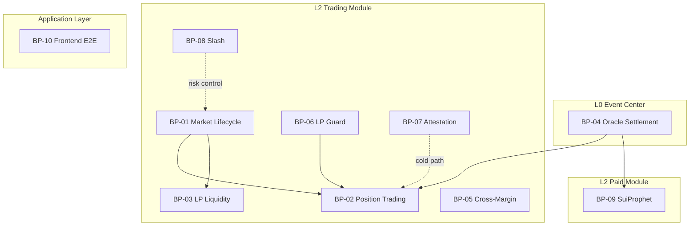
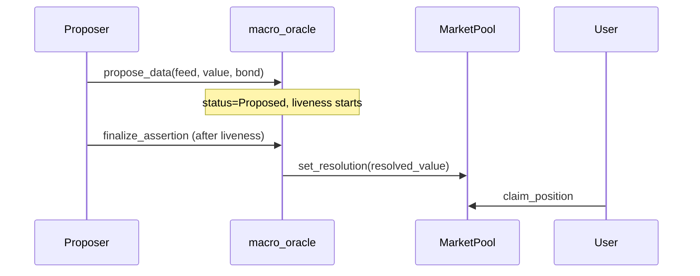
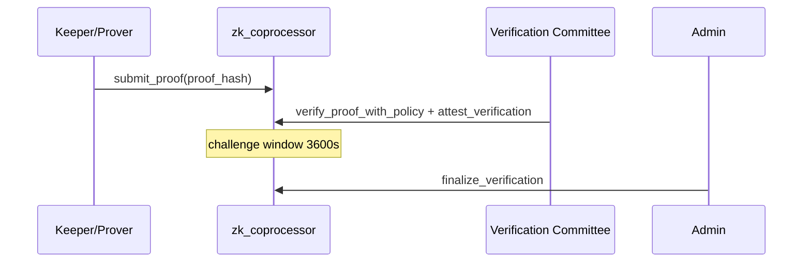

<!--
  Copyright (c) 2026 zouyc zouyccq@gmail.com.
  All rights reserved.

  Licensed under the Business Source License 1.1 (BSL 1.1).
  You may not use this file except in compliance with the License.

  Change Date: 2031-01-01
  On the Change Date, or the fourth anniversary of the first publicly available
  distribution of the code under the BSL, whichever comes first, the code
  automatically becomes available under the Apache License 2.0.
-->

# X-Market Sui Test Cases

**English** | [简体中文](./test-cases.zh.md)

> **Version:** v1.0 · **Date:** 2026-06-08  
> **Status:** Draft  
> **Related:** [PRD.md](../PRD.md) · [oracle-playbook.md](./oracle-playbook.md) · [phase1.5-playbook.md](./phase1.5-playbook.md) · [phase2-playbook.md](./phase2-playbook.md) · [phase3-playbook.md](./phase3-playbook.md) · [prophet-playbook.md](./prophet-playbook.md) · [slash-and-attestation.md](./slash-and-attestation.md)

---

## 1. Document Overview

### 1.1 Purpose

This document derives executable test cases from **business process → use case → interaction event → sequence**, covering on-chain Move, off-chain Keepers, frontend, and drill scripts for QA, audit, and pre-mainnet regression.

### 1.2 Numbering Rules

| Layer | Prefix | Example |
| --- | --- | --- |
| Business process | `BP-xx` | BP-01 Market lifecycle |
| Use case | `UC-xx.y` | UC-01.2 Auction finalize |
| Interaction event | `E-xx.y.z` | E-01.2.3 finalize_auction |
| Test case | `TC-xx.y.z` | TC-01.2.3 Dirichlet finalize enters Trading |

### 1.3 Priority & Automation

| Priority | Meaning |
| --- | --- |
| P0 | Mainnet blocker; run every release |
| P1 | Core path; required for Testnet regression |
| P2 | Edge/exception; sampled per iteration |

| Automation | Meaning |
| --- | --- |
| **Move** | `sui move test` unit tests |
| **Drill** | `app/scripts/p0-drills.ts` / `run-p0-drills-testnet.ps1` |
| **Manual** | Frontend or dual-wallet manual |
| **Keeper** | `services/*/src/*.test.ts` |

### 1.4 Business Process Overview



---

## 2. BP-01 Market Lifecycle

**Flow:** Create pool → Opening Auction → Trading → Oracle settlement → Settled

**State machine:** `Auction` → `Trading` → `Settled` (`market_status`)

### UC-01.1 Create Market with Feed

| Interaction event | Initiator | On-chain entry | Postcondition |
| --- | --- | --- | --- |
| E-01.1.1 Create Oracle config | Protocol ops | `macro_oracle::create_oracle_config` | `OracleConfig` + `FeedRegistry` exist |
| E-01.1.2 Start auction pool | Market creator | `start_poisson_auction` / `start_dirichlet_auction` / `start_normal_auction` | `MarketPool.status = Auction` |
| E-01.1.3 Create pool with Feed | Market creator | `create_*_pool_with_feed` (same PTB) | `FeedRegistry` can `lookup_feed_by_market` |

**Sequence:**

```
Protocol ops → create_oracle_config
Market creator → start_*_auction [+ register_data_feed_for_pool]
Indexer/frontend → lookup_feed_by_market(pool_id)
```

| ID | Case | Precondition | Steps | Expected | Priority | Automation |
| --- | --- | --- | --- | --- | --- | --- |
| TC-01.1.1 | Poisson auction pool create | Oracle initialized | `start-auction-pool.ps1 -Kind poisson` | Returns Pool ID; `status=Auction` | P0 | Manual |
| TC-01.1.2 | Dirichlet auction pool create | Same | `-Kind dirichlet` | Three buckets α initial 0; Auction state | P0 | Manual |
| TC-01.1.3 | Normal auction pool create | Same | `-Kind normal` | μ/σ three-bucket anchors correct | P1 | Manual |
| TC-01.1.4 | Feed on-chain discovery | Pool created `_with_feed` | `lookup_feed_by_market` | Returns matching `DataFeed`; no env hardcoding | P1 | Manual |

### UC-01.2 Opening Auction Bid & Finalize

| Interaction event | Initiator | On-chain entry | Constraint |
| --- | --- | --- | --- |
| E-01.2.1 Auction bid | Anyone | `auction_bid` | Only `Auction` state; USDC to bucket |
| E-01.2.2 Finalize | Anyone | `finalize_*_auction` | `now >= auction_end_ts` |
| E-01.2.3 State transition | On-chain atomic | finalize internal | `Auction → Trading`; Vault locked; `lp_shares` seed |

**Sequence:**

```
UserA → auction_bid(bucket=0, usdc)
UserB → auction_bid(bucket=1, usdc)
... wait auction_end_ts ...
Anyone → finalize_auction
  → bucket ratio → λ/α/μ,σ
  → status = Trading
```

| ID | Case | Precondition | Steps | Expected | Priority | Automation |
| --- | --- | --- | --- | --- | --- | --- |
| TC-01.2.1 | Multi-user bidding | Auction pool | 2+ addresses `auction_bid` | Per-bucket USDC totals correct | P0 | Manual |
| TC-01.2.2 | Reject finalize before end | Before `auction_end_ts` | `finalize_auction` | revert `auction_not_ended` | P1 | Move† |
| TC-01.2.3 | Poisson finalize | Auction ended | `finalize_poisson_auction` | `lambda_tenths` per bucket ratio; Trading | P0 | Manual |
| TC-01.2.4 | Dirichlet finalize | Auction ended | `finalize_dirichlet_auction` | α vector matches bucket ratio | P0 | Manual |
| TC-01.2.5 | Normal finalize | Auction ended | `finalize_normal_auction` | μ/σ weighted finalize | P1 | Move† |
| TC-01.2.6 | Reject bid on non-Auction | Already Trading | `auction_bid` | revert `not_auction` | P1 | Move† |

> † Guard logic in `math/*_auction_tests.move`, `market_status` constant tests.

### UC-01.3 Maturity & Settlement State

| Interaction event | Initiator | On-chain entry | Postcondition |
| --- | --- | --- | --- |
| E-01.3.1 Oracle finalize | Proposer / Committee | `finalize_assertion` / arbitration callback | `DataFeed.resolved_value` readable |
| E-01.3.2 Pool bind settlement | Admin / callback | `set_resolution` / `report_resolution` | `MarketPool.resolved=true` |
| E-01.3.3 Settled state | On-chain | after resolution | `status=Settled`; `buy_*` forbidden |

| ID | Case | Precondition | Steps | Expected | Priority | Automation |
| --- | --- | --- | --- | --- | --- | --- |
| TC-01.3.1 | No claim before maturity | Pool Trading; not resolved | `claim_position` | revert | P0 | Manual |
| TC-01.3.2 | Claim after resolved | Oracle Finalized + set_resolution | `claim_position` | USDC payout per hit rules | P0 | Drill‡ |
| TC-01.3.3 | No buy after Settled | Pool Settled | any `buy_*` | revert | P1 | Manual |

> ‡ Drill A skips claim before maturity; rerun after maturity.

---

## 3. BP-02 Position Trading (Parametric AMM)

**Flow:** User USDC → on-chain PDF pricing → parameter update + Position mint

**Tier 1 hot path:** Single PTB atomically completes pricing and state change ([tier2-decision.md](./tier2-decision.md)).

### UC-02.1 Interval / Digital Options (P0)

| Distribution | Interval entry | Digital entry |
| --- | --- | --- |
| Poisson | `buy_poisson_interval` | `buy_poisson_digital` |
| Dirichlet | `buy_dirichlet_interval` | `buy_dirichlet_digital` |
| Normal | `buy_normal_interval` | `buy_normal_digital` |

**Common interaction events:**

| Event | Description |
| --- | --- |
| E-02.1.1 Merge USDC | Frontend/PTB merge multiple Coins |
| E-02.1.2 Max-Loss check | `risk.move` worst case ≤ Vault |
| E-02.1.3 Parameter update | μ/σ/λ/α shift with volume |
| E-02.1.4 Mint Position | owned object to buyer address |

**Sequence (Poisson interval example):**

```
User → buy_poisson_interval(pool, [L,U], usdc, clock)
  → lp_guard::effective_fee_bps (if enabled)
  → poisson PDF integral pricing
  → risk max-loss assert
  → vault += usdc; update lambda
  → mint Position{interval, shares, cost}
```

| ID | Case | Precondition | Steps | Expected | Priority | Automation |
| --- | --- | --- | --- | --- | --- | --- |
| TC-02.1.1 | Poisson digital | Trading pool; USDC | `buy_poisson_digital` k=7 | Position minted; λ changed; Drill A covered | P0 | Drill |
| TC-02.1.2 | Poisson interval hit | resolved X∈[L,U] | buy → claim | 1 USDC per share | P0 | Manual |
| TC-02.1.3 | Poisson interval miss | resolved X∉[L,U] | buy → claim | Position zeroed | P0 | Manual |
| TC-02.1.4 | Dirichlet WDL digital | Dirichlet Trading | `buy_dirichlet_digital` outcome=0 | α updated; Position correct | P0 | Manual |
| TC-02.1.5 | Normal CPI interval | Normal Trading | `buy_normal_interval` | CDF integral; stable Gas | P0 | Manual |
| TC-02.1.6 | Max-Loss reject | oversized order | exceed `buy_*` | revert; Vault not breached | P0 | Move |
| TC-02.1.7 | Reject buy in Auction | status=Auction | `buy_*` | revert | P1 | Manual |
| TC-02.1.8 | Reject buy when paused | `pool.paused=true` | `buy_*` | revert | P0 | Drill B |

### UC-02.2 Linear Options & Straddle (P1)

| Entry | Description |
| --- | --- |
| `buy_normal_call` / `buy_normal_put` | max(X−K,0) / max(K−X,0) |
| `buy_normal_straddle` | Raises σ simultaneously |

| ID | Case | Precondition | Steps | Expected | Priority | Automation |
| --- | --- | --- | --- | --- | --- | --- |
| TC-02.2.1 | Call buy | Normal Trading | `buy_normal_call` K=250 | Position type Call; σ raised | P1 | Move |
| TC-02.2.2 | Put buy | Same | `buy_normal_put` | Symmetric pricing | P1 | Move |
| TC-02.2.3 | Straddle buy | Same | `buy_normal_straddle` | Volatility-sensitive position | P1 | Move |

> See `linear_tests.move` (7 unit tests).

### UC-02.3 Phase 3 Structured Notes (P1)

| Type | Entry | Key params |
| --- | --- | --- |
| Variance Swap | `buy_variance_swap` | K; (X−K)² |
| Structured Note | `buy_structured_note` | K, C; capped call |
| Range Note | `buy_range_note` | L, U; in-range coupon |
| Barrier Note | `buy_barrier_note` | B; X≥B coupon |

| ID | Case | Precondition | Steps | Expected | Priority | Automation |
| --- | --- | --- | --- | --- | --- | --- |
| TC-02.3.1 | Variance Swap | Normal Trading | Frontend select Variance; fill K | Position label correct; /positions display | P1 | Manual |
| TC-02.3.2 | Structured Note constraint | C≤K | `buy_structured_note` | revert | P2 | Manual |
| TC-02.3.3 | Range Note L>U | Invalid interval | `buy_range_note` | revert | P2 | Manual |

### UC-02.4 Position Transfer

| Event | Description |
| --- | --- |
| E-02.4.1 Native transfer | `sui client transfer` or PTB transfer Position |

| ID | Case | Precondition | Steps | Expected | Priority | Automation |
| --- | --- | --- | --- | --- | --- | --- |
| TC-02.4.1 | Secondary market transfer | Hold Position | transfer to address B | B can claim; no redundant owner field | P2 | Manual |

---

## 4. BP-03 LP Liquidity (NAV)

**Flow:** deposit (subscribe) → hold LpShare → withdraw (redeem)

### UC-03.1 NAV Subscribe

| Event | On-chain entry | Behavior |
| --- | --- | --- |
| E-03.1.1 Compute NAV | `nav::nav_pre` | (vault − L_mtm) / lp_shares |
| E-03.1.2 Subscribe | `deposit_liquidity` | mint_lp = amount / nav_pre |
| E-03.1.3 α scaling | Dirichlet pool internal | Proportional α scale; probability shape unchanged |

**Sequence:**

```
LP → deposit_liquidity(pool, usdc)
  → nav_pre
  → vault += usdc
  → Dirichlet: α *= (vault_new / vault_old)
  → mint LpShare → LP wallet
```

| ID | Case | Precondition | Steps | Expected | Priority | Automation |
| --- | --- | --- | --- | --- | --- | --- |
| TC-03.1.1 | First subscribe NAV | Trading pool | deposit 50 USDC | LpShare = 50/nav_pre; not 1:1 | P0 | Drill |
| TC-03.1.2 | Dirichlet α scale | Open positions | second deposit | Distribution unchanged; α scaled | P1 | Move |
| TC-03.1.3 | T2 subscribe forbidden | Near maturity < deposit_cutoff | `deposit_liquidity` | revert | P1 | Manual |
| TC-03.1.4 | /lp page display | Subscribed | open `/lp` | LpShare list matches chain | P1 | Manual E4 |

> See `nav_tests.move` (5 tests).

### UC-03.2 NAV Redeem

| Event | On-chain entry | Behavior |
| --- | --- | --- |
| E-03.2.1 Redeem | `withdraw_liquidity` | payout = burn × nav_pre; burn LpShare |

| ID | Case | Precondition | Steps | Expected | Priority | Automation |
| --- | --- | --- | --- | --- | --- | --- |
| TC-03.2.1 | Partial redeem | Hold LpShare | withdraw partial | USDC at NAV; shares reduced | P1 | Manual |
| TC-03.2.2 | Redeem forbidden when paused | pool.paused | withdraw | revert or UI disabled | P1 | Manual |

---

## 5. BP-04 Oracle Settlement (Macro Data Oracle)

**Flow:** Event occurs → propose → dispute window → [arbitration] → Finalized → claim

**Four-stage closed loop** ([PRD §10](../PRD.md#10-macro-data-oracle)).

### UC-04.1 Dispute-Free Path



| ID | Case | Precondition | Steps | Expected | Priority | Automation |
| --- | --- | --- | --- | --- | --- | --- |
| TC-04.1.1 | Insufficient propose bond | bond < minimum | `propose_data` | revert | P0 | Move |
| TC-04.1.2 | Duplicate propose | Active assertion exists | propose again | revert | P0 | Move |
| TC-04.1.3 | Finalize forbidden in window | liveness not ended | `finalize_assertion` | revert | P0 | Move |
| TC-04.1.4 | Dispute-free finalize | liveness ended | finalize → set_resolution | Feed Finalized; resolved_value readable | P0 | Manual |
| TC-04.1.5 | Claim payout | Pool resolved | `claim_position` | USDC per rules | P0 | Drill‡ |
| TC-04.1.6 | /oracle read-only | Testnet deploy | open `/oracle` | Feed/assertion state correct | P1 | Manual E5 |

> Move guards: `macro_oracle_tests.move` (7 tests).

### UC-04.2 Dispute & Committee Arbitration

**Sequence (dispute path):**

```
Disputer → dispute_and_request_arbitration (same PTB)
  → assertion: Proposed → In_Arbitration
  → create ArbitrationCase
Committee → propose_verdict → approve_verdict → execute_arbitration
  → Feed Finalized + resolved_value
```

| ID | Case | Precondition | Steps | Expected | Priority | Automation |
| --- | --- | --- | --- | --- | --- | --- |
| TC-04.2.1 | Dispute outside window | liveness ended | `dispute` | revert | P0 | Move |
| TC-04.2.2 | Freeze read when disputed | In_Arbitration | `get_finalized_value` | revert / not consumable | P0 | Manual |
| TC-04.2.3 | 2-of-3 committee final ruling | disputed | committee vote + execute | Finalized; winner bond handling | P0 | Manual |
| TC-04.2.4 | Non-committee vote rejected | not signers | `approve_verdict` | revert | P1 | Move |

> See `oracle_arbitrator_tests.move` (6 tests).

### UC-04.3 Testnet Admin Fast Path

| ID | Case | Precondition | Steps | Expected | Priority | Automation |
| --- | --- | --- | --- | --- | --- | --- |
| TC-04.3.1 | settlement_oracle report | AdminCap; Testnet | `report_resolution` | Integration only; disabled in production | P2 | Drill A skip |

---

## 6. BP-05 Cross-Margin

**Flow:** Same address multiple Positions → unified VaR ledger → limit new positions

| ID | Case | Precondition | Steps | Expected | Priority | Automation |
| --- | --- | --- | --- | --- | --- | --- |
| TC-05.1.1 | Multi-slot max liability | 4 liability slots | `max_liability_from_slots` | returns max(slots) | P1 | Move |
| TC-05.1.2 | Portfolio VaR frontend | Multiple positions | `/margin` page | Matches on-chain config | P1 | Manual E8 |
| TC-05.1.3 | Reject over-limit open | VaR at cap | `buy_*` | revert or warning | P2 | Manual |

---

## 7. BP-06 LP Guard Risk Control

**Flow:** Keeper observes pool → risk score → `set_lp_guard_params` → dynamic fee / virtual σ

### UC-06.1 On-Chain Defense Parameters

| Parameter | Effect |
| --- | --- |
| `fee_multiplier_bps` | Effective fee raised |
| `sigma_virtual_tenths` | Normal pricing σ increased |
| `deposit_cutoff_bps` | T2 subscribe forbidden |
| `resolution_window_ts` | Buy forbidden near maturity |

| ID | Case | Precondition | Steps | Expected | Priority | Automation |
| --- | --- | --- | --- | --- | --- | --- |
| TC-06.1.1 | Effective fee calc | fee_multiplier=5000 | `lp_guard::effective_fee_bps` | base × (1 + mult) correct | P0 | Move |
| TC-06.1.2 | Buy forbidden in resolution window | within resolution_window | `buy_*` | revert | P1 | Manual |
| TC-06.1.3 | Non-authority set params | not authority | `set_lp_guard_params` | revert | P1 | Manual |

> See `lp_guard_tests.move` (3 tests).

### UC-06.2 LP Guard Keeper (off-chain)

| ID | Case | Precondition | Steps | Expected | Priority | Automation |
| --- | --- | --- | --- | --- | --- | --- |
| TC-06.2.1 | Risk score calc | mock pool state | `npm test` in lp-guard-keeper | drift/skew/volume weights 0.4/0.35/0.25 | P1 | Keeper |
| TC-06.2.2 | dry_run observe | LP_GUARD_DRY_RUN=true | Keeper runs | logs evaluation; chain unchanged | P1 | Manual F3 |
| TC-06.2.3 | High risk raises fee | dry_run=false | simulate dump | fee_multiplier rises; decay ×0.85 | P2 | Manual |

---

## 8. BP-07 ZK Attestation Supervision (Cold Path)

**Flow:** submit_proof → committee attest → [challenge] → finalize  
**Does not block** `buy_*` hot path ([slash-and-attestation.md](./slash-and-attestation.md)).

### UC-07.1 Happy Path



| ID | Case | Precondition | Steps | Expected | Priority | Automation |
| --- | --- | --- | --- | --- | --- | --- |
| TC-07.1.1 | Submit proof_hash | Trading pool | `submit_proof` | Wallet receives ZkProofTicket | P1 | Drill D |
| TC-07.1.2 | Committee threshold attest | VerifierPolicy 2-of-3 | verify + 2× attest | approvals ≥ threshold | P1 | Manual |
| TC-07.1.3 | Finalize after window | 3600s later; no challenge | `finalize_verification` | finalized=true | P1 | Drill D manual |
| TC-07.1.4 | Invalid status_code | code=0 | verify | revert | P2 | Move |
| TC-07.1.5 | proof_hash length | len=31 or 129 | submit | revert | P2 | Move |

> See `zk_coprocessor_tests.move` (8 tests).

### UC-07.2 Challenge Path

| ID | Case | Precondition | Steps | Expected | Priority | Automation |
| --- | --- | --- | --- | --- | --- | --- |
| TC-07.2.1 | Challenge in window | verified | `challenge_verification` | status=challenged; finalize forbidden | P1 | Manual |
| TC-07.2.2 | Challenge outside window | after 3600s | challenge | revert | P1 | Move |
| TC-07.2.3 | Same address challenge rejected | verifier=challenger | challenge | revert (Drill D skip) | P1 | Drill D |
| TC-07.2.4 | Admin ruling | challenged | `resolve_challenge` → accepted/rejected | can proceed to finalize | P1 | Manual |

### UC-07.3 Brevis Prover (off-chain)

| ID | Case | Precondition | Steps | Expected | Priority | Automation |
| --- | --- | --- | --- | --- | --- | --- |
| TC-07.3.1 | Mock audit | ZK_PROVER_MODE=mock | GET /health | 200; local SHA-256 | P2 | Keeper |
| TC-07.3.2 | dry_run no on-chain | ZK_PROVER_DRY_RUN=true | pool change trigger | log has proof; no chain tx | P2 | Manual |

---

## 9. BP-08 Slash Forfeiture & Recovery

**Flow:** slash_pool / multisig proposal → paused + timelock → unslash_resume_pool

### UC-08.1 Admin Emergency Single-Sig

**Sequence:**

```
Admin → slash_pool(amount, reason, recipient)
  → vault -= amount; recipient +=
  → pool.paused = true
  → timelock = now + 1800s
[wait 1800s]
Admin → unslash_resume_pool
  → paused = false
```

| ID | Case | Precondition | Steps | Expected | Priority | Automation |
| --- | --- | --- | --- | --- | --- | --- |
| TC-08.1.1 | Single slash ≤30% | vault=1M | slash 300k | success; SlashRecord | P0 | Move |
| TC-08.1.2 | Single slash >30% | vault=1M | slash 301k | revert | P0 | Move |
| TC-08.1.3 | Period cumulative ≤50% | already slashed 30% | slash 20% more | success | P1 | Move |
| TC-08.1.4 | Period cumulative >50% | already slashed 30% | slash 21% more | revert | P1 | Move |
| TC-08.1.5 | paused after slash | Drill B | slash 1 USDC | paused=true; buy fails TC-02.1.8 | P0 | Drill |
| TC-08.1.6 | Resume before timelock | <1800s | `unslash_resume_pool` | revert | P0 | Manual |
| TC-08.1.7 | Resume after timelock | ≥1800s | unslash | paused=false | P0 | Manual |

> See `slash_tests.move` (8 tests).

### UC-08.2 Multisig SlashGovernance

**Sequence:**

```
Admin → init_slash_governance(signers, threshold)
Signer → propose_slash_request
Signers → approve_slash_request (≥ threshold)
Signer → execute_slash_request
```

| ID | Case | Precondition | Steps | Expected | Priority | Automation |
| --- | --- | --- | --- | --- | --- | --- |
| TC-08.2.1 | Proposal execute | threshold=1 | propose → execute | Same as TC-08.1.5 | P0 | Drill C |
| TC-08.2.2 | Below threshold | threshold=2 | only 1 approve | execute revert | P1 | Move |
| TC-08.2.3 | Proposal TTL 86400s | expired request | execute | revert | P2 | Move |
| TC-08.2.4 | Duplicate approve | already approved | approve again | revert | P2 | Move |

---

## 10. BP-09 SuiProphet Paid Knowledge

**Flow:** Commit (Seal+Indexer/IPFS) → Unlock (USDC) → Decrypt → Audit (after Oracle)

### UC-09.1 Prophet Commit

**Sequence:**

```
Prophet → JSON canonical → Seal.encrypt → POST Indexer /v1/prophecies/blob
      → commit_private_prophecy(blob_id, seal_id, plaintext_hash)
On-chain → lock_time = pool.maturity_ts
```

| ID | Case | Precondition | Steps | Expected | Priority | Automation |
| --- | --- | --- | --- | --- | --- | --- |
| TC-09.1.1 | Full Commit | Registry created | /prophet step 1 | On-chain PrivateProphecy; Indexer blob GET | P1 | Manual E6 |
| TC-09.1.2 | plaintext_hash binding | Same | tamper plaintext then audit | CHEAT | P1 | Move |

> See `prophet_registry_tests.move` (6 tests).

### UC-09.2 Subscriber Unlock & Seal Decrypt

| Condition | Seal OR policy |
| --- | --- |
| A Paid | sender ∈ paid_buyers |
| B Public | now > lock_time or is_public |

| ID | Case | Precondition | Steps | Expected | Priority | Automation |
| --- | --- | --- | --- | --- | --- | --- |
| TC-09.2.1 | Paid unlock | Wallet B | unlock_prophecy + USDC | paid_buyers includes B; can decrypt | P1 | Manual dual-wallet |
| TC-09.2.2 | Unpaid decrypt rejected | not buyer | Seal decrypt | fail |
| TC-09.2.3 | Public after lock_time | after maturity | any address decrypt | success (Condition B) | P1 | Manual |

### UC-09.3 Oracle Audit & Track Record

| ID | Case | Precondition | Steps | Expected | Priority | Automation |
| --- | --- | --- | --- | --- | --- | --- |
| TC-09.3.1 | Correct prediction WIN | Pool resolved; hash match | audit_prophecy | WIN; escrow split; is_public | P1 | Manual |
| TC-09.3.2 | Wrong prediction LOSS | Same | audit | LOSS; prophet no remainder | P1 | Manual |
| TC-09.3.3 | Plaintext tamper CHEAT | hash mismatch | audit | CHEAT; escrow refund split | P0 | Move |
| TC-09.3.4 | Leaderboard update | after audit | /leaderboard | wins/losses/streak correct | P1 | Manual E7 |

> See `prophet_leaderboard_tests.move` (4 tests).

---

## 11. BP-10 Frontend & Ops E2E

### UC-10.1 Page Regression ([p0-drill-ef-checklist.md](./p0-drill-ef-checklist.md) §E)

| ID | Route | Checks | Priority |
| --- | --- | --- | --- |
| TC-10.1.1 | `/` | Home, seed markets, nav | P0 |
| TC-10.1.2 | `/markets/[id]` | Three distribution pools, buy, IV/LP Guard panels | P0 |
| TC-10.1.3 | `/positions` | Matches Drill A positions | P0 |
| TC-10.1.4 | `/lp` | Subscribe/redeem; paused state | P1 |
| TC-10.1.5 | `/oracle` | Feed read-only | P1 |
| TC-10.1.6 | `/prophet` | Commit (wallet-paid SUI gas) | P1 |
| TC-10.1.7 | `/leaderboard` | Loads without error | P2 |
| TC-10.1.8 | `/margin` | Margin matches pool config | P2 |

### UC-10.2 Service Health & Alerts (§F)

| ID | Scenario | Expected | Priority |
| --- | --- | --- | --- |
| TC-10.2.1 | verify-services-health | LP Guard :8788 HTTP 200 | P1 |
| TC-10.2.2 | Low gas alert | /health includes balance alert field | P2 |
| TC-10.2.3 | Paused pool Keeper log | risk evaluation appears | P2 |

### UC-10.3 P0 Automated Drill Matrix

| Drill | Covers TC | Script |
| --- | --- | --- |
| A Buy | TC-02.1.1, TC-03.1.1, TC-04.1.5‡ | p0-drills.ts |
| B Slash single-sig | TC-08.1.5, TC-02.1.8 | p0-drills.ts |
| C Slash multisig | TC-08.2.1 | p0-drills.ts |
| D ZK Attestation | TC-07.1.1, TC-07.1.3‡ | p0-drills.ts |

---

## 12. Math Engine Unit Test Index

| Module | File | Tests | Related TC |
| --- | --- | --- | --- |
| Poisson PDF | `math/poisson_tests.move` | 2 | TC-02.1.x |
| Dirichlet | `math/dirichlet_tests.move` | 1 | TC-02.1.4 |
| Normal CDF | `math/normal_tests.move` | 4 | TC-02.1.5 |
| Beta approx | `math/beta_tests.move` | 6 | TC-02.1.4 |
| Auction finalize | `math/*_auction_tests.move` | 2+2+2 | TC-01.2.x |
| Max-Loss | `risk_tests.move` | 1 | TC-02.1.6 |
| EventRoot | `event_root_tests.move` | 2 | Phase 4 |

**Run:**

```powershell
sui move test
```

---

## 13. Test Execution Recommendations

### 13.1 Every Move Package Release

1. `sui move test` (all green)
2. `app/scripts/p0-drills.ts` or `run-p0-drills-testnet.ps1`
3. Update [mainnet-drill-record-template.md](./mainnet-drill-record-template.md) for audit trail

### 13.2 Pre-Mainnet Full Regression

1. §12 unit tests + §11 UC-10.1 frontend §E full table
2. BP-04 Oracle dispute path TC-04.2.3 (dual-wallet + committee)
3. BP-09 dual-wallet Prophet full flow
4. TC-08.1.7 + TC-07.1.3 complete timelock / challenge window manual items

### 13.3 Out of Scope This Round

| Item | Reason |
| --- | --- |
| Tier 2 joint PDF buy | [tier2-decision.md](./tier2-decision.md) decided not to ship |
| UMA DVM production voting | Testnet uses `oracle_arbitrator`; see [deferred-features.md](./deferred-features.md) |
| Mainnet geoblock | See [compliance-geoblock.md](./compliance-geoblock.md); separate compliance tests |

---

## 14. Revision History

| Date | Version | Notes |
| --- | --- | --- |
| 2026-06-08 | v1.0 | Initial: 10 business processes, use case event sequences, 80+ test cases; Move/Drill/Manual mapping |
