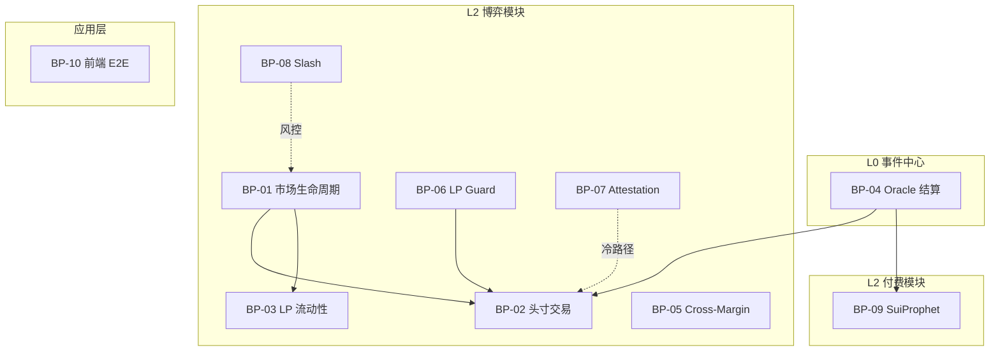
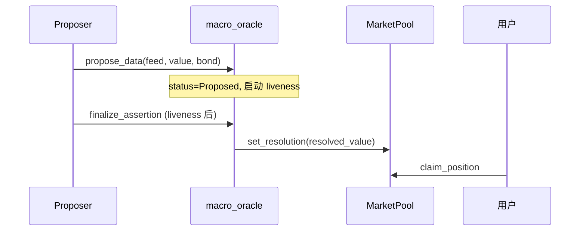
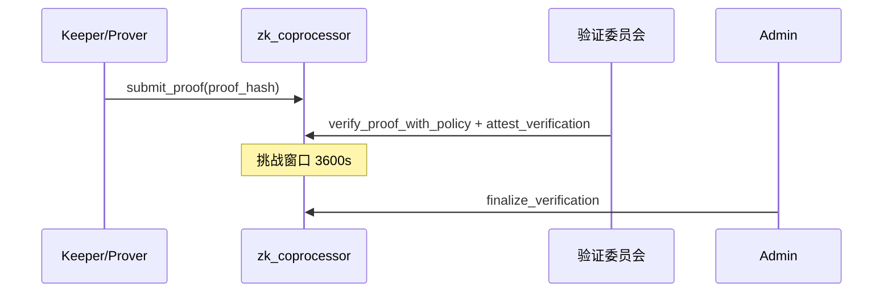

<!--
  Copyright (c) 2026 zouyc zouyccq@gmail.com.
  All rights reserved.

  Licensed under the Business Source License 1.1 (BSL 1.1).
  You may not use this file except in compliance with the License.

  Change Date: 2031-01-01
  On the Change Date, or the fourth anniversary of the first publicly available
  distribution of the code under the BSL, whichever comes first, the code
  automatically becomes available under the Apache License 2.0.
-->

**简体中文** | [English](./test-cases.md)

# X-Market Sui 测试用例

> **版本：** v1.0 · **日期：** 2026-06-08  
> **状态：** 草案  
> **关联：** [PRD.md](../PRD.md) · [oracle-playbook.md](./oracle-playbook.md) · [phase1.5-playbook.md](./phase1.5-playbook.md) · [phase2-playbook.md](./phase2-playbook.md) · [phase3-playbook.md](./phase3-playbook.md) · [prophet-playbook.md](./prophet-playbook.md) · [slash-and-attestation.md](./slash-and-attestation.md)

---

## 1. 文档说明

### 1.1 目的

本文从 **业务流程 → 用例 → 交互事件 → 时序** 四层推导可执行测试用例，覆盖链上 Move、链下 Keeper、前端与演练脚本，便于 QA、审计与主网前回归。

### 1.2 编号规则

| 层级 | 前缀 | 示例 |
| --- | --- | --- |
| 业务流程 | `BP-xx` | BP-01 市场生命周期 |
| 用例 | `UC-xx.y` | UC-01.2 竞价定标 |
| 交互事件 | `E-xx.y.z` | E-01.2.3 finalize_auction |
| 测试用例 | `TC-xx.y.z` | TC-01.2.3 Dirichlet 定标后进入 Trading |

### 1.3 优先级与自动化

| 优先级 | 含义 |
| --- | --- |
| P0 | 主网阻断；每次发布必跑 |
| P1 | 核心路径；Testnet 回归必跑 |
| P2 | 边界/异常；版本迭代抽样 |

| 自动化 | 含义 |
| --- | --- |
| **Move** | `sui move test` 单元测试 |
| **Drill** | `app/scripts/p0-drills.ts` / `run-p0-drills-testnet.ps1` |
| **Manual** | 前端或双钱包手工 |
| **Keeper** | `services/*/src/*.test.ts` |

### 1.4 业务流程总览



---

## 2. BP-01 市场生命周期

**流程：** 创建池 → Opening Auction → Trading → Oracle 结算 → Settled

**状态机：** `Auction` → `Trading` → `Settled`（`market_status`）

### UC-01.1 创建带 Feed 的市场

| 交互事件 | 发起方 | 链上入口 | 后置条件 |
| --- | --- | --- | --- |
| E-01.1.1 创建 Oracle 配置 | 协议运营 | `macro_oracle::create_oracle_config` | `OracleConfig` + `FeedRegistry` 存在 |
| E-01.1.2 启动竞价池 | 市场创建者 | `start_poisson_auction` / `start_dirichlet_auction` / `start_normal_auction` | `MarketPool.status = Auction` |
| E-01.1.3 建池即注册 Feed | 市场创建者 | `create_*_pool_with_feed`（同一 PTB） | `FeedRegistry` 可 `lookup_feed_by_market` |

**时序：**

```
协议运营 → create_oracle_config
市场创建者 → start_*_auction [+ register_data_feed_for_pool]
Indexer/前端 → lookup_feed_by_market(pool_id)
```

| ID | 用例 | 前置 | 步骤 | 预期 | 优先级 | 自动化 |
| --- | --- | --- | --- | --- | --- | --- |
| TC-01.1.1 | Poisson 竞价池创建 | Oracle 已初始化 | `start-auction-pool.ps1 -Kind poisson` | 返回 Pool ID；`status=Auction` | P0 | Manual |
| TC-01.1.2 | Dirichlet 竞价池创建 | 同上 | `-Kind dirichlet` | 三桶 α 初始为 0；Auction 状态 | P0 | Manual |
| TC-01.1.3 | Normal 竞价池创建 | 同上 | `-Kind normal` | μ/σ 三桶锚点正确 | P1 | Manual |
| TC-01.1.4 | Feed 链上发现 | 池已 `_with_feed` 创建 | `lookup_feed_by_market` | 返回对应 `DataFeed`；无需 env 硬编码 | P1 | Manual |

### UC-01.2 Opening Auction 竞价与定标

| 交互事件 | 发起方 | 链上入口 | 约束 |
| --- | --- | --- | --- |
| E-01.2.1 竞价注资 | 任意用户 | `auction_bid` | 仅 `Auction` 状态；USDC 入桶 |
| E-01.2.2 定标 | 任意用户 | `finalize_*_auction` | `now >= auction_end_ts` |
| E-01.2.3 状态切换 | 链上原子 | finalize 内部 | `Auction → Trading`；Vault 锁定；`lp_shares` seed |

**时序：**

```
用户A → auction_bid(bucket=0, usdc)
用户B → auction_bid(bucket=1, usdc)
... 等待 auction_end_ts ...
任意用户 → finalize_auction
  → 桶比例 → λ/α/μ,σ
  → status = Trading
```

| ID | 用例 | 前置 | 步骤 | 预期 | 优先级 | 自动化 |
| --- | --- | --- | --- | --- | --- | --- |
| TC-01.2.1 | 多用户竞价 | Auction 池 | 2+ 地址分别 `auction_bid` | 各桶 USDC 累计正确 | P0 | Manual |
| TC-01.2.2 | 定标前拒绝 finalize | 未到 `auction_end_ts` | `finalize_auction` | revert `auction_not_ended` | P1 | Move† |
| TC-01.2.3 | Poisson 定标 | 竞价结束 | `finalize_poisson_auction` | `lambda_tenths` 按桶比例；Trading | P0 | Manual |
| TC-01.2.4 | Dirichlet 定标 | 竞价结束 | `finalize_dirichlet_auction` | α 向量与桶比例一致 | P0 | Manual |
| TC-01.2.5 | Normal 定标 | 竞价结束 | `finalize_normal_auction` | μ/σ 加权定标 | P1 | Move† |
| TC-01.2.6 | 非 Auction 池拒绝 bid | 已 Trading | `auction_bid` | revert `not_auction` | P1 | Move† |

> † 守卫逻辑见 `math/*_auction_tests.move`、`market_status` 常量测试。

### UC-01.3 到期与结算状态

| 交互事件 | 发起方 | 链上入口 | 后置条件 |
| --- | --- | --- | --- |
| E-01.3.1 Oracle 固化 | Proposer / 委员会 | `finalize_assertion` / 仲裁回调 | `DataFeed.resolved_value` 可读 |
| E-01.3.2 池绑定结算 | Admin / 回调 | `set_resolution` / `report_resolution` | `MarketPool.resolved=true` |
| E-01.3.3 状态 Settled | 链上 | resolution 后 | `status=Settled`；禁 `buy_*` |

| ID | 用例 | 前置 | 步骤 | 预期 | 优先级 | 自动化 |
| --- | --- | --- | --- | --- | --- | --- |
| TC-01.3.1 | maturity 前不可 claim | Pool Trading；未 resolved | `claim_position` | revert | P0 | Manual |
| TC-01.3.2 | resolved 后可 claim | Oracle Finalized + set_resolution | `claim_position` | USDC 按命中规则兑付 | P0 | Drill‡ |
| TC-01.3.3 | Settled 后禁买入 | Pool Settled | 任意 `buy_*` | revert | P1 | Manual |

> ‡ Drill A 在 maturity 前 skip claim；到期后补跑。

---

## 3. BP-02 头寸交易（Parametric AMM）

**流程：** 用户 USDC → 链上 PDF 定价 → 参数更新 + Position 铸造

**Tier 1 热路径：** 单笔 PTB 内原子完成定价与状态变更（[tier2-decision.md](./tier2-decision.md)）。

### UC-02.1 区间 / 数字期权（P0）

| 分布 | 区间入口 | 数字入口 |
| --- | --- | --- |
| Poisson | `buy_poisson_interval` | `buy_poisson_digital` |
| Dirichlet | `buy_dirichlet_interval` | `buy_dirichlet_digital` |
| Normal | `buy_normal_interval` | `buy_normal_digital` |

**通用交互事件：**

| 事件 | 说明 |
| --- | --- |
| E-02.1.1 合并 USDC | 前端/PTB 合并多枚 Coin |
| E-02.1.2 Max-Loss 检查 | `risk.move` 最坏情景 ≤ Vault |
| E-02.1.3 参数更新 | μ/σ/λ/α 随成交量拨动 |
| E-02.1.4 铸造 Position | owned object 至买家地址 |

**时序（Poisson 区间示例）：**

```
用户 → buy_poisson_interval(pool, [L,U], usdc, clock)
  → lp_guard::effective_fee_bps（若启用）
  → poisson PDF 积分定价
  → risk max-loss assert
  → vault += usdc; 更新 lambda
  → mint Position{interval, shares, cost}
```

| ID | 用例 | 前置 | 步骤 | 预期 | 优先级 | 自动化 |
| --- | --- | --- | --- | --- | --- | --- |
| TC-02.1.1 | Poisson 数字期权 | Trading 池；有 USDC | `buy_poisson_digital` k=7 | Position 铸造；λ 变化；Drill A 已覆盖 | P0 | Drill |
| TC-02.1.2 | Poisson 区间命中结算 | resolved X∈[L,U] | buy → claim | 每份 1 USDC 兑付 | P0 | Manual |
| TC-02.1.3 | Poisson 区间未命中 | resolved X∉[L,U] | buy → claim | 头寸归零 | P0 | Manual |
| TC-02.1.4 | Dirichlet 胜平负数字 | Dirichlet Trading | `buy_dirichlet_digital` outcome=0 | α 更新；Position 正确 | P0 | Manual |
| TC-02.1.5 | Normal CPI 区间 | Normal Trading | `buy_normal_interval` | CDF 积分；Gas 平稳 | P0 | Manual |
| TC-02.1.6 | Max-Loss 拒绝 | 超大单 | 超限 `buy_*` | revert；Vault 不被击穿 | P0 | Move |
| TC-02.1.7 | Auction 状态拒绝买入 | status=Auction | `buy_*` | revert | P1 | Manual |
| TC-02.1.8 | paused 拒绝买入 | `pool.paused=true` | `buy_*` | revert | P0 | Drill B |

### UC-02.2 线性期权与 Straddle（P1）

| 入口 | 说明 |
| --- | --- |
| `buy_normal_call` / `buy_normal_put` | max(X−K,0) / max(K−X,0) |
| `buy_normal_straddle` | 同时推高 σ |

| ID | 用例 | 前置 | 步骤 | 预期 | 优先级 | 自动化 |
| --- | --- | --- | --- | --- | --- | --- |
| TC-02.2.1 | Call 买入 | Normal Trading | `buy_normal_call` K=250 | Position 类型 Call；σ 抬升 | P1 | Move |
| TC-02.2.2 | Put 买入 | 同上 | `buy_normal_put` | 对称定价 | P1 | Move |
| TC-02.2.3 | Straddle 买入 | 同上 | `buy_normal_straddle` | 波动率敏感头寸 | P1 | Move |

> 见 `linear_tests.move`（7 项单元测试）。

### UC-02.3 Phase 3 结构化票据（P1）

| 类型 | 入口 | 关键参数 |
| --- | --- | --- |
| Variance Swap | `buy_variance_swap` | K；(X−K)² |
| Structured Note | `buy_structured_note` | K, C；封顶看涨 |
| Range Note | `buy_range_note` | L, U；区间内票息 |
| Barrier Note | `buy_barrier_note` | B；X≥B 票息 |

| ID | 用例 | 前置 | 步骤 | 预期 | 优先级 | 自动化 |
| --- | --- | --- | --- | --- | --- | --- |
| TC-02.3.1 | Variance Swap | Normal Trading | 前端选 Variance；填 K | Position 标签正确；/positions 展示 | P1 | Manual |
| TC-02.3.2 | Structured Note 约束 | C≤K | `buy_structured_note` | revert | P2 | Manual |
| TC-02.3.3 | Range Note L>U | 无效区间 | `buy_range_note` | revert | P2 | Manual |

### UC-02.4 Position 转让

| 事件 | 说明 |
| --- | --- |
| E-02.4.1 原生 transfer | `sui client transfer` 或 PTB transfer Position |

| ID | 用例 | 前置 | 步骤 | 预期 | 优先级 | 自动化 |
| --- | --- | --- | --- | --- | --- | --- |
| TC-02.4.1 | 二级市场转让 | 持有 Position | transfer 至地址 B | B 可 claim；无冗余 owner 字段 | P2 | Manual |

---

## 4. BP-03 LP 流动性（NAV）

**流程：** deposit（申购）→ 持有 LpShare → withdraw（赎回）

### UC-03.1 NAV 申购

| 事件 | 链上入口 | 行为 |
| --- | --- | --- |
| E-03.1.1 计算 NAV | `nav::nav_pre` | (vault − L_mtm) / lp_shares |
| E-03.1.2 申购 | `deposit_liquidity` | mint_lp = amount / nav_pre |
| E-03.1.3 α 缩放 | Dirichlet 池内部 | 等比放大 α，概率形状不变 |

**时序：**

```
LP → deposit_liquidity(pool, usdc)
  → nav_pre
  → vault += usdc
  → Dirichlet: α *= (vault_new / vault_old)
  → mint LpShare → LP 钱包
```

| ID | 用例 | 前置 | 步骤 | 预期 | 优先级 | 自动化 |
| --- | --- | --- | --- | --- | --- | --- |
| TC-03.1.1 | 首次申购 NAV | Trading 池 | deposit 50 USDC | LpShare 份额 = 50/nav_pre；非 1:1 | P0 | Drill |
| TC-03.1.2 | Dirichlet α 缩放 | 有未平 Position | 二次 deposit | 概率分布不变；α 等比放大 | P1 | Move |
| TC-03.1.3 | T2 禁申购 | 距到期 < deposit_cutoff | `deposit_liquidity` | revert | P1 | Manual |
| TC-03.1.4 | /lp 页展示 | 已申购 | 打开 `/lp` | LpShare 列表与链上一致 | P1 | Manual E4 |

> 见 `nav_tests.move`（5 项）。

### UC-03.2 NAV 赎回

| 事件 | 链上入口 | 行为 |
| --- | --- | --- |
| E-03.2.1 赎回 | `withdraw_liquidity` | payout = burn × nav_pre；销毁 LpShare |

| ID | 用例 | 前置 | 步骤 | 预期 | 优先级 | 自动化 |
| --- | --- | --- | --- | --- | --- | --- |
| TC-03.2.1 | 部分赎回 | 持有 LpShare | withdraw 部分份额 | USDC 按 NAV 到账；份额减少 | P1 | Manual |
| TC-03.2.2 | paused 禁赎回 | pool.paused | withdraw | revert 或 UI 禁用 | P1 | Manual |

---

## 5. BP-04 Oracle 结算（Macro Data Oracle）

**流程：** 事件发生 → 提议 → 争议窗口 → [仲裁] → Finalized → claim

**闭环四阶段**（[PRD §10](../PRD.md#10-宏观经济数据预言机macro-data-oracle)）。

### UC-04.1 无争议路径



| ID | 用例 | 前置 | 步骤 | 预期 | 优先级 | 自动化 |
| --- | --- | --- | --- | --- | --- | --- |
| TC-04.1.1 | 提议质押不足 | bond < minimum | `propose_data` | revert | P0 | Move |
| TC-04.1.2 | 重复提议 | 已有活跃 assertion | 再次 propose | revert | P0 | Move |
| TC-04.1.3 | 窗口内禁止 finalize | liveness 未结束 | `finalize_assertion` | revert | P0 | Move |
| TC-04.1.4 | 无争议 finalize | liveness 结束 | finalize → set_resolution | Feed Finalized；可读 resolved_value | P0 | Manual |
| TC-04.1.5 | claim 兑付 | Pool resolved | `claim_position` | USDC 按规则转出 | P0 | Drill‡ |
| TC-04.1.6 | /oracle 只读 | Testnet 部署 | 打开 `/oracle` | Feed/断言状态正确 | P1 | Manual E5 |

> Move 守卫：`macro_oracle_tests.move`（7 项）。

### UC-04.2 争议与委员会仲裁

**时序（争议路径）：**

```
Disputer → dispute_and_request_arbitration (同一 PTB)
  → assertion: Proposed → In_Arbitration
  → 创建 ArbitrationCase
委员 → propose_verdict → approve_verdict → execute_arbitration
  → Feed Finalized + resolved_value
```

| ID | 用例 | 前置 | 步骤 | 预期 | 优先级 | 自动化 |
| --- | --- | --- | --- | --- | --- | --- |
| TC-04.2.1 | 窗口外争议 | liveness 已结束 | `dispute` | revert | P0 | Move |
| TC-04.2.2 | 争议冻结读取 | In_Arbitration | `get_finalized_value` | revert / 不可消费 | P0 | Manual |
| TC-04.2.3 | 2-of-3 委员会终裁 | 已 dispute | 委员投票 + execute | 状态 Finalized；胜诉方押金处理 | P0 | Manual |
| TC-04.2.4 | 非委员拒绝投票 | 非 signers | `approve_verdict` | revert | P1 | Move |

> 见 `oracle_arbitrator_tests.move`（6 项）。

### UC-04.3 Testnet Admin 快路径

| ID | 用例 | 前置 | 步骤 | 预期 | 优先级 | 自动化 |
| --- | --- | --- | --- | --- | --- | --- |
| TC-04.3.1 | settlement_oracle 上报 | AdminCap；Testnet | `report_resolution` | 仅联调用；生产禁用 | P2 | Drill A skip |

---

## 6. BP-05 Cross-Margin 保证金

**流程：** 同地址多 Position → 统一 VaR 账本 → 限制新开仓

| ID | 用例 | 前置 | 步骤 | 预期 | 优先级 | 自动化 |
| --- | --- | --- | --- | --- | --- | --- |
| TC-05.1.1 | 多槽位最大负债 | 4 个 liability slots | `max_liability_from_slots` | 返回 max(slots) | P1 | Move |
| TC-05.1.2 | 组合 VaR 前端 | 多持仓 | `/margin` 页 | 与链上配置一致 | P1 | Manual E8 |
| TC-05.1.3 | 超限拒绝开仓 | VaR 达上限 | `buy_*` | revert 或预警 | P2 | Manual |

---

## 7. BP-06 LP Guard 风控

**流程：** Keeper 观测池状态 → 评估风险分 → `set_lp_guard_params` → 动态费率 / 虚拟 σ

### UC-06.1 链上防守参数

| 参数 | 效果 |
| --- | --- |
| `fee_multiplier_bps` | 有效费率抬高 |
| `sigma_virtual_tenths` | Normal 定价 σ 增大 |
| `deposit_cutoff_bps` | T2 禁申购 |
| `resolution_window_ts` | 到期前禁 buy |

| ID | 用例 | 前置 | 步骤 | 预期 | 优先级 | 自动化 |
| --- | --- | --- | --- | --- | --- | --- |
| TC-06.1.1 | 有效费率计算 | fee_multiplier=5000 | `lp_guard::effective_fee_bps` | base × (1 + mult) 正确 | P0 | Move |
| TC-06.1.2 | 结算窗口禁买 | resolution_window 内 | `buy_*` | revert | P1 | Manual |
| TC-06.1.3 | authority 设参 | 非 authority | `set_lp_guard_params` | revert | P1 | Manual |

> 见 `lp_guard_tests.move`（3 项）。

### UC-06.2 LP Guard Keeper（链下）

| ID | 用例 | 前置 | 步骤 | 预期 | 优先级 | 自动化 |
| --- | --- | --- | --- | --- | --- | --- |
| TC-06.2.1 | 风险分计算 | mock 池状态 | `npm test` in lp-guard-keeper | 漂移/偏度/成交量权重 0.4/0.35/0.25 | P1 | Keeper |
| TC-06.2.2 | dry_run 观测 | LP_GUARD_DRY_RUN=true | Keeper 运行 | 日志有评估；链上不变 | P1 | Manual F3 |
| TC-06.2.3 | 高 risk 抬费 | dry_run=false | 模拟砸盘 | fee_multiplier 上升；衰减 ×0.85 | P2 | Manual |

---

## 8. BP-07 ZK Attestation 监督（冷路径）

**流程：** submit_proof → 委员会 attest → [challenge] → finalize  
**不阻塞** `buy_*` 热路径（[slash-and-attestation.md](./slash-and-attestation.md)）。

### UC-07.1  happy path



| ID | 用例 | 前置 | 步骤 | 预期 | 优先级 | 自动化 |
| --- | --- | --- | --- | --- | --- | --- |
| TC-07.1.1 | 提交 proof_hash | Trading 池 | `submit_proof` | 钱包收到 ZkProofTicket | P1 | Drill D |
| TC-07.1.2 | 委员阈值见证 | VerifierPolicy 2-of-3 | verify + 2× attest | approvals ≥ threshold | P1 | Manual |
| TC-07.1.3 | 窗口后 finalize | 3600s 后；无挑战 | `finalize_verification` | finalized=true | P1 | Drill D manual |
| TC-07.1.4 | 无效 status_code | code=0 | verify | revert | P2 | Move |
| TC-07.1.5 | proof_hash 长度 | len=31 或 129 | submit | revert | P2 | Move |

> 见 `zk_coprocessor_tests.move`（8 项）。

### UC-07.2 挑战路径

| ID | 用例 | 前置 | 步骤 | 预期 | 优先级 | 自动化 |
| --- | --- | --- | --- | --- | --- | --- |
| TC-07.2.1 | 窗口内挑战 | 已 verify | `challenge_verification` | status=challenged；禁止 finalize | P1 | Manual |
| TC-07.2.2 | 窗口外挑战 | 3600s 后 | challenge | revert | P1 | Move |
| TC-07.2.3 | 同地址挑战拒绝 | verifier=challenger | challenge | revert（Drill D skip） | P1 | Drill D |
| TC-07.2.4 | Admin 裁决 | challenged | `resolve_challenge` → accepted/rejected | 可进入 finalize 判定 | P1 | Manual |

### UC-07.3 Brevis Prover（链下）

| ID | 用例 | 前置 | 步骤 | 预期 | 优先级 | 自动化 |
| --- | --- | --- | --- | --- | --- | --- |
| TC-07.3.1 | mock 审计 | ZK_PROVER_MODE=mock | GET /health | 200；本地 SHA-256 | P2 | Keeper |
| TC-07.3.2 | dry_run 不上链 | ZK_PROVER_DRY_RUN=true | 池变更触发 | 日志有 proof；无链上 tx | P2 | Manual |

---

## 9. BP-08 Slash 罚没与恢复

**流程：** slash_pool / 多签提案 → paused + timelock → unslash_resume_pool

### UC-08.1 Admin 应急单签

**时序：**

```
Admin → slash_pool(amount, reason, recipient)
  → vault -= amount; recipient +=
  → pool.paused = true
  → timelock = now + 1800s
[等待 1800s]
Admin → unslash_resume_pool
  → paused = false
```

| ID | 用例 | 前置 | 步骤 | 预期 | 优先级 | 自动化 |
| --- | --- | --- | --- | --- | --- | --- |
| TC-08.1.1 | 单次 slash ≤30% | vault=1M | slash 300k | 成功；SlashRecord | P0 | Move |
| TC-08.1.2 | 单次 slash >30% | vault=1M | slash 301k | revert | P0 | Move |
| TC-08.1.3 | 周期累计 ≤50% | 已 slash 30% | 再 slash 20% | 成功 | P1 | Move |
| TC-08.1.4 | 周期累计 >50% | 已 slash 30% | 再 slash 21% | revert | P1 | Move |
| TC-08.1.5 | slash 后 paused | Drill B | slash 1 USDC | paused=true；buy 失败 TC-02.1.8 | P0 | Drill |
| TC-08.1.6 | timelock 前恢复 | <1800s | `unslash_resume_pool` | revert | P0 | Manual |
| TC-08.1.7 | timelock 后恢复 | ≥1800s | unslash | paused=false | P0 | Manual |

> 见 `slash_tests.move`（8 项）。

### UC-08.2 多签 SlashGovernance

**时序：**

```
Admin → init_slash_governance(signers, threshold)
Signer → propose_slash_request
Signers → approve_slash_request (≥ threshold)
Signer → execute_slash_request
```

| ID | 用例 | 前置 | 步骤 | 预期 | 优先级 | 自动化 |
| --- | --- | --- | --- | --- | --- | --- |
| TC-08.2.1 | 提案执行 | threshold=1 | propose → execute | 同 TC-08.1.5 效果 | P0 | Drill C |
| TC-08.2.2 | 未达 threshold | threshold=2 | 仅 1 approve | execute revert | P1 | Move |
| TC-08.2.3 | 提案 TTL 86400s | 过期 request | execute | revert | P2 | Move |
| TC-08.2.4 | 重复 approve | 已 approve | 再次 approve | revert | P2 | Move |

---

## 10. BP-09 SuiProphet 知识付费

**流程：** Commit（Seal+Indexer/IPFS）→ Unlock（USDC）→ Decrypt → Audit（Oracle 后）

### UC-09.1 预言家 Commit

**时序：**

```
预言家 → JSON canonical → Seal.encrypt → POST Indexer /v1/prophecies/blob
      → commit_private_prophecy(blob_id, seal_id, plaintext_hash)
链上 → lock_time = pool.maturity_ts
```

| ID | 用例 | 前置 | 步骤 | 预期 | 优先级 | 自动化 |
| --- | --- | --- | --- | --- | --- | --- |
| TC-09.1.1 | 完整 Commit | Registry 已创建 | /prophet 步骤 1 | 链上 PrivateProphecy；Indexer blob 可 GET | P1 | Manual E6 |
| TC-09.1.2 | plaintext_hash 绑定 | 同上 | 篡改明文后 audit | CHEAT | P1 | Move |

> 见 `prophet_registry_tests.move`（6 项）。

### UC-09.2 订阅解锁与 Seal 解密

| 条件 | Seal OR 策略 |
| --- | --- |
| A 付费 | sender ∈ paid_buyers |
| B 公开 | now > lock_time 或 is_public |

| ID | 用例 | 前置 | 步骤 | 预期 | 优先级 | 自动化 |
| --- | --- | --- | --- | --- | --- | --- |
| TC-09.2.1 | 付费解锁 | 钱包 B | unlock_prophecy + USDC | paid_buyers 含 B；可解密 | P1 | Manual 双钱包 |
| TC-09.2.2 | 未付费拒绝解密 | 非 buyer | Seal decrypt | 失败 |
| TC-09.2.3 | lock_time 后公开 | maturity 后 | 任意地址 decrypt | 成功（条件 B） | P1 | Manual |

### UC-09.3 Oracle 审计与战绩

| ID | 用例 | 前置 | 步骤 | 预期 | 优先级 | 自动化 |
| --- | --- | --- | --- | --- | --- | --- |
| TC-09.3.1 | 预测正确 WIN | Pool resolved；hash 匹配 | audit_prophecy | WIN；escrow 分账；is_public | P1 | Manual |
| TC-09.3.2 | 预测错误 LOSS | 同上 | audit | LOSS；预言家无余款 | P1 | Manual |
| TC-09.3.3 | 明文篡改 CHEAT | hash 不匹配 | audit | CHEAT；托管均分退还 | P0 | Move |
| TC-09.3.4 | 排行榜更新 | audit 后 | /leaderboard | wins/losses/streak 正确 | P1 | Manual E7 |

> 见 `prophet_leaderboard_tests.move`（4 项）。

---

## 11. BP-10 前端与运维 E2E

### UC-10.1 页面回归（[p0-drill-ef-checklist.md](./p0-drill-ef-checklist.md) §E）

| ID | 路由 | 检查项 | 优先级 |
| --- | --- | --- | --- |
| TC-10.1.1 | `/` | 首页、种子市场、导航 | P0 |
| TC-10.1.2 | `/markets/[id]` | 三分布池详情、买入、IV/LP Guard 面板 | P0 |
| TC-10.1.3 | `/positions` | 与 Drill A 持仓一致 | P0 |
| TC-10.1.4 | `/lp` | 申购/赎回；paused 态展示 | P1 |
| TC-10.1.5 | `/oracle` | Feed 只读 | P1 |
| TC-10.1.6 | `/prophet` | Commit（钱包自付 SUI Gas） | P1 |
| TC-10.1.7 | `/leaderboard` | 无报错加载 | P2 |
| TC-10.1.8 | `/margin` | 保证金与池配置一致 | P2 |

### UC-10.2 服务健康与告警（§F）

| ID | 场景 | 预期 | 优先级 |
| --- | --- | --- | --- |
| TC-10.2.1 | verify-services-health | LP Guard :8788 HTTP 200 | P1 |
| TC-10.2.2 | Gas 不足告警 | /health 含余额告警字段 | P2 |
| TC-10.2.3 | paused 池 Keeper 日志 | risk 评估出现 | P2 |

### UC-10.3 P0 自动化演练矩阵

| 演练 | 覆盖 TC | 脚本 |
| --- | --- | --- |
| A 买入 | TC-02.1.1, TC-03.1.1, TC-04.1.5‡ | p0-drills.ts |
| B Slash 单签 | TC-08.1.5, TC-02.1.8 | p0-drills.ts |
| C Slash 多签 | TC-08.2.1 | p0-drills.ts |
| D ZK Attestation | TC-07.1.1, TC-07.1.3‡ | p0-drills.ts |

---

## 12. 数学引擎单元测试索引

| 模块 | 文件 | 测试数 | 关联 TC |
| --- | --- | --- | --- |
| Poisson PDF | `math/poisson_tests.move` | 2 | TC-02.1.x |
| Dirichlet | `math/dirichlet_tests.move` | 1 | TC-02.1.4 |
| Normal CDF | `math/normal_tests.move` | 4 | TC-02.1.5 |
| Beta 近似 | `math/beta_tests.move` | 6 | TC-02.1.4 |
| 竞价定标 | `math/*_auction_tests.move` | 2+2+2 | TC-01.2.x |
| Max-Loss | `risk_tests.move` | 1 | TC-02.1.6 |
| EventRoot | `event_root_tests.move` | 2 | Phase 4 |

**执行：**

```powershell
sui move test
```

---

## 13. 测试执行建议

### 13.1 每次 Move 包发布

1. `sui move test`（全绿）
2. `app/scripts/p0-drills.ts` 或 `run-p0-drills-testnet.ps1`
3. 更新 [mainnet-drill-record-template.md](./mainnet-drill-record-template.md) 留痕

### 13.2 主网前完整回归

1. §12 单元测试 + §11 UC-10.1 前端 §E 全表
2. BP-04 Oracle 争议路径 TC-04.2.3（双钱包 + 委员会）
3. BP-09 双钱包 Prophet 全流程
4. TC-08.1.7 + TC-07.1.3 补完 timelock / challenge 窗口 manual 项

### 13.3 不在本轮范围

| 项 | 原因 |
| --- | --- |
| Tier 2 联合 PDF 买入 | [tier2-decision.md](./tier2-decision.md) 决议不上 |
| UMA DVM 生产投票 | Testnet 用 `oracle_arbitrator`；见 [deferred-features.md](./deferred-features.md) |
| 主网 geoblock | 见 [compliance-geoblock.md](./compliance-geoblock.md)；独立合规测试 |

---

## 14. 修订记录

| 日期 | 版本 | 说明 |
| --- | --- | --- |
| 2026-06-08 | v1.0 | 初版：10 大业务流程、用例事件序列与 80+ 测试用例；映射 Move/Drill/Manual |
