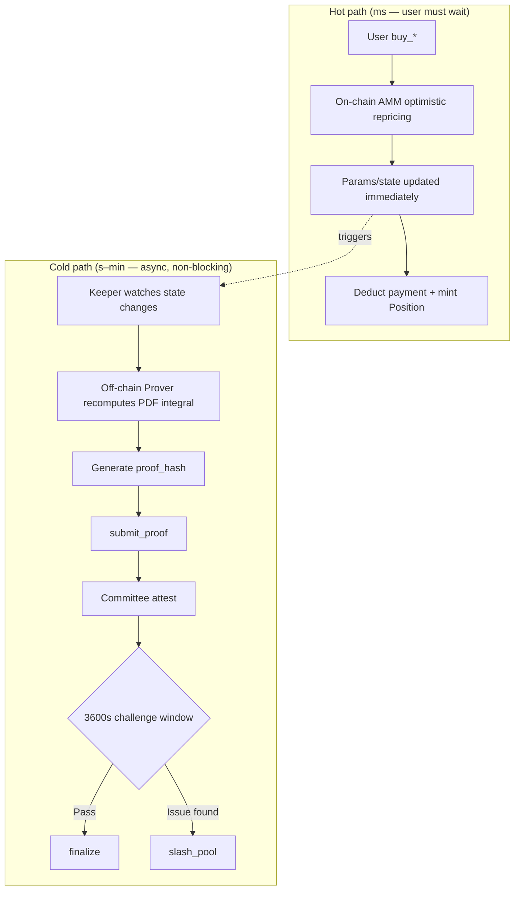
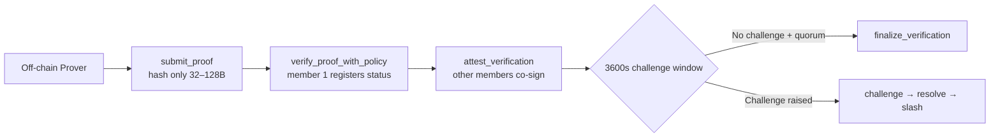

<!--
  Copyright (c) 2026 zouyc zouyccq@gmail.com.
  All rights reserved.

  Licensed under the Business Source License 1.1 (BSL 1.1).
  You may not use this file except in compliance with the License.

  Change Date: 2031-01-01
  On the Change Date, or the fourth anniversary of the first publicly available
  distribution of the code under the BSL, whichever comes first, the code
  automatically becomes available under the Apache License 2.0.
-->

**English** | [简体中文](./tier2-optimistic-pricing-explained.zh.md)

# Tier 2 Complex PDF: Optimistic Pricing + Attestation/ZK Cold Path — Detailed Explanation

> **Version:** v1.0 · **Date:** 2026-06-19  
> **Type:** Local archive (conversation digest)  
> **Scope:** Forward-looking architecture for “truly complex PDFs” — multivariate Gaussian, Copula, dynamic correlation matrices  
> **Related:** [tier2-decision.md](./tier2-decision.md) · [slash-and-attestation.md](./slash-and-attestation.md) · [qa.md](./qa.md) §Tier 1/2 · [glossary.md](./glossary.md)

---

## Summary

Joint PDFs such as multivariate Gaussian, Copula, and dynamic correlation matrices cannot be priced on-chain with Tier 1 LUT/Taylor methods. The project’s forward-looking path is:

- **Hot path (millisecond):** Off-chain complex PDF computation → on-chain **optimistic acceptance** of pricing bundle → immediate execution and repricing
- **Cold path (async):** Keeper/Prover post-hoc recomputation → Attestation or ZK supervision → challenge window → Slash accountability

**Current status:** Supervision skeleton (`zk_coprocessor`, `brevis-zk-prover`, `slash`) is live; Tier 2 joint PDF is **not yet wired** into `buy_*`; Tier 2 is deferred before mainnet.

---

## 1. Why Complex PDFs Cannot Use Tier 1

Pricing with multivariate Gaussian, Copula, or dynamic correlation matrices typically requires:

$$P(X_1 \in A_1,\; X_2 \in A_2,\; \ldots) = \iint \cdots f_{\text{joint}}(\mathbf{x})\, d\mathbf{x}$$

Direct on-chain implementation hits a three-way conflict:

| Conflict | Manifestation |
| --- | --- |
| **Compute** | High-dimensional integration, correlation matrix inversion, nested Copulas — LUT/Taylor cannot run in Move |
| **Latency** | Real ZK proof generation takes seconds to minutes; parametric AMM requires **atomic updates within the same block**, or arbitrage follows |
| **Trust** | Pure off-chain oracle signatures introduce a ~500ms delay window → MEV bots drain the pool |

Project conclusion: **separate “compute” from “verify”** — optimistic execution at trade time, async supervision afterward.

---

## 2. Core Paradigm: Optimistic Execution + Async Supervision

Analogous to Macro Oracle’s “propose → dispute period → finalization,” Tier 2 pricing follows the same **optimistic game** pattern:

```
Assume off-chain pricing is correct → execute and reprice immediately
                    ↓ (async, non-blocking)
Anyone/system can challenge later → committee ruling → economic forfeiture
```

### 2.1 Comparison with Macro Oracle

| Step | Macro Oracle (L0 settlement) | Tier 2 pricing supervision line |
| --- | --- | --- |
| Submit | `propose` data | `submit_proof` hash |
| Confirm | Committee + dispute period | Committee `attest` + `finalize_verification` |
| Challenge | `dispute` | `challenge_verification` |
| Accountability | Arbitration / stake game | `slash_pool` + market pause |

---

## 3. Two Paths: Hot Path vs Cold Path



| Path | What it does | Latency | Blocks `buy_*`? |
| --- | --- | --- | --- |
| **Hot path** | Optimistic pricing + atomic state update | Milliseconds | ✅ User must complete |
| **Cold path** | Attestation / ZK supervision | Seconds–minutes | ❌ Fully async |

**Product decision:** Main path does not depend on the supervision line; `zk_coprocessor` is **not yet wired** into `buy_*` (see [tier2-decision.md](./tier2-decision.md)).

---

## 4. Hot Path in Detail: “Optimistic Pricing”

Example: joint distribution of “rate-cut magnitude × unemployment rate” (strongly correlated; independent dual-pool multiplication error is too large).

### 4.1 What Lives On-Chain

The chain **does not store the full joint PDF** — only a **low-dimensional parameter vector**, e.g.:

- **Multivariate Gaussian:** \(\boldsymbol{\mu}\), \(\boldsymbol{\Sigma}\) (or Cholesky factor)
- **Copula:** marginal parameters + correlation \(\rho\)
- **Dynamic correlation:** current correlation matrix + timestamp

### 4.2 What Happens When a User Buys

```
[Trading phase — milliseconds]

1. User submits buy intent (amount, interval, slippage cap)
2. Transaction carries off-chain precomputed “pricing bundle”:
   - New parameter vector Δμ, ΔΣ (or Copula coefficients)
   - Interval probability P_joint for this trade
   - Optional: threshold signature / block anchoring
3. On-chain AMM performs lightweight checks:
   - Repricing slope circuit breaker (e.g. single-step λ/μ change ≤ ±20%)
   - Probability sum constraint (e.g. Σpᵢ ∈ [0.999, 1.001])
   - User slippage guard max_price
4. Checks pass → pool params updated immediately → payment deducted, tokens minted
```

Key point: **no high-dimensional integration on-chain** — only “accept off-chain result + business-rule circuit breakers.” That is “optimistic”: assume off-chain math is correct; execute first.

### 4.3 Relation to the Skellam Hybrid Architecture

Skellam (medium complexity) is a simplified instance of the same idea:

- Off-chain: Skellam engine computes CDF (10–50 μs)
- On-chain: 32B polynomial coefficients → Horner evaluation

Tier 2 extends the “pricing bundle” from 32B coefficients to **full joint-distribution parameters + interval probability**, while on-chain settlement stays lightweight. See [football-wdl-solution.md](./football-wdl-solution.md).

---

## 5. Cold Path in Detail: Attestation vs ZK

The cold path answers: **“What if off-chain math was wrong?”**

### 5.1 Attestation — On-Chain Transition Layer (Implemented)

Sui Move has **no** native Groth16/Plonk precompile, so `zk_coprocessor` does:

> On-chain **does not verify** proof mathematics — only registers `proof_hash` + committee threshold attestation.



**On-chain registered fields** (`sources/zk_coprocessor.move`):

| Field | Meaning |
| --- | --- |
| `proof_hash` | Hash of proof or audit conclusion |
| `public_inputs_hash` | Hash of public inputs (pool ID, params, checkpoint, etc.) |
| `proof_scheme_code` | 1=Groth16, 2=Plonk, 3=STARK (**label only**) |
| `approvals` | Committee M-of-N attestation list |

**Trust source:** verifier committee + challenge period + Slash — not cryptographic interception on the hot path.

### 5.2 Real ZK (Brevis) — Verifiable Off-Chain, Attestation On-Chain

```
Brevis generates real ZK proof off-chain (live mode)
  → mapped to proof_hash + public_inputs_hash
  → same Attestation registration flow
```

I.e. **off-chain can be real ZK; on-chain remains “hash + committee attestation”** (see `services/brevis-zk-prover/README.md`).

Today Brevis Prover audits Tier 1 pool **parameter bounds and max-loss** (`audit.ts`), not joint-PDF integral proofs — this is the supervision line **skeleton**; public inputs expand when Tier 2 pricing is wired in.

### 5.3 Attestation vs Real ZK

| Mode | Off-chain | On-chain | Use case |
| --- | --- | --- | --- |
| **Attestation** | Local SHA-256 or simple audit | Committee attests hash | Default, low ops burden |
| **Real ZK (Brevis live)** | Generate validity proof | Still registers hash (no native verifier) | Institutional compliance requiring cryptographic verifiability |

Both sit on the **cold path** and do not block `buy_*`.

---

## 6. Full Timeline: Lifecycle of a Tier 2 Trade

Assume T=0 user buys a joint-PDF product:

```
T = 0ms     User buy_* carries off-chain pricing bundle
            → on-chain optimistic repricing, state update, trade completes ✅

T = 1–5s    Keeper detects checkpoint change
            → off-chain Prover recomputes: “Is joint PDF integral self-consistent after this trade?”
            → generates proof_hash

T = 5–30s   submit_proof → committee attest (M-of-N)

T = 0–3600s Challenge window open
            → anyone can challenge_verification (submit evidence_hash)
            → if param drift > ε or integral inconsistent, file challenge

T = 3600s+  No open challenge + quorum met
            → finalize_verification ✅ supervision conclusion effective

If challenge succeeds:
            → resolve_challenge → rejected
            → slash_pool: forfeit pool USDC (single event ≤30%), pause market
            → unslash_resume_pool after 1800s timelock
            → compensate affected parties (governance process)
```

**Note:** When the cold path finds an issue, the trade has usually already settled — blocks are **not** automatically reverted. Accountability relies on **economic forfeiture + market pause + compensation**. That is “optimistic execution + post-hoc accountability.”

---

## 7. Three Lines of Defense in the Trust Model

Attestation’s weakness: committee collusion or misjudgment. The project adds three remedies:

| Defense | Mechanism | Role |
| --- | --- | --- |
| **1. Challenge window** | `challenge_verification` within 3600s | Anyone can dispute supervision conclusion |
| **2. Governance ruling** | Admin `resolve_challenge` | Resolve challenged to accepted/rejected |
| **3. Economic forfeiture** | `slash_pool`: deduct Vault USDC + pause market | Cost of misbehavior > benefit |

On-chain **hot-path circuit breakers** (repricing slope, probability sum, slippage guard) reduce off-chain attack surface but cannot replace cold-path supervision.

### 7.1 Slash Parameters (On-Chain Constants)

| Parameter | Value |
| --- | --- |
| Challenge window | 3600 s |
| Resume timelock | 1800 s |
| Single-event cap | 30% of collateral (3000 bps) |
| Period cumulative cap | 50% of collateral (5000 bps) |

See [slash-and-attestation.md](./slash-and-attestation.md) · [mainnet-governance-params.md](./mainnet-governance-params.md).

---

## 8. Why “Optimistic”?

Conceptually similar to Optimistic Rollup, different domain:

| | Optimistic Rollup | X-Market Tier 2 |
| --- | --- | --- |
| Optimistic about | L2 state transition correctness | Off-chain PDF integral / param update correctness |
| Default assumption | Batch valid, post first | Pricing bundle valid, trade first |
| Challenge method | Fraud proof | challenge + evidence_hash |
| Penalty | Forfeit sequencer bond | slash_pool forfeits LP collateral |

Same core: **execute first, verify later; on failure, economic accountability — not hot-path blocking.**

---

## 9. Model Roles in the Architecture

| Model | Off-chain (Prover engine) | On-chain (hot path) | Cold-path supervision |
| --- | --- | --- | --- |
| **Multivariate Gaussian** | Compute high-dimensional CDF integrals e.g. \(\Phi_2(a,b;\rho)\) | Store \(\mu, \Sigma\); accept off-chain interval probability | Prove “integral + param update” matches on-chain state |
| **Copula** | Marginal CDF + nested Copula evaluation | Store marginal params + \(\rho\) / Archimedean params | Prove Copula structure not tampered |
| **Dynamic correlation** | Filter/update time-varying \(\rho_t\) | Store current correlation matrix + timestamp | Prove update trajectory satisfies model constraints |

**Compute** always off-chain; **store + lightweight check + settle** on-chain; **verify** async on cold path.

---

## 10. Boundary with Tier 1 / MVP

| Tier | Scenario | Implementation | Code status |
| --- | --- | --- | --- |
| **Tier 1** | Single-variable PDF | LUT + fixed-point, full on-chain atomic | ✅ `sources/math/` + `pool.move` |
| **MVP compound events** | Win ∧ over goals, etc. | Independent dual pools + Indexer multiplication | 📋 SPEC §9, no dedicated module |
| **Skellam** | WDL + handicap linkage | Off-chain engine + 32B on-chain coefficient settlement | ❌ Draft only in `football-wdl-solution` |
| **Tier 2 joint PDF** | Multivariate Gaussian / Copula | Optimistic pricing + cold-path supervision | ⚠️ Supervision skeleton live; pricing not wired |

### 10.1 When to Re-Evaluate Tier 2

Launch Tier 2 project review when **at least one** trigger is met ([tier2-decision.md](./tier2-decision.md) §6):

| Trigger | Example |
| --- | --- |
| Strong correlation breaks independence | “Rate-cut magnitude × unemployment” joint distribution |
| Single-pool capital efficiency required | Institution needs one Vault for multi-dimensional exposure |
| PDF infeasible on-chain | Multivariate Gaussian, Copula, dynamic correlation matrix |
| Compliance mandate | Counterparty requires validity proof |
| Liquidity fragmentation bottleneck | Independent pools cause unacceptable slippage / TVL split |

### 10.2 Recommended Evolution Path

```
Now → 6–12 months post-mainnet
  ├── Focus Tier 1: three distributions + structured notes + LP guard + Oracle + Prophet
  └── Compound events: independent dual pools + Indexer display, UI labels “independence assumption”

When triggers are met
  ├── First evaluate Tier 1 extensions (more Normal pools, off-chain Copula preview)
  ├── Still insufficient → Tier 2 optimistic execution + Attestation supervision
  └── Institutional compliance pressure → async ZK audit line (still non-blocking)
```

---

## 11. Source Index

| Module / Service | Path | Role |
| --- | --- | --- |
| ZK supervision (on-chain) | `sources/zk_coprocessor.move` | submit_proof, attest, challenge, finalize |
| Slash forfeiture | `sources/slash.move` | slash_pool, unslash_resume_pool |
| Brevis Prover Keeper | `services/brevis-zk-prover/` | Off-chain audit → proof_hash submission |
| Pool trade entry | `sources/pool.move` | `buy_*` (Tier 1 only today; does not call zk_coprocessor) |
| Off-chain quote preview | `pricing-engine/` | Mirrors Tier 1 math, not Tier 2 |

---

## 12. One-Sentence Summary

**Optimistic pricing + Attestation/ZK cold path** splits the blockchain derivatives pricing “impossible triangle”:

- **Hot path:** Off-chain complex PDF → on-chain optimistic accept → millisecond execution (speed)
- **Cold path:** Async recompute + proof/attestation + challenge + Slash (verifiability and accountability)
- **ZK as “supreme court”:** Post-hoc audit, not a trading bottleneck
- **Optimistic mechanism as “enforcement”:** Assume correct, execute first; penalize on failure

For “truly complex PDFs” — multivariate Gaussian, Copula, dynamic correlation — this is the project’s forward-looking design; before mainnet, Tier 1 + independent dual-pool approximation remains the path, with supervision optional and non-blocking.

---

## Changelog

| Date | Version | Notes |
| --- | --- | --- |
| 2026-06-19 | v1.0 | Initial archive: Tier 2 optimistic pricing and cold-path supervision (conversation digest) |
