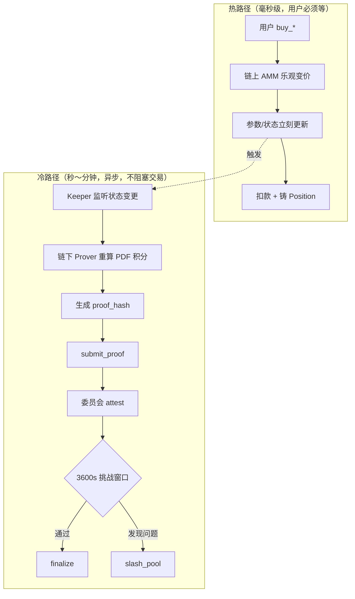
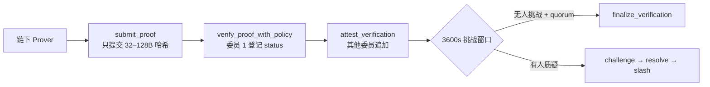

<!--
  Copyright (c) 2026 zouyc zouyccq@gmail.com.
  All rights reserved.

  Licensed under the Business Source License 1.1 (BSL 1.1).
  You may not use this file except in compliance with the License.

  Change Date: 2031-01-01
  On the Change Date, or the fourth anniversary of the first publicly available
  distribution of the code under the BSL, whichever comes first, the code
  automatically becomes available under the Apache License 2.0.
-->

**简体中文** | [English](./tier2-optimistic-pricing-explained.md)

# Tier 2 复杂 PDF：乐观定价 + Attestation/ZK 冷路径 — 详细说明

> **版本：** v1.0 · **日期：** 2026-06-19  
> **类型：** 本地归档（对话整理）  
> **范围：** 多维高斯、Copula、动态相关矩阵等「真复杂 PDF」的远期架构设计  
> **关联：** [tier2-decision.zh.md](./tier2-decision.zh.md) · [slash-and-attestation.zh.md](./slash-and-attestation.zh.md) · [qa.zh.md](./qa.zh.md) §Tier 1/2 · [glossary.zh.md](./glossary.zh.md)

---

## 摘要

多维高斯、Copula、动态相关矩阵等联合 PDF，在链上无法用 Tier 1 的 LUT/Taylor 完成定价。项目设计的远期路径是：

- **热路径（毫秒级）**：链下算复杂 PDF → 链上**乐观接受**定价包 → 立刻成交变价
- **冷路径（异步）**：Keeper/Prover 事后重算 → Attestation 或 ZK 监督 → 挑战窗口 → Slash 追责

**当前状态：** 监督骨架（`zk_coprocessor`、`brevis-zk-prover`、`slash`）已落地；Tier 2 联合 PDF **尚未接入** `buy_*`；主网前决议不上 Tier 2。

---

## 1. 为什么复杂 PDF 不能走 Tier 1？

多维高斯、Copula、动态相关矩阵定价通常需要：

$$P(X_1 \in A_1,\; X_2 \in A_2,\; \ldots) = \iint \cdots f_{\text{joint}}(\mathbf{x})\, d\mathbf{x}$$

在链上直接实现会遇到三重矛盾：

| 矛盾 | 表现 |
| --- | --- |
| **算力** | 高维积分、相关矩阵求逆、Copula 嵌套 — LUT/Taylor 在 Move 里算不动 |
| **延迟** | 真 ZK 证明生成要秒～分钟；参数化 AMM 要求**同一区块内**原子更新，否则被套利 |
| **信任** | 纯链下 Oracle 签名有 500ms 延迟窗口 → MEV 抢跑吸干池子 |

项目结论：**把「算」和「验」拆开** —— 交易时先乐观执行，事后异步监督。

---

## 2. 核心范式：乐观执行 + 异步监督

类比 Macro Oracle 的「提议 → 争议期 → 终裁」，Tier 2 定价也是同一套**乐观博弈**范式：

```
先假定链下算价是对的 → 立刻成交变价
                    ↓（异步，不阻塞）
事后有人/系统可以质疑 → 委员会裁决 → 经济罚没
```

### 2.1 与 Macro Oracle 的对照

| 环节 | Macro Oracle（L0 结算） | Tier 2 定价监督线 |
| --- | --- | --- |
| 提交 | `propose` 数据 | `submit_proof` 哈希 |
| 确认 | 委员会 + 争议期 | 委员会 `attest` + `finalize_verification` |
| 质疑 | `dispute` | `challenge_verification` |
| 追责 | 仲裁 / 质押博弈 | `slash_pool` + 市场暂停 |

---

## 3. 两条路径：热路径 vs 冷路径



| 路径 | 做什么 | 延迟 | 是否阻塞 `buy_*` |
| --- | --- | --- | --- |
| **热路径** | 乐观定价 + 原子状态更新 | 毫秒级 | ✅ 用户必须走完 |
| **冷路径** | Attestation / ZK 监督 | 秒～分钟 | ❌ 完全异步 |

**产品决议：** 主路径不依赖监督线；`zk_coprocessor` **尚未接入** `buy_*`（见 [tier2-decision.zh.md](./tier2-decision.zh.md)）。

---

## 4. 热路径详解：「乐观定价」

以「降息幅度 × 失业率」联合分布为例（强相关，独立双池乘法误差太大）。

### 4.1 链上存什么

链上**不存整条联合 PDF**，只存**低维参数向量**，例如：

- **多维高斯**：\(\boldsymbol{\mu}\)、\(\boldsymbol{\Sigma}\)（或 Cholesky 因子）
- **Copula**：边缘分布参数 + 相关系数 \(\rho\)
- **动态相关**：当前相关矩阵 + 时间戳

### 4.2 用户买入时发生什么

```
[交易阶段 - 毫秒级]

1. 用户提交 buy 意图（金额、区间、滑点上限）
2. 交易携带链下预计算的「定价包」：
   - 新的参数向量 Δμ, ΔΣ（或 Copula 系数）
   - 该笔交易的区间概率 P_joint
   - 可选：门限签名 / 区块锚定
3. 链上 AMM 做轻量校验：
   - 变价斜率熔断（如 λ/μ 单次变幅 ≤ ±20%）
   - 概率和约束（如 Σpᵢ ∈ [0.999, 1.001]）
   - 用户滑点守卫 max_price
4. 校验通过 → 立刻更新池参数 → 扣款铸币
```

要点：**链上不做高维积分**，只做「接受链下算好的结果 + 业务规则熔断」。这就是「乐观」—— 默认链下算对了，先成交。

### 4.3 与 Skellam 混合架构的关系

Skellam（中等复杂）是同一思路的简化版：

- 链下：Skellam 引擎算 CDF（10–50 μs）
- 链上：32B 多项式系数 → Horner 求值

Tier 2 只是把「定价包」从 32B 系数扩展为**完整联合分布参数 + 区间概率**，链上仍保持轻量结算。详见 [football-wdl-solution.zh.md](./football-wdl-solution.zh.md)。

---

## 5. 冷路径详解：Attestation 与 ZK 的分工

冷路径解决：**「链下算错了怎么办？」**

### 5.1 Attestation（见证）— 链上已实现的过渡层

Sui Move **没有** Groth16/Plonk 原生预编译，因此 `zk_coprocessor` 做的是：

> 链上**不验算**证明数学，只登记 `proof_hash` + 委员会阈值见证。



**链上登记字段**（`sources/zk_coprocessor.move`）：

| 字段 | 含义 |
| --- | --- |
| `proof_hash` | 证明或审计结论的哈希 |
| `public_inputs_hash` | 公开输入（池 ID、参数、checkpoint 等）的哈希 |
| `proof_scheme_code` | 1=Groth16, 2=Plonk, 3=STARK（**仅标签**） |
| `approvals` | 委员会 M-of-N 见证列表 |

**信任来源：** 验证委员会 + 挑战期 + Slash，而非密码学当场拦截。

### 5.2 真 ZK（Brevis）— 链下可验证，链上仍走 Attestation

```
Brevis 链下生成真 ZK 证明（live 模式）
  → 映射为 proof_hash + public_inputs_hash
  → 走同一套 Attestation 登记
```

即：**链下可以是真 ZK，链上仍是「哈希 + 委员会见证」**（见 `services/brevis-zk-prover/README.zh.md`）。

当前 Brevis Prover 审计的是 Tier 1 池的**参数边界与 max-loss**（`audit.ts`），不是联合 PDF 积分证明 —— 这是监督线的**骨架**，Tier 2 定价接入后才会扩展 public inputs。

### 5.3 Attestation vs 真 ZK 怎么选

| 模式 | 链下 | 链上 | 适用 |
| --- | --- | --- | --- |
| **Attestation** | 本地 SHA-256 或简单审计 | 委员会见证哈希 | 默认、低运维 |
| **真 ZK（Brevis live）** | 生成 validity proof | 仍登记哈希（无原生验算器） | 机构合规要求密码学可验证性 |

两者都放**冷路径**，都不阻塞 `buy_*`。

---

## 6. 完整时间线：一笔 Tier 2 交易的一生

假设 T=0 用户买入联合 PDF 产品：

```
T = 0ms     用户 buy_* 携带链下定价包
            → 链上乐观变价，状态更新，交易完成 ✅

T = 1–5s    Keeper 监听到 checkpoint 变更
            → 链下 Prover 重算：「这笔交易后的联合 PDF 积分是否自洽？」
            → 生成 proof_hash

T = 5–30s   submit_proof → 委员会 attest（M-of-N）

T = 0–3600s 挑战窗口开放
            → 任何人可 challenge_verification（提交 evidence_hash）
            → 若发现参数偏离 > ε 或积分不自洽，提交挑战

T = 3600s+  无未决挑战 + quorum 满足
            → finalize_verification ✅ 监督结论生效

若挑战成立：
            → resolve_challenge → rejected
            → slash_pool：罚没池子 USDC（单次 ≤30%）、暂停市场
            → timelock 1800s 后 unslash_resume_pool
            → 受损方补偿（治理流程）
```

**注意：** 冷路径发现问题时，交易通常已经成交 —— 不会自动回滚区块，而是靠**经济追责 + 市场暂停 + 补偿**处理。这就是「乐观执行 + 事后追责」的含义。

---

## 7. 信任模型的三层防线

Attestation 的弱点是委员会可能串通或误判，项目用三层机制补救：

| 防线 | 机制 | 作用 |
| --- | --- | --- |
| **1. 挑战窗口** | 3600s 内 `challenge_verification` | 任何人可质疑监督结论 |
| **2. 治理裁决** | Admin `resolve_challenge` | 将 challenged 裁决为 accepted/rejected |
| **3. 经济罚没** | `slash_pool`：扣 Vault USDC + 暂停市场 | 作恶成本 > 作恶收益 |

链上还有**热路径熔断**（变价斜率、概率和、滑点守卫），减少链下作恶空间，但不能替代冷路径监督。

### 7.1 Slash 参数（链上常量）

| 参数 | 值 |
| --- | --- |
| Challenge 窗口 | 3600 s |
| 恢复 timelock | 1800 s |
| 单次扣减上限 | 抵押的 30%（3000 bps） |
| 周期累计上限 | 抵押的 50%（5000 bps） |

详见 [slash-and-attestation.zh.md](./slash-and-attestation.zh.md) · [mainnet-governance-params.zh.md](./mainnet-governance-params.zh.md)。

---

## 8. 为什么叫「乐观」？

概念类似 Optimistic Rollup，但场景不同：

| | Optimistic Rollup | X-Market Tier 2 |
| --- | --- | --- |
| 乐观对象 | L2 状态转换正确 | 链下 PDF 积分/参数更新正确 |
| 默认假设 | 批次有效，先上链 | 定价包有效，先成交 |
| 质疑方式 | fraud proof | challenge + evidence_hash |
| 惩罚 | 罚没 sequencer bond | slash_pool 罚没 LP 抵押 |

核心一致：**先执行，后验证；验证失败则经济追责，而非阻塞热路径。**

---

## 9. 各模型在架构中的分工

| 模型 | 链下（Prover 引擎） | 链上（热路径） | 冷路径监督 |
| --- | --- | --- | --- |
| **多维高斯** | 算 \(\Phi_2(a,b;\rho)\) 等高维 CDF 积分 | 存 \(\mu, \Sigma\)；接受链下算好的区间概率 | 证明「积分 + 参数更新」与链上状态一致 |
| **Copula** | 边缘 CDF + Copula 函数嵌套求值 | 存边缘参数 + \(\rho\) / Archimedean 参数 | 证明 Copula 结构未被篡改 |
| **动态相关** | 时变 \(\rho_t\) 的滤波/更新 | 存当前相关矩阵 + 时间戳 | 证明更新轨迹满足模型约束 |

**算**永远在链下；**存 + 轻量校验 + 成交**在链上；**验**在冷路径异步完成。

---

## 10. 与 Tier 1 / MVP 的边界

| 层级 | 场景 | 实现方式 | 代码状态 |
| --- | --- | --- | --- |
| **Tier 1** | 单变量 PDF | LUT + 定点数，全链上原子 | ✅ `sources/math/` + `pool.move` |
| **MVP 复合事件** | Win ∧ 大球等 | 独立双池 + Indexer 乘法 | 📋 SPEC §9，无专用模块 |
| **Skellam** | 胜平负 + 让球联动 | 链下引擎 + 32B 系数链上结算 | ❌ 仅 `football-wdl-solution` 草案 |
| **Tier 2 联合 PDF** | 多维高斯/Copula | 乐观定价 + 冷路径监督 | ⚠️ 监督骨架有，定价未接入 |

### 10.1 何时重新评估 Tier 2

满足以下**至少一条**时，启动 Tier 2 立项评审（[tier2-decision.zh.md](./tier2-decision.zh.md) §6）：

| 触发条件 | 示例 |
| --- | --- |
| 强相关无法独立近似 | 「降息幅度 × 失业率」联合分布 |
| 单池资本效率刚需 | 机构要求单一 Vault 承载多维敞口 |
| 链上算不动的 PDF | 多维高斯、copula、动态相关矩阵 |
| 合规明确要求 | 对手方要求 validity proof |
| 流动性碎片化瓶颈 | 独立池导致滑点 / TVL 撕裂不可接受 |

### 10.2 推荐演进路线

```
现在 ～ 主网后 6–12 个月
  ├── 全力 Tier 1：三种分布 + 结构化票据 + LP 防守 + Oracle + Prophet
  └── 复合事件：独立双池 + Indexer 展示，UI 标注「独立假设」

触发条件满足时
  ├── 先评估 Tier 1 扩展（更多 Normal 池、链下 Copula 预览）
  ├── 仍不够 → Tier 2 乐观执行 + Attestation 监督
  └── 机构合规倒逼 → 异步 ZK 审计线（仍不阻塞交易）
```

---

## 11. 源码索引

| 模块 / 服务 | 路径 | 职责 |
| --- | --- | --- |
| ZK 监督链上模块 | `sources/zk_coprocessor.move` | submit_proof、attest、challenge、finalize |
| Slash 罚没 | `sources/slash.move` | slash_pool、unslash_resume_pool |
| Brevis Prover Keeper | `services/brevis-zk-prover/` | 链下审计 → proof_hash 提交 |
| 池子交易入口 | `sources/pool.move` | `buy_*`（当前仅 Tier 1，不调用 zk_coprocessor） |
| 链下报价预览 | `pricing-engine/` | 镜像 Tier 1 数学，非 Tier 2 |

---

## 12. 一句话总结

**乐观定价 + Attestation/ZK 冷路径** = 把区块链衍生品定价的「不可能三角」拆开：

- **热路径**：链下算复杂 PDF → 链上乐观接受 → 毫秒成交（速度）
- **冷路径**：异步重算 + 证明/见证 + 挑战 + Slash（可验证性与追责）
- **ZK 当「最高法院」**：事后审计，不当交易瓶颈
- **乐观机制当「执法机构」**：默认正确、先执行，错了再罚

对多维高斯、Copula、动态相关矩阵这类「真复杂 PDF」，这是项目设计的远期路径；主网前仍走 Tier 1 + 独立双池近似，监督线保持可选、不阻塞交易。

---

## 变更记录

| 日期 | 版本 | 说明 |
| --- | --- | --- |
| 2026-06-19 | v1.0 | 初版：对话整理归档，Tier 2 乐观定价与冷路径监督详细说明 |
